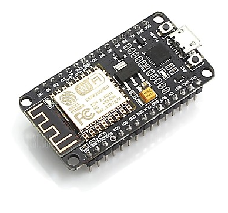

# Wireless stepper control board

The idea is to add a wifi microcontroller to our motors

+

*ESP8266 microcontroller and JMC closed loop stepper motor iHSSXX.*

*Youtube: Proof of concept*

* [Test code](stepperWifi/stepperWifi.ino) written for the Arduino Core of the ESP8266 Wifi microcontroller on a NodeMCU 1.0 dev board.

### Benefits and features
* This will allow for remote control of the motors. 
* Even without precision timing a wirelessly controlled motor is a fun idea.
* The onboard motor controller can host a small webpage with settings, sequences and interactive use.

### Initial test
* Positive results! See [video.](http://img.youtube.com/vi/pCvchR9jpPg/0.jpg)
* [IHSS60-36-30-31 stepper motor from JMC](http://www.jmc-motor.com/product/954.html), integrated closed loop NEMA24 
* Router as a local wifi hotspot, not connected to the internet
* mDNS worked to iPhone but not to PC
* PC could access server using IP nr 
* Could control the motor using iPhone Chrome and PC Chrome
* Step pulse length of 5 ms and arbitrary loop time of the program controlled the speed. (The motor can max 200kHz pulses = 2.5 micro sec min pulse length and min 2.5 micro sec pulse gap length. See [Data sheet](http://www.jmc-motor.com/file/1806080877.pdf))
* Motor was set to 3200 pulses per full shaft rotation
* [Test code](stepperWifi/stepperWifi.ino) written for the Arduino Core of the ESP8266 Wifi microcontroller on a NodeMCU 1.0 dev board.

### Connections NodeMCU to Stepper
* D1 (GPIO5) to PUL+
* D2 (GPIO4) to DIR+
* Vin to VCC (on the HISU programming header)
* GND to GND (on the HISU programming header)
* GND to PUL- (any GND pin will do)
* GND to DIR- (any GND pin will do)

#### Powering the board
* The motor has a 3.3V voltage pin that can power the board. 
* The Step and direction inputs can (barely) be driven straight from the microcontroller pins, min 3.5 V acc to a [data sheet](https://www.cnc-technics.de/stepper_motoren_integrated.pdf) and min 3.3 V acc to another [data sheet](https://webseite.sorotec.de/download/Technische-Daten/schrittmotor_datenblaetter/jmc_closed_loop/DS_iHSSXXen_181030Soro.pdf). Initial test shows this working fine. 

#### Future feature ideas - falling importance / rough roadmap
* Add Over The Air, [OTA code uploading](https://arduino-esp8266.readthedocs.io/en/latest/ota_updates/readme.html)
* Accurate speed control, pulses per second. Necessary for real time driving.
* Breadboard can be skipped if you use female-female jumper cables
* Show driving a load on a linear axis
* [Painlessmesh](http://painlessmesh.gitlab.io) - Two motors, try running in sync. (Cool demo if axels are screwed together and their rotaions cancels out.)
* More example modes: run continiously, acceleration control, different speeds, loops, pre-programmed cycles, input field for steps to take.
* Make card to mount the board straight on the motor as proposed in [Hertz motor monitoring board](https://github.com/fellesverkstedet/fabricatable-machines/tree/master/hertz-axis-monitor#hertz---axis-monitoring-board)
* Add example with limit switch(es) and homeing / calibration
* Add data streaming functions to the page, like positon [AJAX example](https://circuits4you.com/2018/02/04/esp8266-ajax-update-part-of-web-page-without-refreshing/)
* Add Alarm detection
* Add Enable / disable functionallity
* Add HISU configuration functionallity to allow easy reprograming of the internal acceleration, smoothing and current settings of the integrated closed loop stepper driver
* NEMA17 version with generic small popular stepper module
* External NEMA23 5A stepper driver example, costs much much less.

### Challanges
* Timing between multiple motors. This [issue](https://github.com/fellesverkstedet/fabricatable-machines/issues/30#) debates if we can sync the clocks of such boards to make them perform precision tasks in paralell, like CNC milling. 

### Mounting on and connecting to the motor

