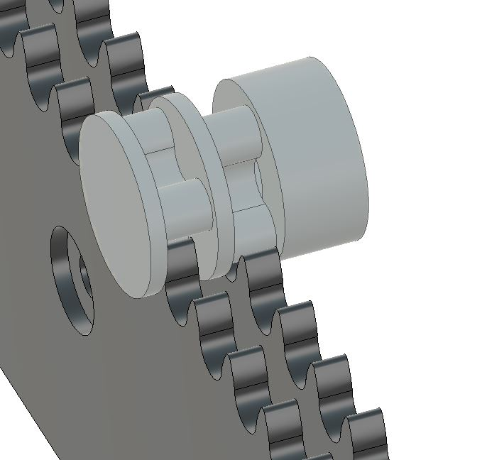
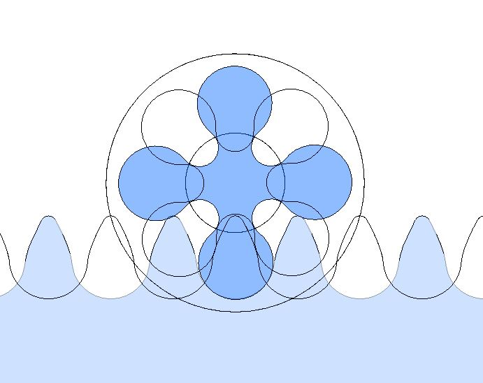
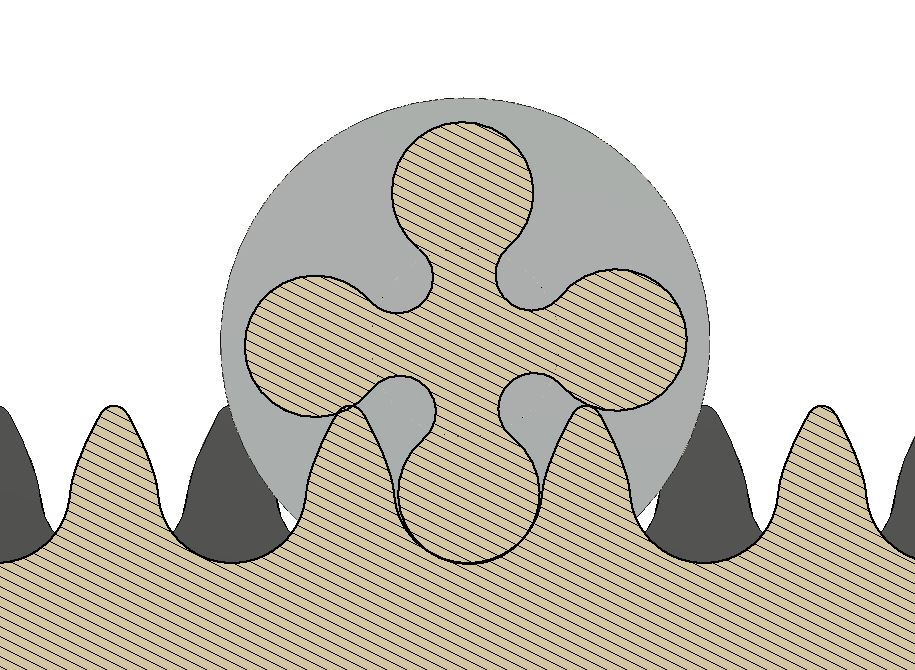
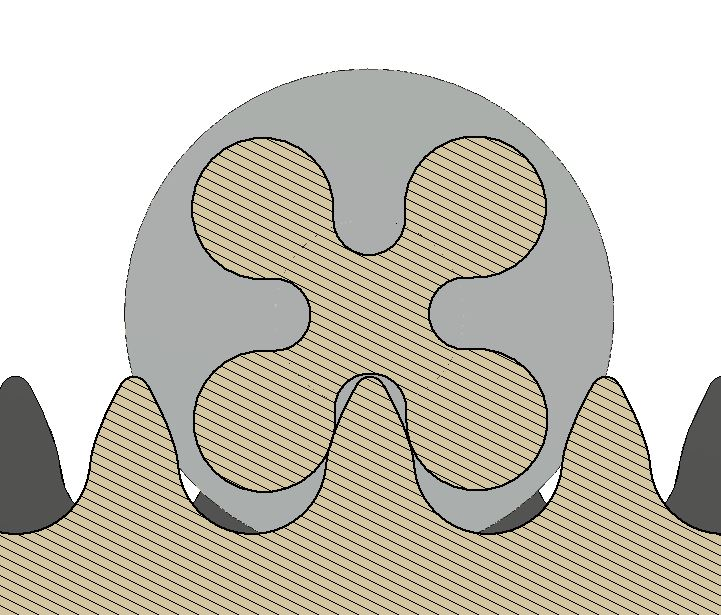
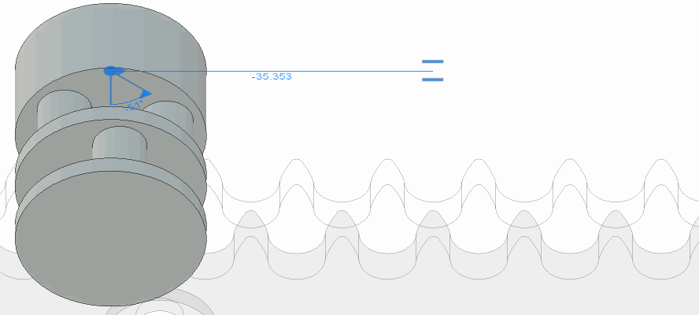
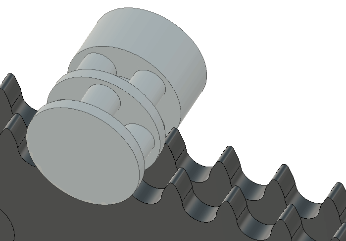
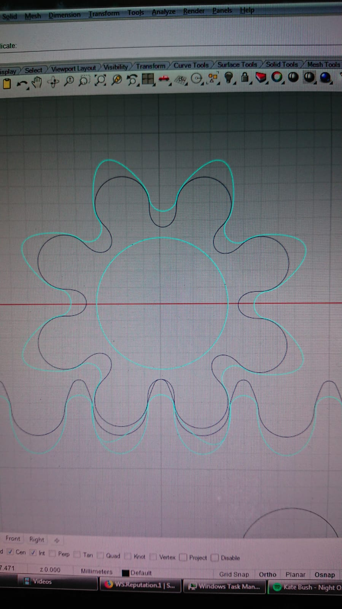

# Two layer pinion
Pros:
* Diameter 6 mm teeth = strong
* 40 mm travel per revolution = High gear ratio 
Cons:
* Requires double racks = more complex

## alternative version

* More contact points
* Single rack machined in two steps

