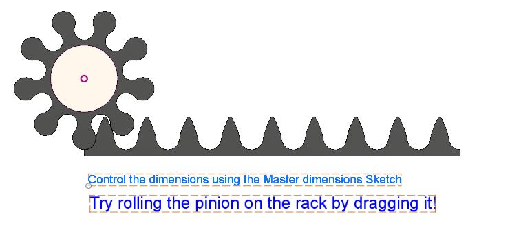
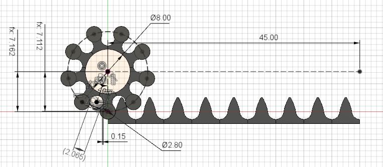
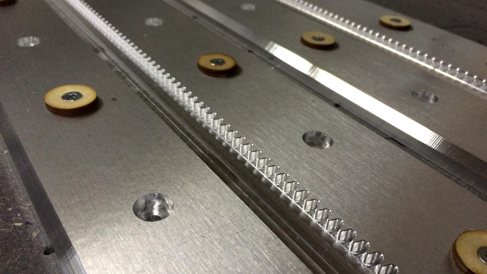
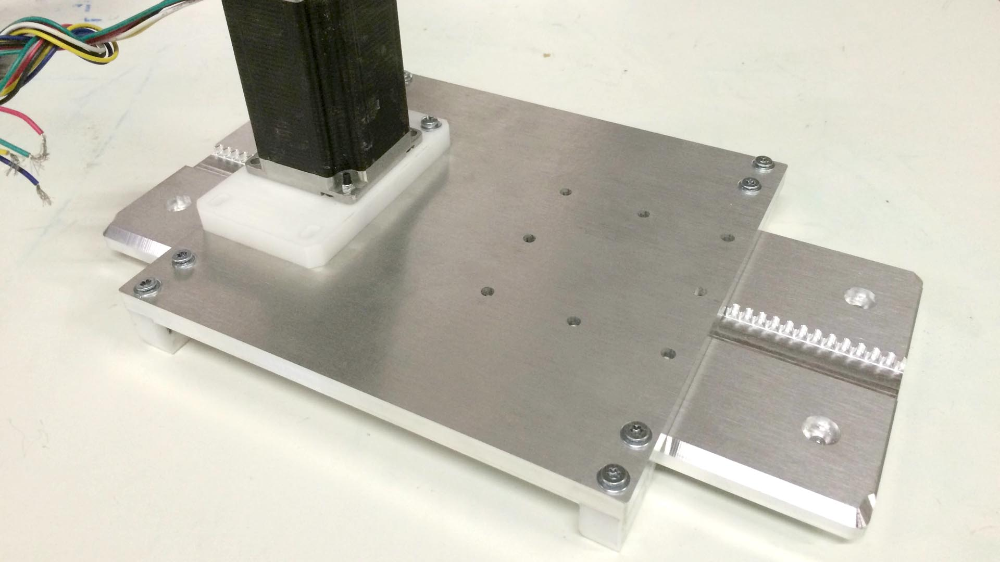
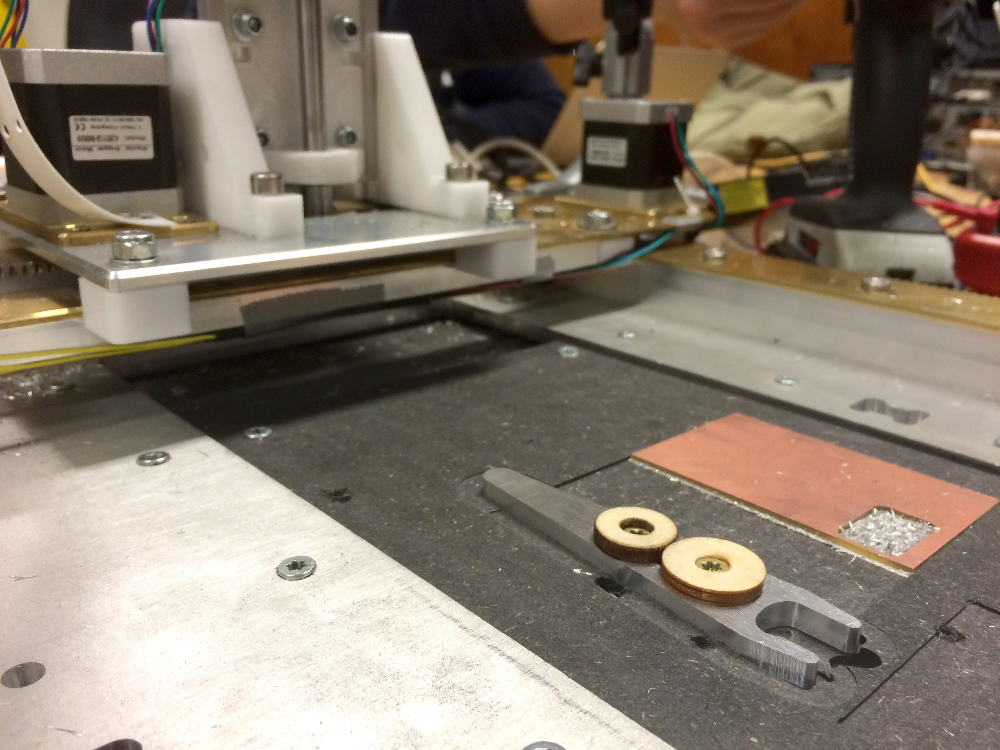
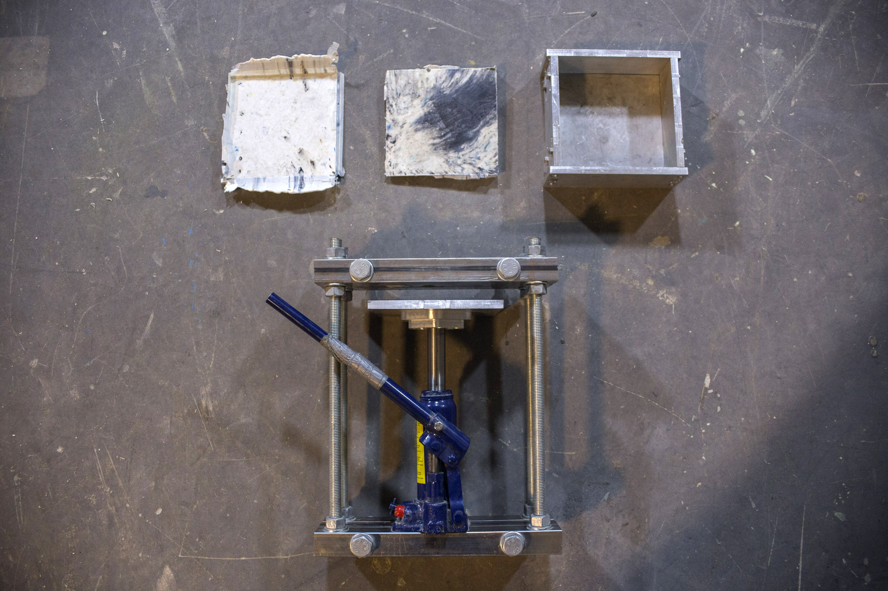
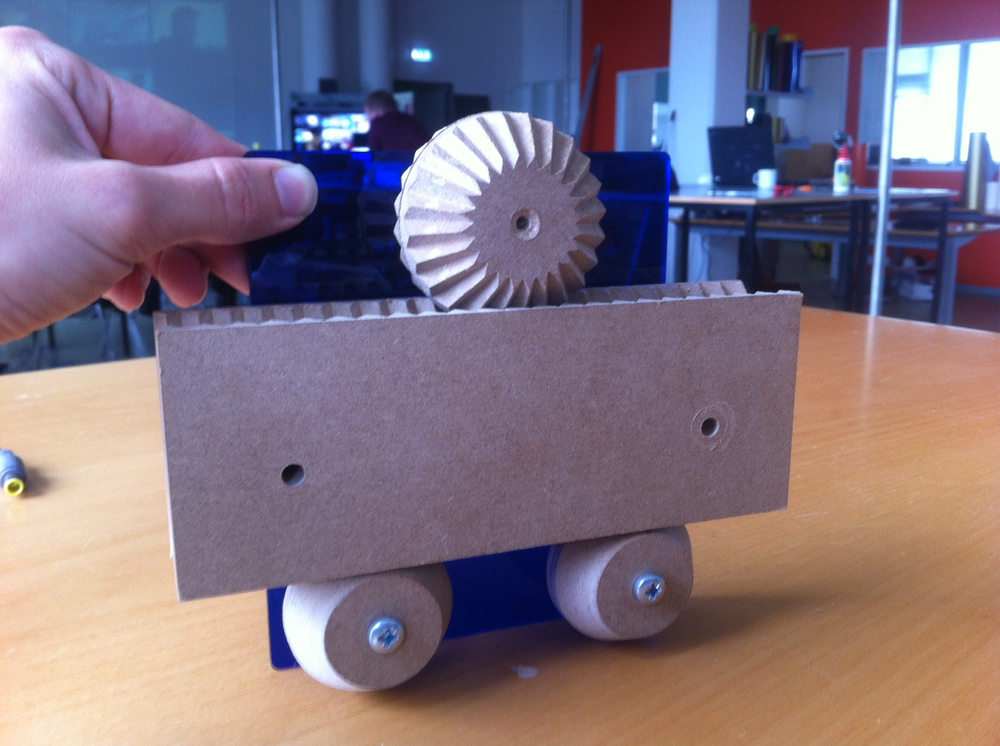
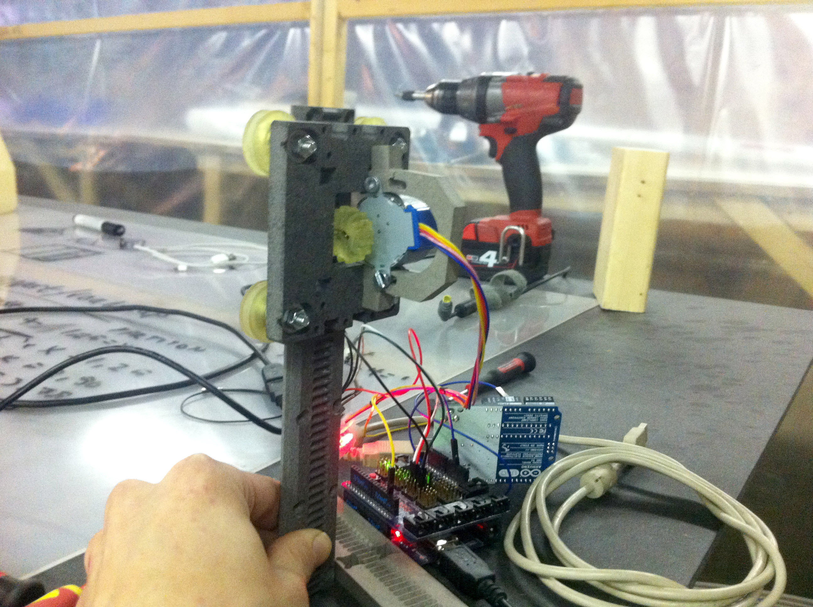

A *fabricatable machine* is a computer-controlled fabrication machine that can be made using a standard set of existing computer-controlled machines; with minimal use of speciality parts, processes or skills.
The type of machines include CNC-milling, lasercutter, and 3d-printers.

We want to enable individuals and communities to build their own production machines, to expand their own capabilities.
Build more machines to increase production, build cheaper to increase availability, or build specialized machines tailored for specific purposes.

Bellow you find a timeline of development. Press the download button in [root](https://github.com/fellesverkstedet/fabricatable-machines) to get all files. Study the theory of machine building and our design decisions [here](https://github.com/fellesverkstedet/fabricatable-machines/tree/master/theory).

# [Rack and Pinion for Fusion360](https://github.com/fellesverkstedet/fabricatable-machines/tree/master/chamferrail/Fusion360)
*September 2017, by Jakob Nilsson*

Now we have a rack and pinon generator for Autodesk Fusion360 as well!

Fully parametric and jointed!

# [Hector - luggage based CNC platform](http://archive.fabacademy.org/archives/2017/fablabverket/students/100/web/projects/diy_cnc/index.html)
*June 2017, by Jakob Nilsson*

* A portable CNC milling machine that fits in your luggage
* The cutting head extends through the frame
* All PCBs for machine control and motor drivers are self fabricated

### Status

**Currently being tested**

Full documentation and source files 

# [Hank - medium format CNC mill](https://github.com/fellesverkstedet/fabricatable-machines/tree/master/hank-medium-format-cnc)
*March 2017, by Jens Dyvik and Alex Schaub*

* A gantry based CNC milling machine where a substantial amount of the parts can be fabricated on a CNC mill
* Linear rails, rack, pinion and glide blocks can all be fabricated on a conventional CNC milling machine
* Based on the chamfer rail system in this repo
* Work area is 600mm x 300mm x 50mm
* The rack and pinion has 4.444444 steps per mm with a 200 step motor

Further documentation in repo subfolder [README](https://github.com/fellesverkstedet/fabricatable-machines/tree/master/hank-medium-format-cnc/README.md)

### Status

**Currently being tested, we are concidering upgrading to Humphrey style upside down rails and glide blocks**

[Rhino source](./hank-medium-format-cnc/hank-cnc-mill-3dm.zip)

[STEP 3D](./hank-medium-format-cnc/hank-cnc-mill-stp.zip)

[DXF 2D](./hank-medium-format-cnc/hank-cnc-mill-dxf.zip)

# [Chamfer Rail](https://github.com/fellesverkstedet/fabricatable-machines/tree/master/chamferrail)
*December 2016 / March 2017, by Jens Dyvik*

* A linear actuator with rack & pinion drive system, designed to be CNC-milled.
* This is a simplified version of the axis system from [V-bird](#V-bird) and [Simple Gantry](#simple-gantry),
* Can be reproduced using only standard CNC operations and bits (chamfering using a 90deg V-bit, or 3D mill with ball nose or end mill). 
* The rack and pinion has 4.444444 steps per mm with a 200 step motor
* The pitch is slightly smaller than v-bird rail, for higher resolution and torque.
* Motor plate files are included for NEMA17, NEMA23 and 60mm sized motors.

**NOTE:** The glide block design in this repo is undergoing improvements. Check [Hattori - small format CNC mill](https://github.com/fellesverkstedet/fabricatable-machines/blob/master/hattori-small-format-cnc/README.md) for an example of a state of the art glide block design.

### Status

**Currently in test and improvement cycle**

[Rhino source](./chamferrail/standard-chamferrails.3dm)

[FreeCAD source, older design](./chamferrail/chamferrail.fcstd)

[STEP 3D](./chamferrail/standard-chamferrails.stp)

[DXF 2D](./chamferrail/standard-chamferrails.dxf)

# [Award Plotter - CNC mill variation](https://github.com/fellesverkstedet/fabricatable-machines/tree/master/award-plotter)
*December 2016, by Jens Dyvik*

* CNC mill experiment from extra parts left after award plotter trophy
* Chamferrail rack and pinion based Z-axis
* Validated that the roller rack and pinion system can deliver high quality motion
* Validated the potential for self production
* Able to produce high quality PCBs
* Able to mill 5mm aluminium and 2mm steel

### Status

**No longer developed**

[Rhino source](./award-plotter/320%20x%20160%20CNC%20mill%20version.3dm)

[3D Step](./award-plotter/320%20x%20160%20CNC%20mill%20version.stp)

# [Award Plotter](https://github.com/fellesverkstedet/fabricatable-machines/tree/master/award-plotter)
*October 2016, by Jens Dyvik, Graham Hayward, Hans Christian Skovholt and Erling Knudtsen*

* Pen plotter
* Trophy for the 2016 Oslo Innovation Award
* Prints as many dipomas as the winner wants
* Servo-based Z-axis

### Status

**No longer developed**

[Rhino source](./award-plotter/award-plotter.3dm)

[3D Step](./award-plotter/award-plotter-3D-STEP.stp)

[2D Dxf](./award-plotter/award-plotter-2D-DXF.dxf)

# [Sheet maker 160mm x 160mm](https://github.com/fellesverkstedet/fabricatable-machines/tree/master/sheet-maker)
*October 2016, by Jens Dyvik*

* Compression mold for recylcling plastic waste into sheet material
* Works well with PLA from 3D prints
* PLA sheets are easy to lasercut and CNC mill
* Rape seed oil makes good mold release
* Works ok with one sided heat from cooking plate
* Can be improved with two-sided heat source. Maybe cartridge?
* Needs improved geometry for faster mold release (cycle time)

### Status

**Currently being tested**

[Rhino source](./sheet-maker/sheet-maker.3dm)

[2D Dxf](./sheet-maker/export/mini%20sheet%20maker%20test%20-%20160mm%20x%20160mm%20-%20milling%20files%20for%2010mm%20aluminum.dxf)

Goal: A fabricatable system for making shopBot sized sheets from waste in a fab lab

# [TapeXY](https://github.com/jonnor/tapecore/tree/master/README.md#tapexy)
*August 2016, by Jon Nordby*

* A CoreXY-based motion platform using low-friction tape for plain bearings
* Designed for low-force end-effectors, easy reproduction using lasercutter + FDM 3d-printer.

### Status

**Sleeping**

[FreeCAD source](https://github.com/jonnor/tapecore/blob/master/tapexy.fcstd)

# [V-bird](https://github.com/fellesverkstedet/fabricatable-machines/tree/master/simple-gantry)
*August 2016, by Jens Dyvik and Jon Nordby*

* Presented during the [FAB12 conference](http://fab12.fabevent.org/).
* Standardized axis
* Assembled together into a CNC-mill
* Validated the potential of fabricatable modular rack and pinion stages

### Status

**No longer developed**

# [Simple Gantry](https://github.com/fellesverkstedet/fabricatable-machines/tree/master/simple-gantry)
*July 2016, by Jens Dyvik and Jon Nordby*

Our first complete XY platform designed to be fabricated in a Fablab.
It can be used to build custom digital fabrication machines, from laserengraving to light-duty milling.
Initial prototype is for a gantry-based vinyl/laser-cutter. Video from fabricating the first gantry rig [here](https://youtu.be/k9ujdUikcWI)

### Status

**No longer developed**

### Core principles

* Using a birdbeak bit to make V-profiles, both inner and outer.
* Using technical low-friction plastics (UHWMPE/POM) motion/contact parts
* Assembling and contining to machine the axes on the CNC itself

### Tests

Laserengraving

* 10mm/s workspeed, 20 mm/s jog, 0.9 Amps laser power.
* Gcode generated by Cura, from a STL.
* No software control of the laserdiode (manually turned on off)
* Some of the bad lines are actually due to the poor quality font rendering
* At this speed will also (generally) cut through standard white printer paper

# [V carved rack and pinion](https://github.com/fellesverkstedet/fabricatable-machines/tree/master/Module%20development/CNC%20milled%20rack%20and%20pinion/V%20carved%20rack%20and%20pinion)
*September 2015, by Jens Dyvik*

* Test of a tecnnique for making rack and pinion geometry by moving a v-bit along a specific angle
* Seemed promising, but required sofisticated milling skils and tooolpath software
* Requires perfect positioning of pinion on motor shaft
* Has been replaced by the much simpler roller rack and pinion system, used on the [Chamfer rail](https://github.com/fellesverkstedet/fabricatable-machines#chamfer-rail)

### Status

**No longer developed**

# [Engraved rack and pinion](https://github.com/fellesverkstedet/fabricatable-machines/tree/master/Module%20development/Engraved%20rack%20and%20pinion)
*April 2015, by Jens Dyvik*

* Test of CNC mill v-bit engraved rack with SLA 3D printed pinions and V-wheels
* Sla 3D prints tends to shrink over time

### Status

**No longer developed**

# [Column rack and pinion](https://github.com/fellesverkstedet/fabricatable-machines/tree/master/Module%20development/Column%20rack%20and%20pinion)
*January 2015, by Jens Dyvik and Jon Nordby*

* Test of making linear motion with a column and carriage
* Is a bad idea bacouse a column can only be attached at top and botoom
* Makes a weak structure, and a complicated acrriage to farbricate
* Using a regular 60 degree V-bit to engraving rack was a success

### Status

**No longer developed**

# Milestones

* Make an axis that is longer than the workarea.
Either by moving the workpiece, or machine in stages.
* A machine has been reproduced independently by someone else
* Use the machine in for realizing a project
* Have a machine that can fully reproduce itself

# Ideas

* Fabricate V-wheel for standard bearing using Shopbot with birdbeak/birdmouth bit

# Resources

Open source lasercutting software

* http://www.shapeoko.com/wiki/index.php/Laser_Cutter
* http://www.shapeoko.com/wiki/index.php/CAM#2D_.28Laser_or_plasma_machines.29
* https://hackaday.io/project/4828-raster-2-laser-gcode-generator

CAM in your browser

* http://www.makercam.com/
* http://fabmodules.org/ now ith support for replicape https://github.com/Madouc/fabmodules-html5

# Related work

To develop a complete inventory of fabricatable machines is a goal of the [Fablab Network](http://fablabs.io/).

The [Reprap](http://reprap.org/) aims to build self-replicating machines, where each individual machine can make itself.
Mostly focused on FDM 3d-printers.

