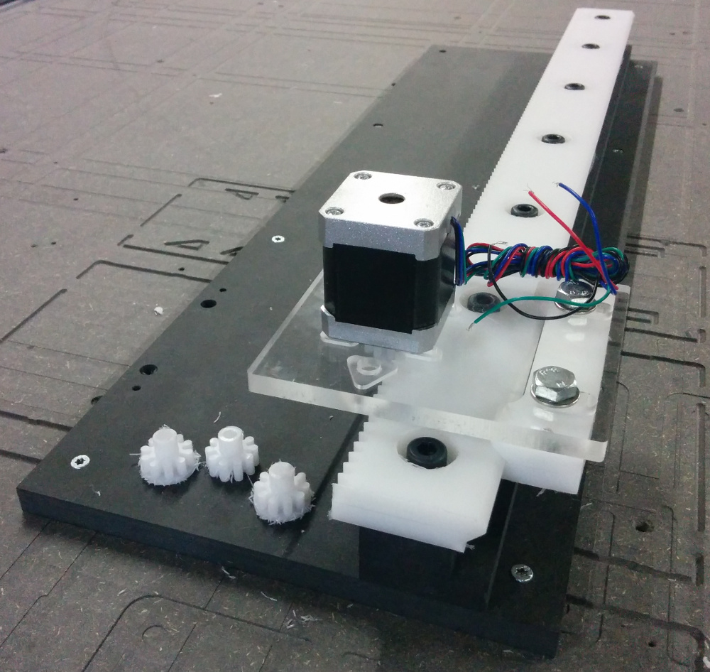

A *fabricatable machine* is a computer-controlled fabrication machine that can be made using a standard set of existing computer-controlled machines; with minimal use of speciality parts, processes or skills.
The type of machines include CNC-milling, lasercutter, and 3d-printers.

To develop a complete inventory of fabricatable machines is a goal of the [Fablab Network](http://fablabs.io/), as part of the "FAB2.0" concept. Together we aim to build the first self-fabricated Fablab during the [FAB12 conference](http://fab12.fabevent.org/).

# Simple gantry

A linear actuator designed to be fabricated in a Fablab, to the desired length/resolution/size.
It can be used to build custom digital fabrication machines, from laserengraving to light-duty milling.
Initial prototype is for a gantry-based vinyl/laser-cutter. Video from fabricating the first gantry rig [here](https://youtu.be/k9ujdUikcWI)

## Status

**Prototyping in progress**

## Core principles

* Using a birdbeak bit to make V-profiles, both inner and outer.
* Using technical low-friction plastics (UHWMPE/POM) motion/contact parts
* Assembling and contining to machine the axes on the CNC itself

## TODO

Basics

* Come up with a better name. birdbeak? V?
* Upload pictures/results of initial tests to Github repo

Full-machine test

* Design & Fabricate Y axis
* Fabricate a pair of X-axes
* Test using 12mm PolyEthylene (UHMW?)
* Make a Z-carriage, with end-effector attachment
* Attach a laser diode, run tests

FAB12 workshop

* Create a manufacturing plan (which parts when)
* Create a workshop plan (scope, participant involvment)
* Polish documentation in Github repo
* Do it!

Bonus

* Also fabricate a V-wheel for 608 bearing using birdbeak
* Research possible cross-pollination with [TapeXY](https://github.com/jonnor/projects/tree/master/reprapping#tapexy)

# Motivation

Enables individuals and communities to build their own production machines, to expand their own capabilities. Build more machines to increase production, build cheaper to increase availability, or build specialized machines tailored for specific purposes.

A similar project is [Reprap](http://reprap.org/), which focuses on FDM 3d-printers, but has the additional constraint of self-replication: that the individual machine can make itself.
