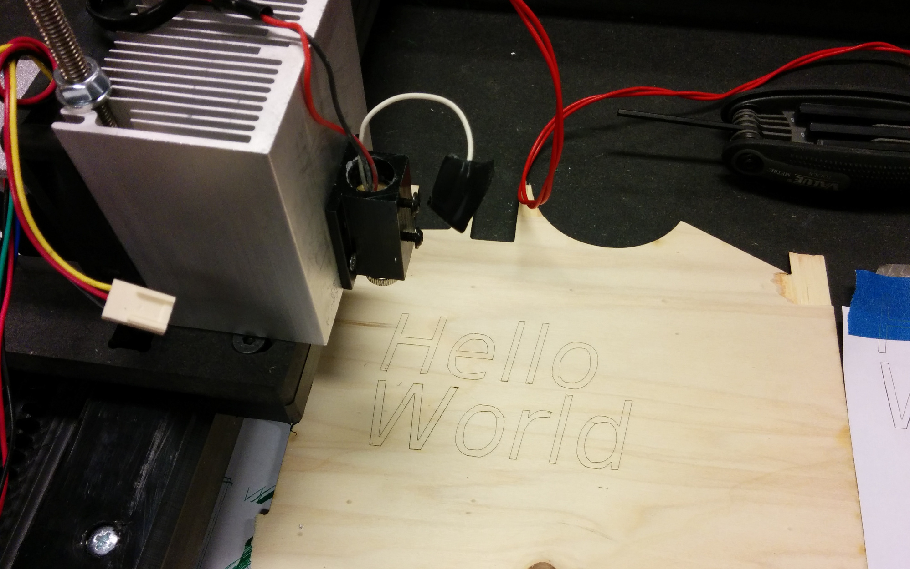
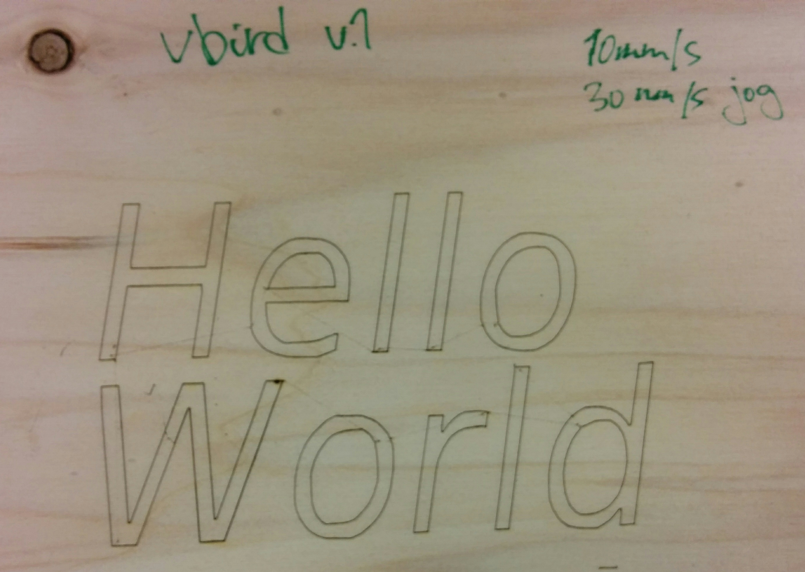

A *fabricatable machine* is a computer-controlled fabrication machine that can be made using a standard set of existing computer-controlled machines; with minimal use of speciality parts, processes or skills.
The type of machines include CNC-milling, lasercutter, and 3d-printers.

To develop a complete inventory of fabricatable machines is a goal of the [Fablab Network](http://fablabs.io/), as part of the "FAB2.0" concept. Together we aim to build the first self-fabricated Fablab during the [FAB12 conference](http://fab12.fabevent.org/).

# Simple gantry

A linear actuator designed to be fabricated in a Fablab, to the desired length/resolution/size.
It can be used to build custom digital fabrication machines, from laserengraving to light-duty milling.
Initial prototype is for a gantry-based vinyl/laser-cutter. Video from fabricating the first gantry rig [here](https://youtu.be/k9ujdUikcWI)

Working title: "Vbird", after the V-rails and birdbeak cutting steel used.

## Status

**Prototyping in progress**

## Core principles

* Using a birdbeak bit to make V-profiles, both inner and outer.
* Using technical low-friction plastics (UHWMPE/POM) motion/contact parts
* Assembling and contining to machine the axes on the CNC itself

## TODO

FAB12 workshop

* Maybe design in some connecting-geometry, so axes can be connected together/to framing to make machine
* Create a manufacturing plan (which parts when)
* Create a workshop plan (scope, participant involvment)
* Polish documentation in Github repo
* Do dry-run on site in China
* Do it!

Laserengraver full-machine test

* Test using [LaserWeb](https://github.com/openhardwarecoza/LaserWeb3) to control machine.
Hopefully can be done with Marlin or Grbl backend?

Bonus

* Add a pen-plotter/vinyl-cutter attachment, using servo
* Also fabricate a V-wheel for 608 bearing using birdbeak
* Research possible cross-pollination with [TapeXY](https://github.com/jonnor/projects/tree/master/reprapping#tapexy)

## Roadmap

* (current phase) Validate usage as a lasercutter/vinylcutter
* Make it work as a CNC mill
* Prototype making its own parts.
Especially consumable, like the pinion/slides
* Make an axis that is longer than the workarea
* Reproduce a new machine fully

## Motivation

Enables individuals and communities to build their own production machines, to expand their own capabilities. Build more machines to increase production, build cheaper to increase availability, or build specialized machines tailored for specific purposes.

A similar project is [Reprap](http://reprap.org/), which focuses on FDM 3d-printers, but has the additional constraint of self-replication: that the individual machine can make itself.

## Tests

Laserengraving

* 10mm/s workspeed, 20 mm/s jog, 0.9 Amps laser power.
* Gcode generated by Cura, from a STL.
* No software control of the laserdiode (manually turned on off)
* Some of the bad lines are actually due to the poor quality font rendering
* At this speed will also (generally) cut through standard white printer paper

## Resources

Open source lasercutting software

* http://www.shapeoko.com/wiki/index.php/Laser_Cutter
* http://www.shapeoko.com/wiki/index.php/CAM#2D_.28Laser_or_plasma_machines.29
* https://hackaday.io/project/4828-raster-2-laser-gcode-generator

