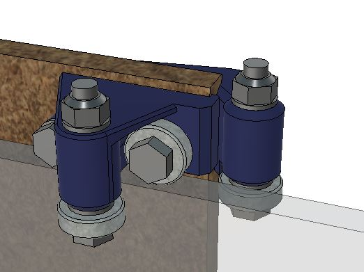

# Bootstrap CNC mill
Made with a 3D printer, a laser cutter and a plywood saw.

*Full sheet CNC milling machine, work area 2,6*1,2m*

## BOM
* 12 mm Plywood rails, 99% straight cuts. Glue and nailgun assembly. Use 8mm for structural parts = lighter = faster.
* Integrated stepper motors 3Nm
* Hrbl controller
* Laser cut plastic racks
* 3D printed pinion Ø6mm teeth
* 48 of type 608 bearings mounted on 3D printed simple holders
* M8 Hex head screws, washers and locknuts (Some M5 will also be needed)

# Files

[Full size Fusion360 model (no rollers)](https://a360.co/33g6WgV)

## Images

* [images](img/)

## Roller holders

Most tuning is made by changing shims. Locknuts are important, the wood and plastic will not withstand full M8 pretension = would come loose. The wood will shrink and the plastic creep so some tuning will have to be done after a while but hopefully it wil be very robust.

[Fusion360 link](https://a360.co/2pHU1Xv) (Fully jointed)

## Performance

Errors under 1 mm should be very realistic, errors under 0,5mm is optimistic.
