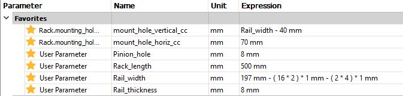
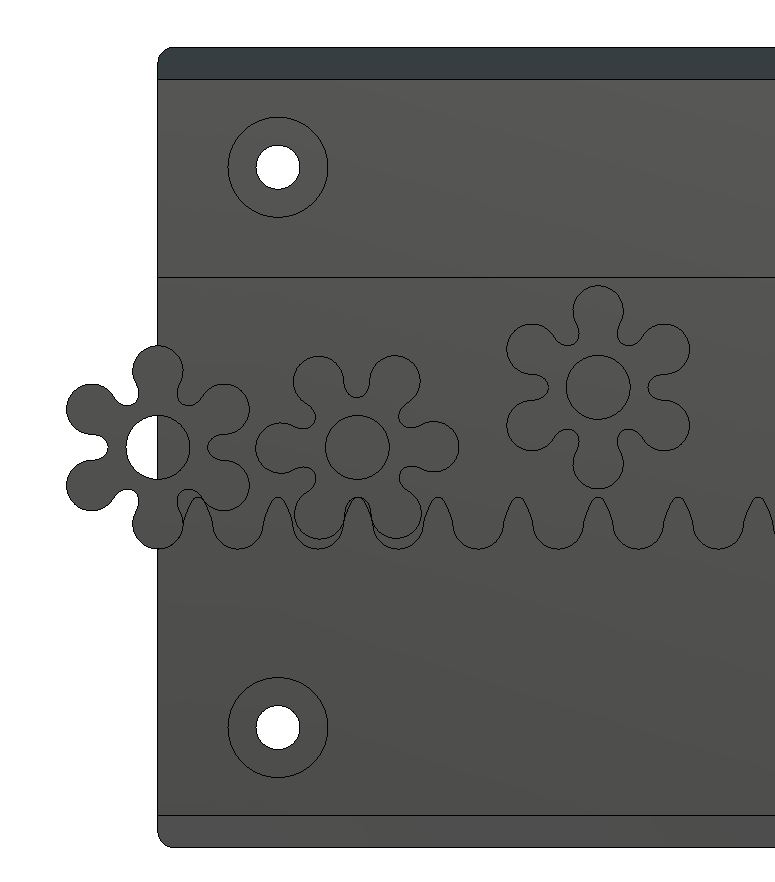
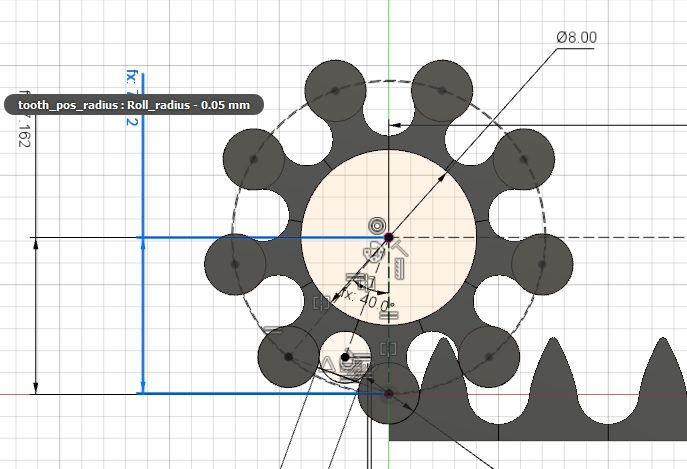

# Rack and Pinion for Fusion360 

## 14.02.2018 UPDATE: Fully parametric version of the rail

Fully parametric model of the rail with rack for fusion360. Drop it into your model and break the link and it will be added to your timeline. All parameters will be imported.

The rack clearance is wide enought so that the pinion clears the rack teeth when adjusting the glide blocks.
I have removed the air gap between the pinion and the tip of the rack teeth. Note that this only changes the pinion geometry. 

## Previous versions:

Standard settings:
* "Standard" 45 mm / revolution pinion 
* Needs a 2 mm mill to machine.

It is Fully parametric and jointed. Use the Master Dimensions sketch to change the control dimensions or how they are calculated.
You can also control it from the parameters window.

To be able to mill the rack with a larger diameter milling bit, experiment with increasing the 
tooth_pos_radius parameter. It needs to be smaller than the main "rolling radius" so I have set it up so that the offset can be tuned.

