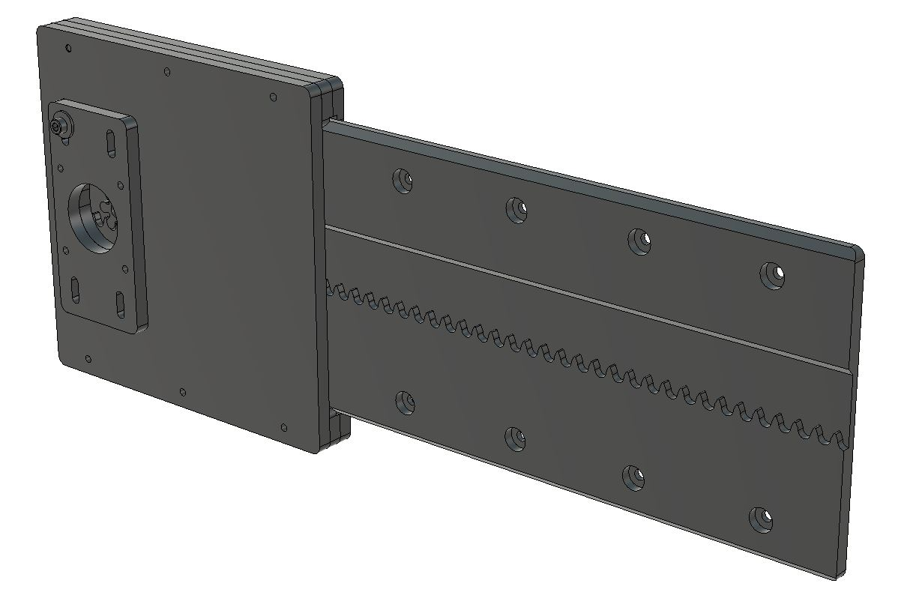

# Rack and Pinion for Fusion360 

## 18.02.2018 Update: Parametric version of the axis
Parametric model of a axis fusion360. Drop it into your model and break the link and it will be added to your timeline. All parameters will be imported.

Designed for 8 mm thick stock for all parts.

The rack clearance is wide enought so that the pinion clears the rack teeth when adjusting the glide blocks.

## Previous versions:

Standard settings:
* "Standard" 45 mm / revolution pinion 
* Needs a 2 mm mill to machine.

It is Fully parametric and jointed. Use the Master Dimensions sketch to change the control dimensions or how they are calculated.
You can also control it from the parameters window.

To be able to mill the rack with a larger diameter milling bit, experiment with increasing the 
tooth_pos_radius parameter. It needs to be smaller than the main "rolling radius" so I have set it up so that the offset can be tuned.

