# Hattori - Small format CNC Mill and 3D printer
*July-September 2017, designed by Jens Dyvik. Contributions by Torbjørn Nordvik Helgesen, Charlie Banthorpe, Jakob Nilsson and Erling Knudsen*

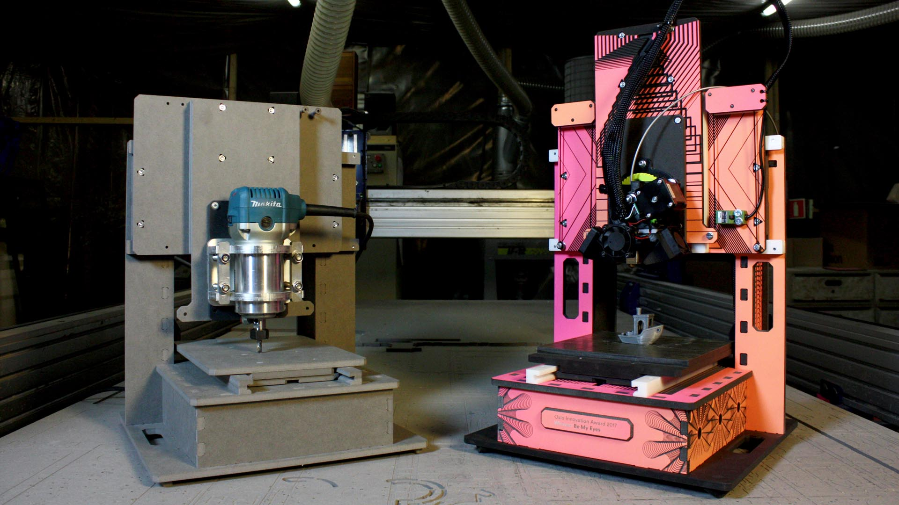
*CNC mill version on the left, 3D printer version on the right*

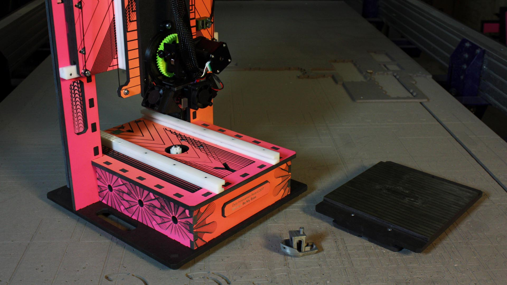
*The chamfer rail axis system makes hot-swapping the machine bed and z-axis easy

* A solid, small-format desktop CNC platform for CNC milling and 3D printing
* Fabricatable with a CNC mill
* Uses the [Chamfer Rail](https://github.com/fellesverkstedet/fabricatable-machines-archive/tree/master/chamferrail) system
* Current version has a 200mm x 300mm x 120mm work volume
* Each axis is identical and can be made from from 130mm x 8mm aluminium flat bar or HDF sheet (reduced from 10mm) 
* Hot-swappable build platform and end-effectors for quick job processing or transition between milling and 3D-printing

**Design wins**
* Identical axes types for X, Y and Z makes part removal, fixturing and mash-ups easy
* Having two out three motors static allows for very snappy performance
* The machine base is very sturdy
* The HDF wood base is strong enough for most applications, but can be substituted with an aluminium base for hardcore tasks
* Making the chamfer rail from HDF (valchromat) instead of aluminium gives sufficient performance for 3D printing and light milling
* Overall part count is very low
* The parts are easy to fabricate
* The machine is easy to assemble
* Split chamfer rails solves POM warping and scraping challenge dicovered with [Hank - medium format CNC mill](../hank-medium-format-cnc)
* Works with regular nema 17 motors (nema 23 reccomended for tighter axis tuning and higher performance)
* Using a temporary CNC spindle to surface a 3D printer bed before applying a PEI sheet works great
* The Aluminium and POM version is able to mill mild steel using trochoidal milling techniques!	

**Design fails**
* The plain bearing "chamfer rail" glideblocks had too much friction, making the steppers not reach their postion due to stepper "springiness"
* Chamfer rail was hard to tune
* The split chamfer rail parts required semi complex cnc machining operations
* Drilling and tapping in aluminium adds a lot of assembly time (though an HDF base glued with wood glue is a great allrounder)
* Integrating a versatile electronics enclousere is half solved (ihss57 motors with integrated drivers seem promising for reducing enclosure volume and cable mangement)
* Spring or elastic band gravity assist on Z-axis is half solved (the goal is to have an automatable swap system of Z-axis)
* Cable management and filament hooks/guides is half solved

### Hattoris in the wild
* Hattori 1, by Jens Dyvik. Now at bitraf in Oslo, Norway
* Hattori 2, by Torbjørn Nordvik Helgesen. Work in progrees CNC mill for Kuben upper secondary school
* Hattori 3, by Torbjørn Nordvik Helgesen. Work in progrees CNC mill for commercial client
* Hattori A.P.E (Award Printer Edition), by Jens Dyvik, Jakob Nilsson and Erling Knudsen. Trophy for Oslo Innovation Award 2017. Now in Copenhagen, Denmark
* Hattori 5, by Jens Dyvik and Nadya Peek. Work in progress heavy duty 3D printer

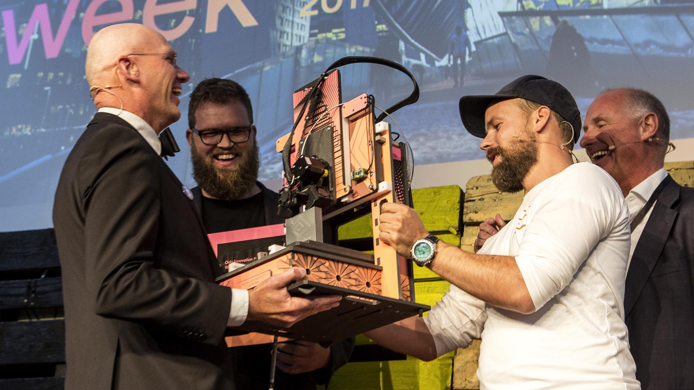
*Winners of Oslo Innovation Award 2017 reciveing their Hattori A.P.E*

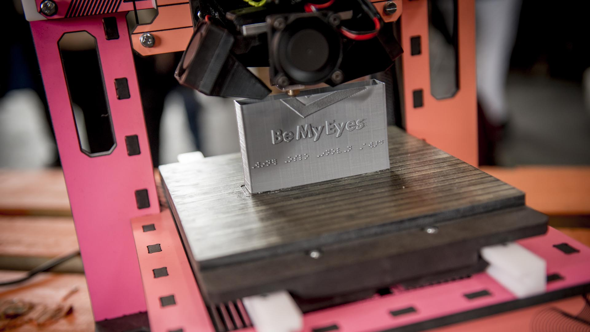
*The winners have developed "Be my eyes" an app that connects blind people and volunteers. So their trophy was set to print another trophy with braille text*

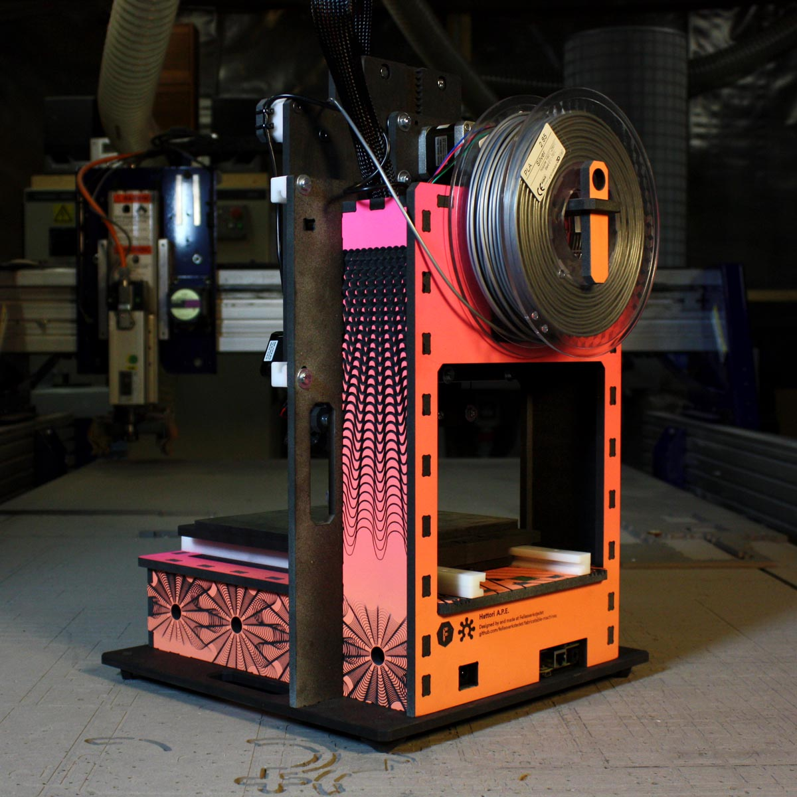
*Filament roll, electronics, motors, proximity switches and cable harness are all integrated*

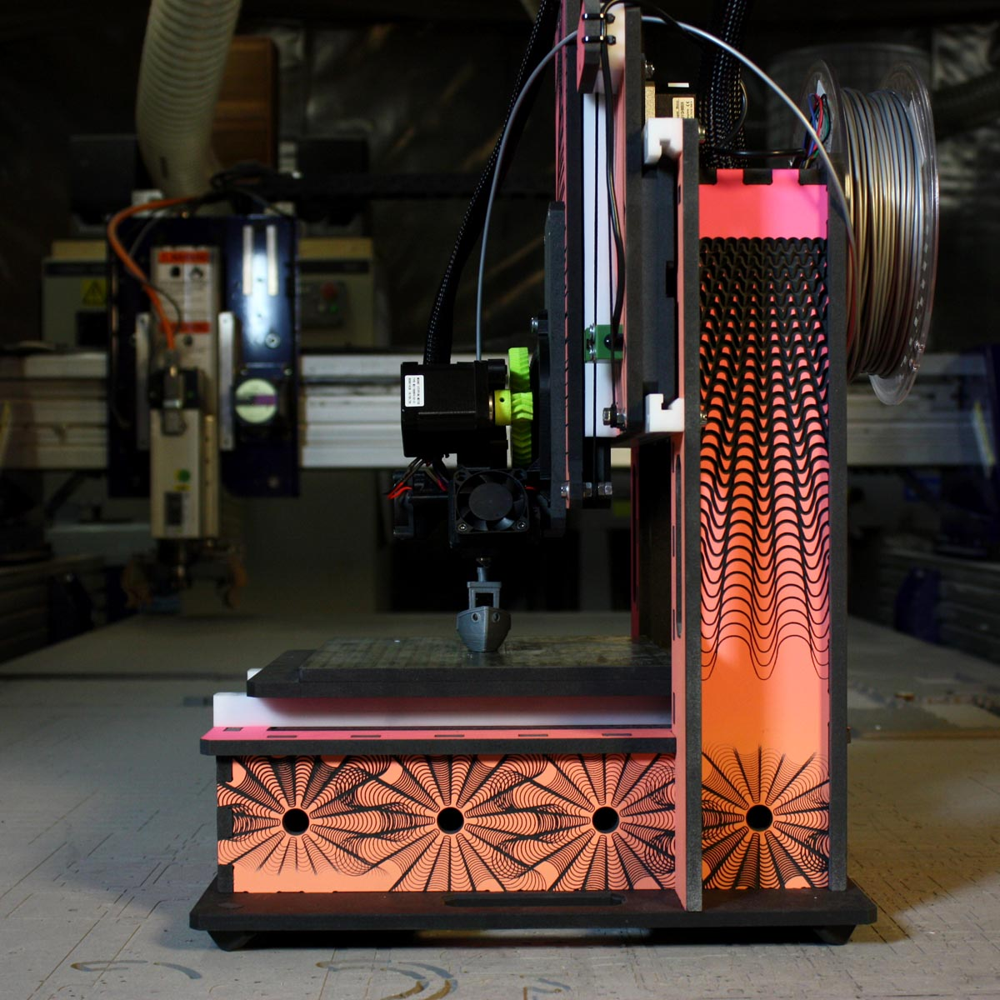
*Custom grahics by Erling Knudsen. 3D v-bit engraving on valchromat screenprinted with a gradient matching the OIW 2017 profile*

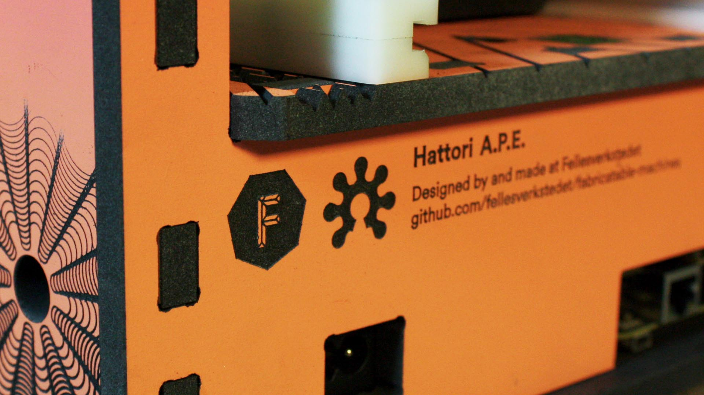
*The open source hardware logo has been hacked to match the chamfer rail roller pinion*

*Label with intructions for the winner of the 2017 Oslo Innovatoin Award*

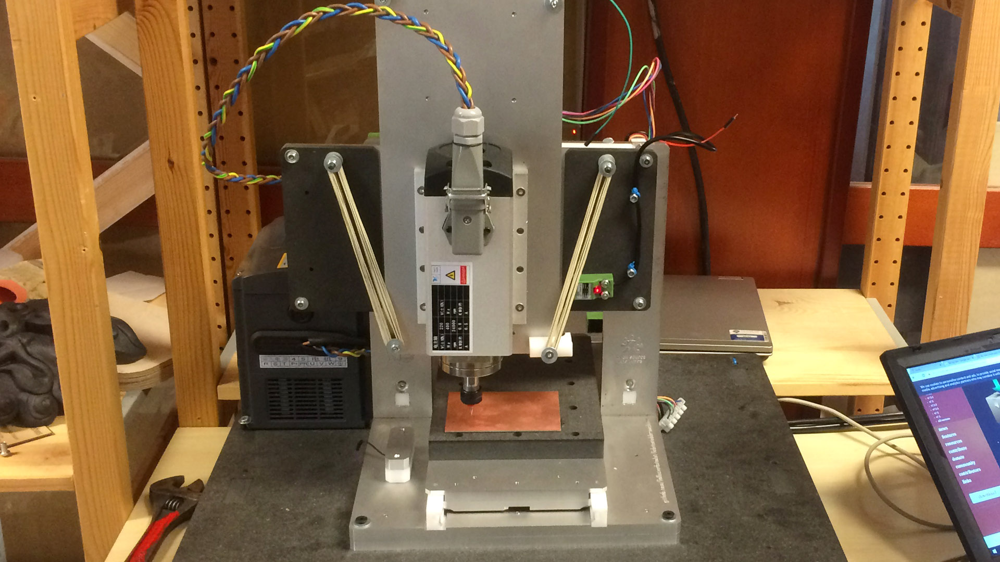
*Hattori CNC mill version making first PCB test*

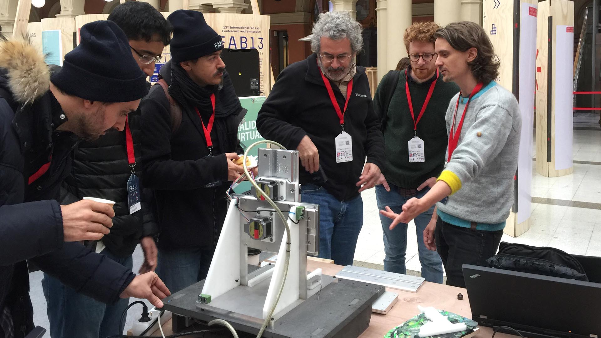
*Hattori at FAB13 in Santiago, Chile*

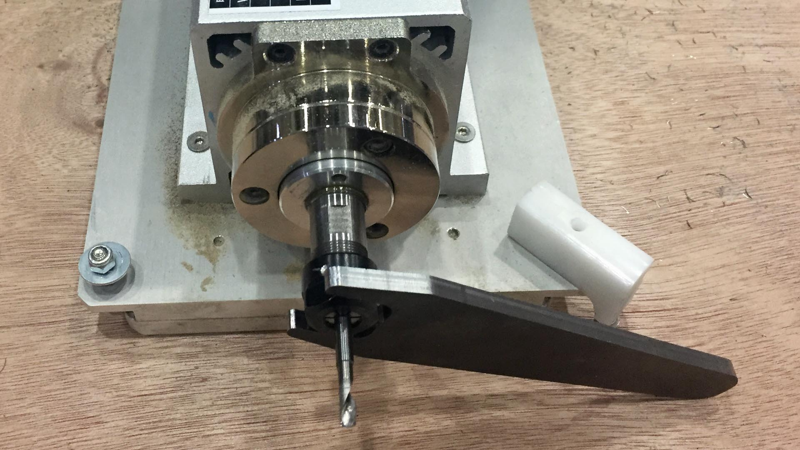
*Z axis and spindle with a steel spanner milled by Hattori. Trochoidal milling with Bark Beetle in 5mm mild steel*

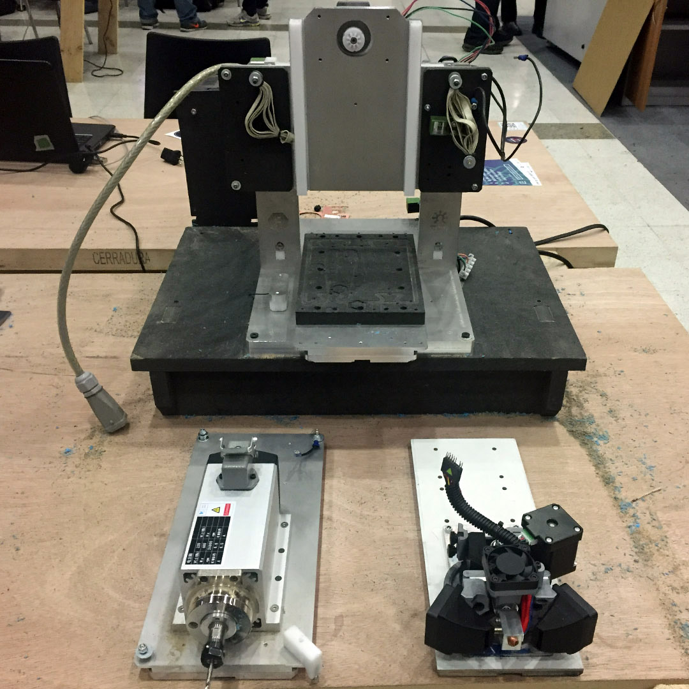
*First self replication test. A new Z axis milled from two parts*

### To do _(Edit: we will no longer do, but could have been done_
* Test UHMW tape on HDF and Aluminium glide blocks
* Update base design to play nice with larger motors like ihss57
* Update CAD files in repo
* Make how to build guide (work in progress [here](http://www.thnordvik.com/hattori-mucj))
* Make bill Of Materials (BOM)
* Develop safey enclosure
* Test saddle type elastic band for Z axis power out assist
* Ass handle to build plate axis for easier hot swap
* Make larger adjustment holes for glide blocks to allow
* Make longer, better umbilical cord. make it possible to use machine with bottom plate detached?
* Find a easy way to maount the umbilical cord to the base plate
* Add horns to X axis front plate for filament leading and homing?
* Add mounting hoels for proximity switches to CAD model
* Remove wedge lock from main design?
* Solve fileament roll squaek - bigger fillet?

### Version history

#### [Hattori 1](https://github.com/fellesverkstedet/fabricatable-machines/blob/master/hattori-small-format-cnc/README.md)

*Small format CNC mill, fast and furious. Desined and fabricated by Jens Dyvik*

#### [Hattori 2](https://github.com/fellesverkstedet/fabricatable-machines/tree/master/hattori-small-format-cnc/README.md)

*A modified extended version with a larger work are and all aluminum frame by Tobjørn Nordvik Helgesen*

#### [Hattori 3](https://github.com/fellesverkstedet/fabricatable-machines/tree/master/hattori-small-format-cnc/README.md)

*This 3D printer version was custom made as a trophy for Oslo Innovation Award. All the axes and racks were milled from high quality black mdf. Super cheap and super fast to fabricate! By Jens Dvvik, Jakob Nilsson and Erling Knutsen*

#### [Hattori 4](https://github.com/fellesverkstedet/fabricatable-machines/tree/master/hattori-small-format-cnc/README.md)

*A beefed up version that can mill upside down and is suitable for educational environments, by Tobjørn Nordvik Helgesen*

### Development log

*3D-Printer / CNC Mill array concept sketch*

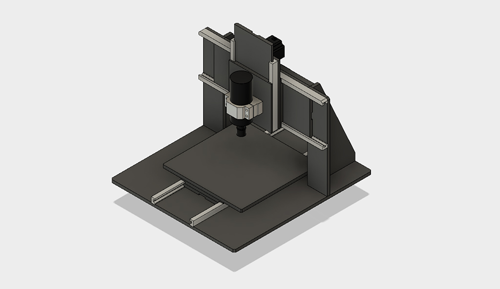
*Hattori-280 development sketch*

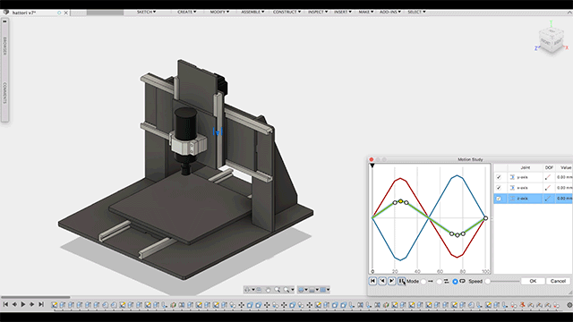 
*Kinematic motion study of all axes in Fusion 360*

View Charile Banthorpes iteration in the browser [here](http://a360.co/2q95BZO)

**
