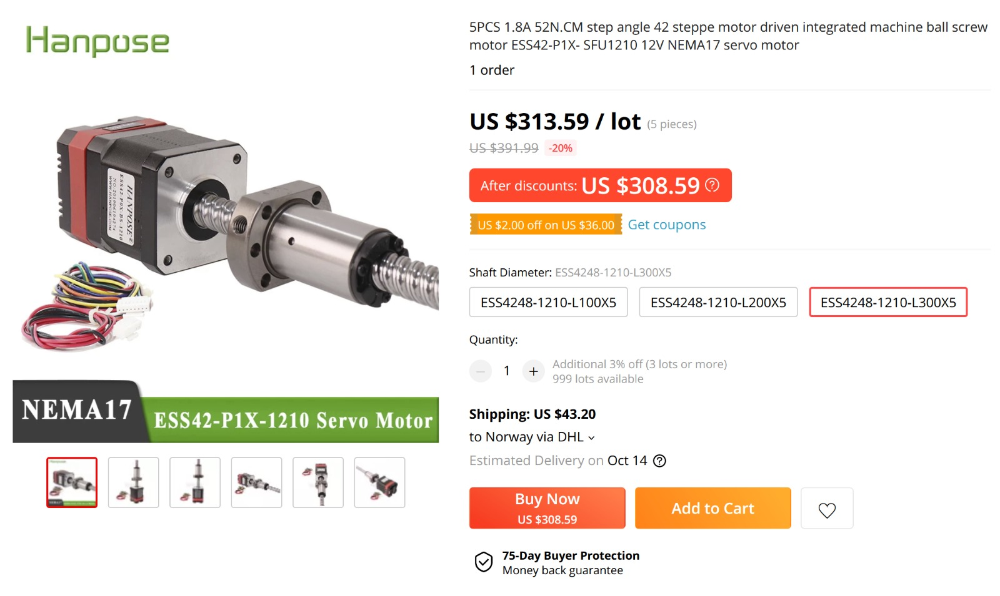
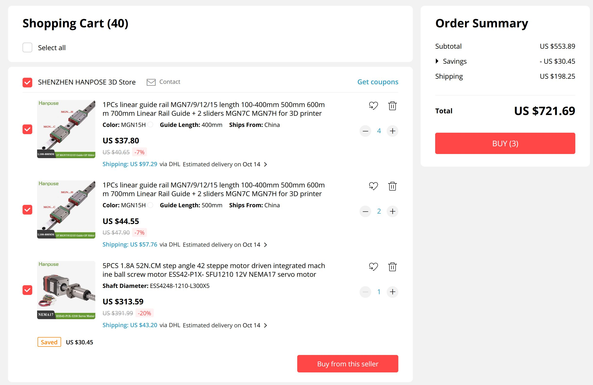
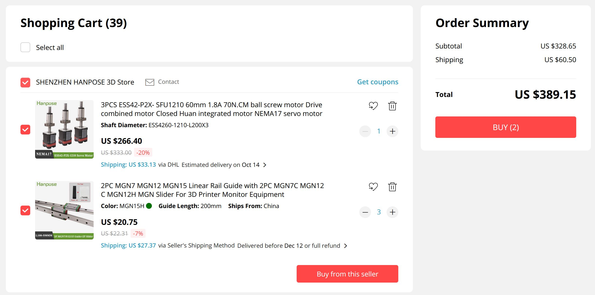

# Hattorini or Hattori 2.0
*by Jens Dyvik. Project state October 2021: Ideas and sketching*

A small agile CNC platform for fast milling or 3D printing. The enclosure might be embedded in machine frame.

### Ideas for components:

 - Closed loop motors with integrated ballscrews: https://www.aliexpress.com/item/4000863514803.html?spm=a2g0o.cart.0.0.5c453c00d6vyRf&mp=1
 - Rails MGN15H: https://www.aliexpress.com/item/4000804416698.html?spm=a2g0o.cart.0.0.5c453c00d6vyRf&mp=1
 

 

*Option for a prusa style architecture with lots rigidity. Dual motors on Y and Z, and 4 blocks per axis*
 

*More frugal option for classic CMC architecture, with one motor per axis and 2 blocks per rail*
 
 Alternative:
 
  - Jens's super DIY autotune axis: https://fab.cba.mit.edu/classes/865.21/people/jensdyvik/h-axis-flexure.html

Ballscrew pitch seems to be 5mm. This gives a 7:1 gearing ratio in comparison with . Quite suitable for milling applications .

### Ideas for enclosure

 - Formica compact 12mm - phenoilc resin and paper composite sheet. Very fast to mill, but stiff and waterproof.