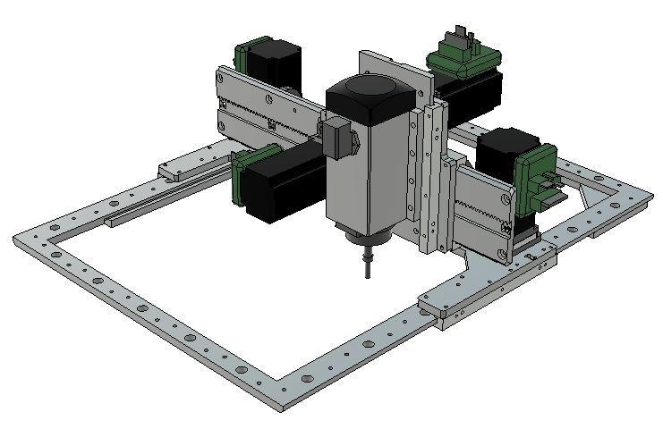
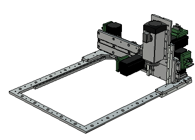

# HECTOR - Medium sized CNC machine

AIMATION

HECTOR was initially a 2017 fab academy final project. 

## Files ##

In this folder you will find .f3d fusion360 files, .step files and .pdf and eagle .sch schematics of the cable harness.

## About ##

[Here is the full fab academy documentation.](http://archive.fabacademy.org/archives/2017/fablabverket/students/100/web/projects/diy_cnc/index.html)

In 2018 it got an upgrade with [nema24 integrated closed loop stepper motors](https://www.aliexpress.com/item/NEMA24-3Nm-425oz-in-Integrated-Closed-Loop-Stepper-motor-with-driver-36VDC-JMC-iHSS60-36-30/32822797339.html) which made it more reliable and simplified its electonics.

HECTOR on the fab14 conference in Toulose France.

## Performance ##

HECTOR has mostly been used as a "show-bot" but the testing indicated that the precision is +/- 0.2 mm on the X axis and +/- 0.05 on the Y axis (the longer one with two motors). The reason for the higher performance in Y direction is belived to be because of the higher friction generated by the weight resting on the chamfer of the X axis, on the Y axis the load is supported on the flat side of the chamfer.

## Recommended upgrade ## 

For an even higher precision in X-direction and easier machining, consider removing the chamfer on the edge of the rails and develop "square glide blocks". This is not yet tested but we have high hopes for high performance on medium load. For high load, please consider the roller-axis solutuion instead.

See rectangle-rail files here:

[Square glide blocks model files](https://github.com/fellesverkstedet/fabricatable-machines/tree/master/chamferrail/new-dev-files)

