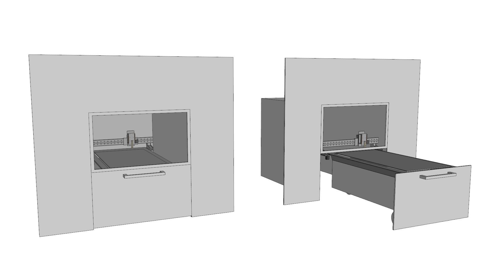

# Hemoglobe - 2x1m Plasma cutter

*Early sketch showing the drawer principle. For convenient loading/unloading in combination with high level safety*

A plasma cutter with a 2m x 1m work area. Based on the gantry design from on [Humphrey](https://github.com/fellesverkstedet/fabricatable-machines/blob/master/humphrey-large-format-cnc/README.md) and [Humphrito](https://github.com/fellesverkstedet/fabricatable-machines/blob/master/humphrito-medium-format-cnc/README.md), using the [chamfer rail]() axis system.

### Status

*Currently researching, not yet designed or tested*

# BOM
*Bill of materials*

### Plasma source
* Hyperherm Powermax45 XP - seems to be the most suiabtle device for a low cost plasma cutter in a public workshop
* Machine torch, short type - for convenient mounting on the Z axis
* Consumables for machine torch - these wear out and there are differnt kinds for cutting and marking
* Machine cpc interface cable - for automatic start/stop
* Machine serial interface cable - for automtic adjustment of amp output
* Air compressor with sufficient capacity
* Tubing for compressed air
* Air filter - it is important that moisture and oil is removed from the compressed air before it enters the Powermax45 XP plasma device

### Safety equipment
* Tinted glasses, helmet or film on safety window needed - to avoid eye damge from looking at the plasma arc
* Extraction and filter - vey important for health and safety
* Ducting for extracion

### Saferty electronics
* Contactor threephase - for controlling power to the Powermax45 XP
* Contactor single phase - for controlling power to the 36v power supply
* Sensor for drawerbed
* Sensor for window
* Safety brain - for ensuring that the machine only can operate when the drawerbed and window is closed
* Reset and e-stop button - for controlling power to the machine

### Electronics
* Proma MyPlasm THC - a torch height controller that overides the Z axis with step and direction commands *(seems to be a good low cost solution for THC)*
* 4 x JMC Ihss57 closed loop stepper motor - great value for money motors with integrated drivers
* Extra motor for tint window? Or brigth illumination inside?
* 36v Power supply for JMC stepper motors and MyPlasm THC - amp capacity is currently unknown
* Control board - Arduino UNO with GRBL or Replicape
* Power cables
* Signal cables 
* End stops?
* CAM computer - to make jobs
* Machine control computer or rasberry pi
* On/off switch?

### Materials
* Aluminium 8mm - for axes plates and bushings?
* Steel flatbar 8mm - for axes?
* Brass strip 5mm - For rack?
* Steel plate 3mm - for machine bed?
* POM plastic 12mm - for milling the pinions
* Material for bearing covers?
* Material for axis wiping?

# General hardware
* 608 bearings - for rolling on the axes surface
* M5 bolts
* M5 nuts
* M5 whashers
* Electronics cabinet - for housing the electronics
* Din rail 35mm
* Wheels - for drawerbed to roll in and out

# Software

### Tools need to fab

* Large format milling machine *for instance fab lab standard shopbot* - to fabricate the machine parts
* M5 tapping tool and taps - to make threads in the holes
* Screw driver/drill - to mount materials in the milling machine and predrill horizontl holes for tapping
* Wrenches - to tightening all the nuts and bolts during assembly

### Research links and thoughts

Good info on eye safety for cnc plasma
http://www.esabna.com/us/en/education/blog/what-eye-protection-is-required-for-cnc-plasma-cutting.cfm

Good guide to building a plasma and running it with LinuxCNC
http://wiki.linuxcnc.org/cgi-bin/wiki.pl?GantryPlasmaMachine

Guide to upgrading torch height controller
https://www.rs-online.com/designspark/upgrading-a-cnc-plasma-cutting-machine-part-4

Good info on the challenges of a THC
http://www.cnczone.com/forums/torchmate/143250-cnc-software-2.html
Copied and pasted repsonse on THC:
1. Accurately sense the surface of the plate with varying conditions such as; thin, flexible sheets; dirty rusty painted or submerged materials, etc, for determining a zero (plate surface) point.
2. Ability to quickly retract to proper pierce height before firing the torch.
3. Ability to index down to proper cut height after the pierce is complete...while still on the lead in kerf.
4. Ability to be switched to arc voltage feedback control after x and y motion accelerates to proper speed.
5. Ability to freeze in x-y slowdown situations (holes, fine features, sharp corners, etc.)
6. Ability to sense kerf crossings and end of cut slowdowns to prevent torch diving.
7. Ability to auto compensate for electrode wear (arc voltage increase) over the life of a set of consumables)
8. Ability to be automated (all settings for different power and different materials automated.....so THC is almost transparent to operator)
9. Collision avoidance (THC knows when to retract between cuts...and when it is not necessary to save time).

About toolpaths and CAM
Plasma toolpaths should be in "climb" direction
https://www.youtube.com/watch?v=LvIpgBNyXBs	

Off the shelf polish THC:
http://proma-elektronika.com/index.php/en/products/thc-torch-height-control/compact-thc-sd

Disucussion about Powermax 45 vs 65. Duty cycle on powermax 45 seems to be no problem
http://www.plasmaspider.com/viewtopic.php?f=60&t=23560&p=145508&hilit=duty+cycle#p145508

Machines running on 608 bearings:

* http://precisionplasmallc.com/ DIY kit
* Torchmate 2x4 and 2x2

Remember short machine torch.
Power use single phase vs threephase?
Which consumables? Shielded 40, shielded 30, fine cut?

