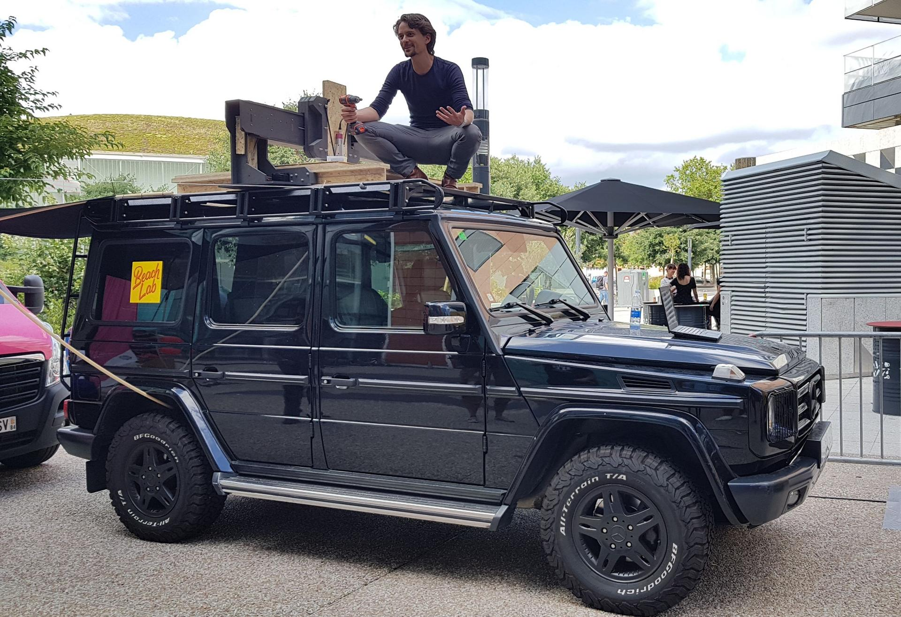
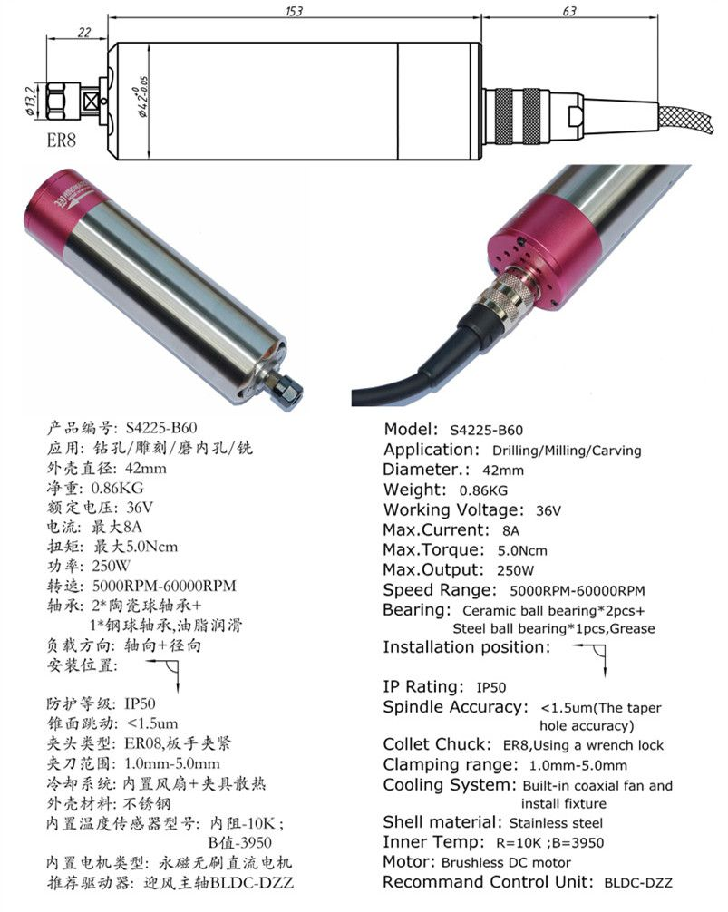
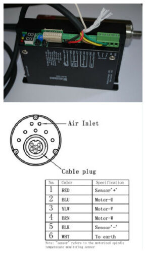
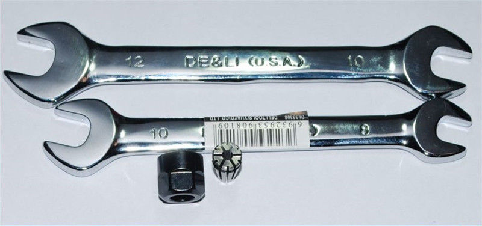
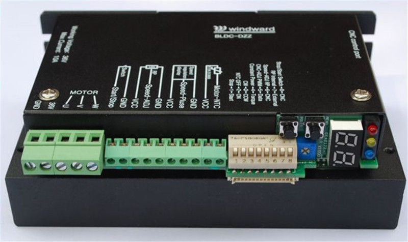
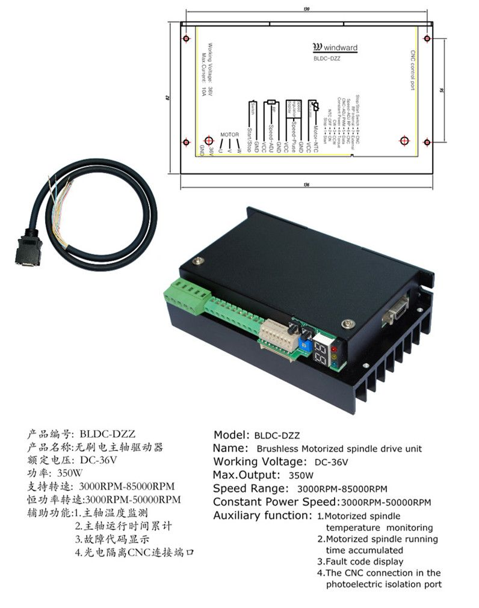
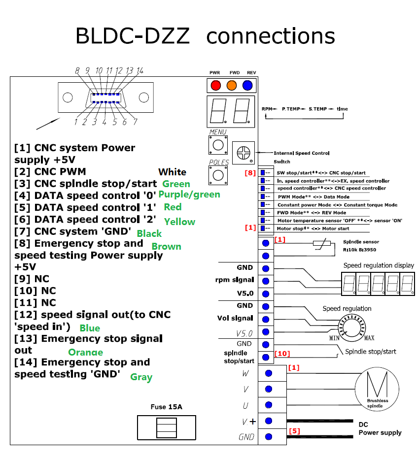
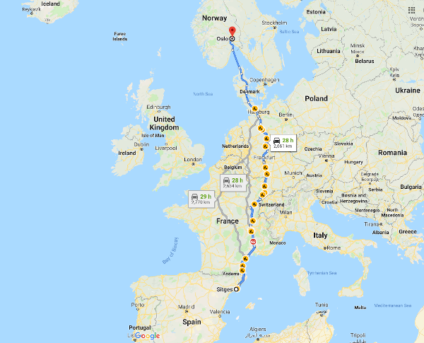

# Highway - mobile large format CNC mill

*August 2018*

Warning this is a WIP (Work in progress) documentation.

## Story

During Fab14 in Tolousse (France) Jens Dyvik and his fabricatable machines team and Fran from [The Beach Lab](https://github.com/thebeachlab) decided to assemble a full size CNC machine on the roof of a Mercedes G wagon. The idea was successfully prototyped using a [Humphrey](https://github.com/fellesverkstedet/fabricatable-machines/tree/master/humphrey-large-format-cnc) version.

Prof. Neil Gershenfeld from the Center for Bits and Atoms at MIT sponsored the parts under the condition of controlling it with a networked interface.

## Needs and challenges

- Highway will be aerodynamic
- Highway will be waterproof
- Highway will be light
- Highway will be black
- Highway will have a low height profile
- Highway will be controlled in a network array by [`mods`](https://github.com/fabfoundation/mods) (CBA requirement)

## Roadmap, deadlines and Milestones

- [ ] Fully disassemble Humphrey. September 2019
- [ ] Build Highway MK I. December 2019
- [ ] Build Highway MK II. April 2020

## Disassembling Humphrey (Highway MK 0)

While Humphrey was a great proof of concept of Highway, I need to dissasemble it to get the electronics and mechanical parts. It is too heavy, too tall and un-aerodynamic to be permanently assembled in a vehicle.

### Spindle

The spindle is a Windward S4225-B60FL8. Max 60000 rpm BLDC 36V 250W which has it's own controller Windward BLDC-DZZ. 

At the moment the spindle unit is wired in manual mode:

- Brown --> Motor U
- Green -->  Motor V
- Yellow --> Motor W
- Red (small) --> Unused
- Black (Small) --> Unused

In the spindle controller Dip-switch 1 controls the ON/OFF of the unit and the RPM are controlled with a potentiometer. This will be changed in a future iteration.

### Stepper motors

Stepper motors are powered by 36V DC and the following color code:

- PUL+ --> Blue
- PUL- --> Green (GND)
- DIR+ --> Yellow
- DIR- --> Orange (GND)

They all have the following Dip-Switch configuration:

- S1 OFF
- S2 ON
- S3 ON
- S4 OFF
- S5 OFF

Dip-Switch S6 varies with the motors (to recheck and adjust in MKI):

- XR OFF
- XL ON
- Y OFF
- Z ON

The pins on the arduino are as follow:

- Z Dir (yellow) --> D7
- Z Pul (blue) --> D4

- Y Dir (yellow) --> D5
- Y Pul (blue) --> D2

- X Dir (yellow) --> D6
- X Pul (blue) --> D3

## The making of Highway MK I

Highway MK I is a temporary iteration of the fabricatable CNC. I will use some commercial parts like an Igus linear axis and upcycle the Z axis from an old Probotix V90 CNC.

### Making the X axis

This X axis rollers use standard *skateboard bearings* type 608 (8mm bore, 22mm diameter and 7mm wide). I used FreeCAD to design the rollers and 3D printed them with an Ultimaker 2 using flexible PLA. Jens warned me about the flexibility of the roller during operation.

Dimensions of the cable carrier:

- X axis cable carrier. The X axis is 2.40 m length and the cable carrier will be 1.3 m.

### Making the Y axis

The Y axis is an Igus linear axis model 1539406 001 001

Dimensions of the cable carriers:

- Y axis cable carrier. The Y axis is 1.40m. The cable carrier will be 0.8 m.

### Making the Z axis

## The making of Highway MK II

Highway MK II will become the truly fabricatable iteration of the CNC. For that purpose a trip to Oslo will be scheduled around easter 2020 (April 5 to April 12), when there is no ice on the roads.

## Files

- [iHSS57-36-20 Stepper motor/driver datasheet (PDF)](./files/ihss-ds.pdf)
- [Windward S4225-B60FL8 Spindle manual (PDF)]()
- [Windward BLDC-DZZ Spinde controller (PDF)](./files/BLDC-DZZ-manual.pdf)
