# Hobo - Large format CNC Mill
*July 2018, by Torbjørn Nordvik Helgesen and Jens Dyvik*

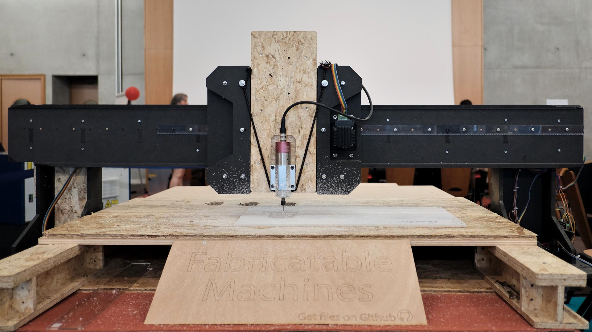
*Hobo milling PMMA at FAB14*

Hobo is a large format cnc milling machine made from 12mm wood plates. It was demoed at FAB14 and is now part of Francisco Sanchez mobile fab lab.

### Status

*No longer developed, not reccomended for reproduction. See [Humphrey](https://github.com/fellesverkstedet/fabricatable-machines/blob/master/humphrey-large-format-cnc/README.md) for our current reccomended large format machine.*

### Design wins

* Super fast to CNC mill all the parts
* Very cheap to build
* The wood construction became very rigid
* Plastic rack gave decent performance
* Registering plastic rack with wooden dowels worked great
* Joining multiple rack pieces worked great *(this made it possible to milled all the rack pieces from a single 800mm x 400mm sheet of plastic)*
* Inline skatewheels roll very smooth on plain wood v-groves
* The two-sided mounting of the wheels doubling as wheel cover worked great
* Shipping only the gantry + y beams and then fab the rest of the bed from local wood sheets worked great and is a promising way of spreading large fromat Fab 2.0 machines

### Design fails

* The rubber inline rubber skatewheels made the machine very soft and unstable. Large rubber wheels are too soft to make a decent CNC mill.
* Having only tree inline skate wheels on the X axis instead of four made the machine even less stable
* Fine tuning the position of the wheels where difficult
* Combining the mounting of the Y  otors with the upper Y wheels made it very difficult to tune with high pressure on the wheel and low pressure on the pinion

### Future plans

We will combine the wood construction principle from Hobo with the 608 bearing roller type axis on [Humphrey2](https://github.com/fellesverkstedet/fabricatable-machines/blob/master/humphrey-large-format-cnc/README.md). This should create an even cheaper machine with much higher performance.

### External documentation

* Torbjørn has written a great piece on the story of Hobo [here](http://www.thnordvik.com/touluse).
* Video of Hobo and other machines at FAB14 [here](https://youtu.be/syCI9m8QGj4)
* Video explaining the Z axis construction [here](https://youtu.be/7Ns-z3jZd3Q)

### The making of
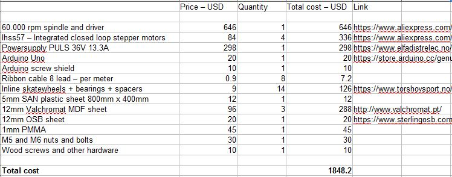
*Screenshot from the Bill of materials in the repo. If you swap the high-end spindle for a low performance DIY version you have a very cheap CNC mill*

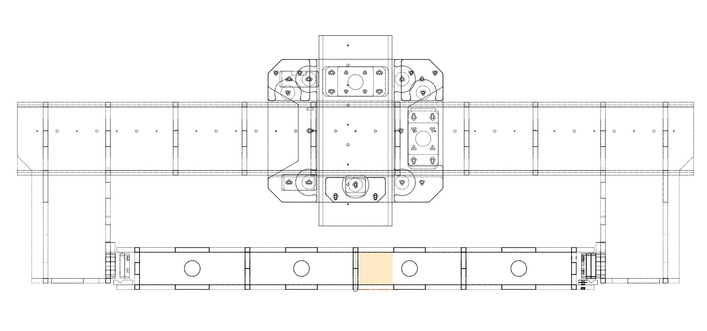
*Front view*

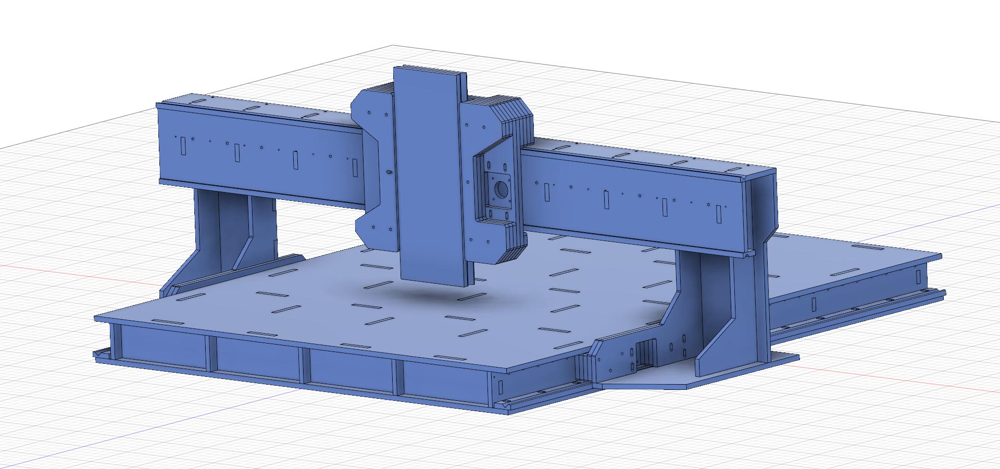
*Nice and simple*

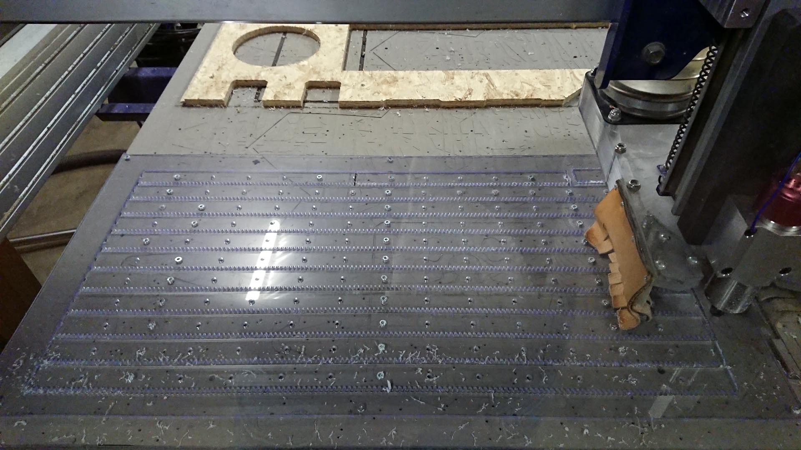
*CNC milling the rack pieces. We used too few hold down screws and skipped the wooden washers. This made the skin between the teeth disappear in some places. Note that we used the same spindle as on Hobo. Good fun to mill with 60.000 RPM*

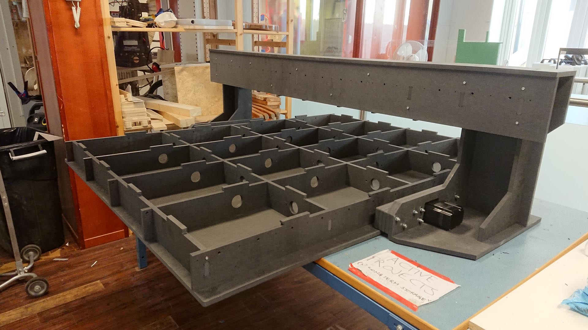
*If you dont need to transport the machine over a long distance, a torsion box bed gives high stiffness for a low cost*

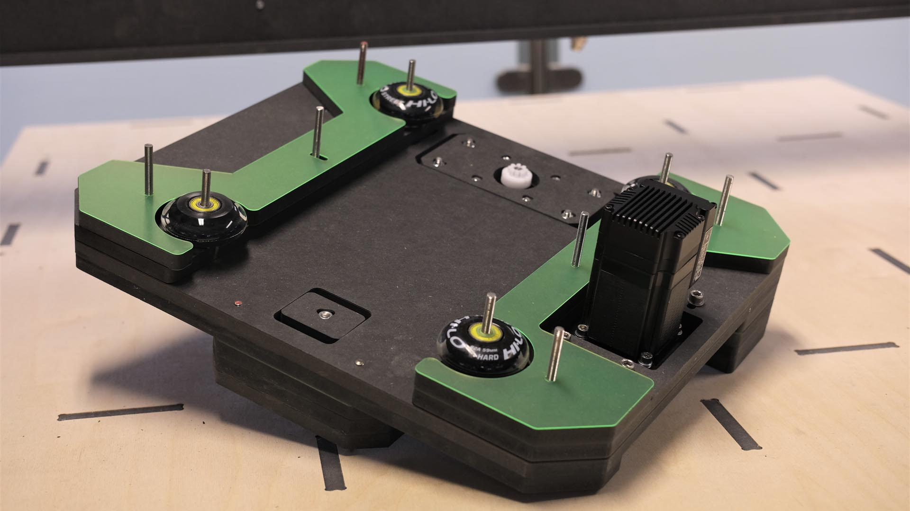
*Assembly of the XZ axis plate. The thin green plastic is to spcace out the construction. The inline skate wheels were 24mm wide, same as two 12mm thick parts, so we needed to some extra witdth to avoid having the wheel rubb against the side wall. We als added whashers between the wheel bearings and the side walls*

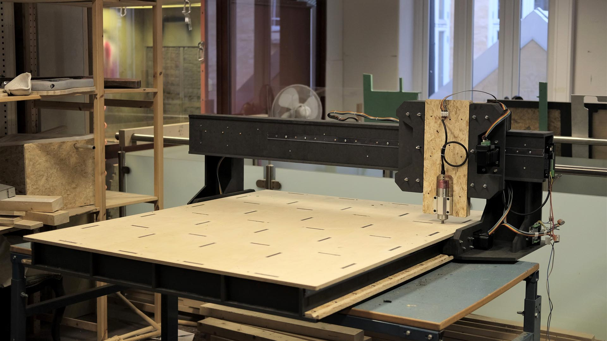
*Torsion box bed complete*

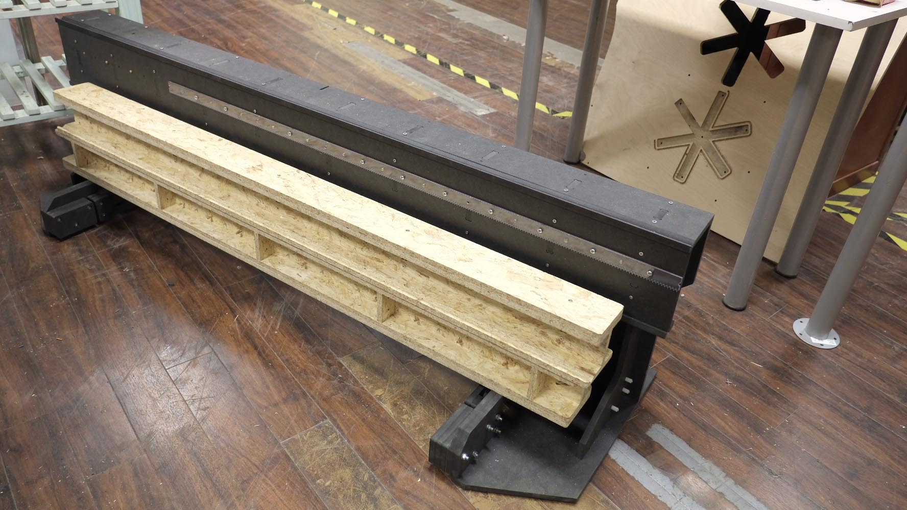
*Hobo ready to fly to France. Note the two Y beans as an alternative to bring the entire torsion box machine bed. Great success*

*All the parts at the FAB14 conference venue*

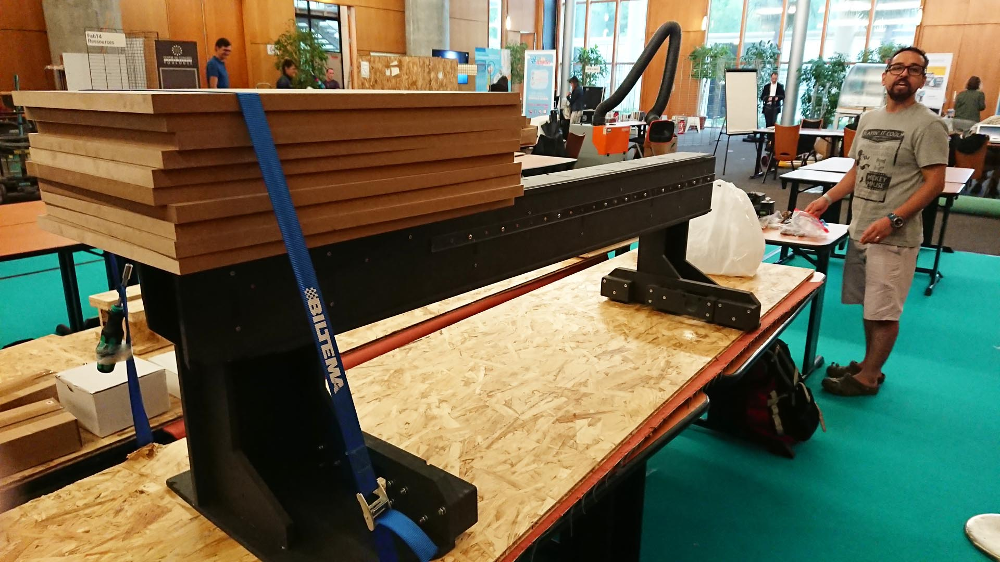
*One of the gantry feet broke off during in transit. But wood is easy to glue and repair. No stress*

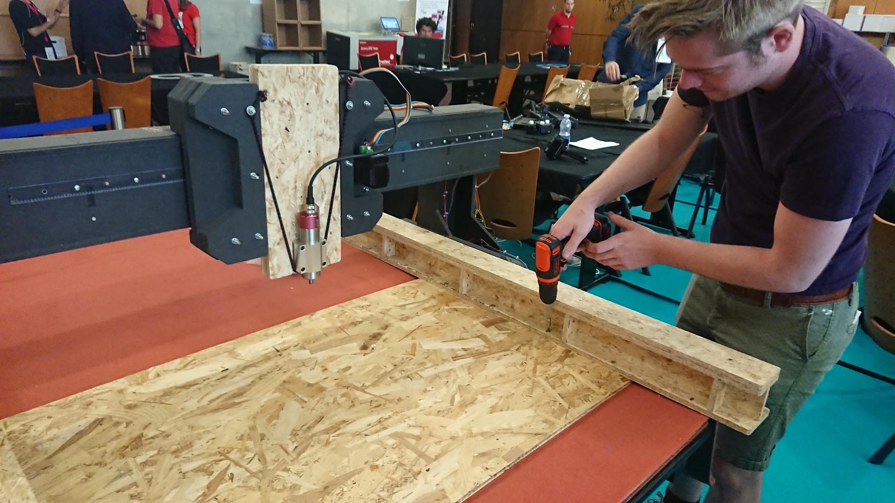
*The Y beams were fast and easy to install. We used the gantry to guide the postion of the second rail. The added a top plate. With setup you could mill a proper torsion box constrution to upgrade the machine on site. You could also mill more Y beams and rack to expand the machine*

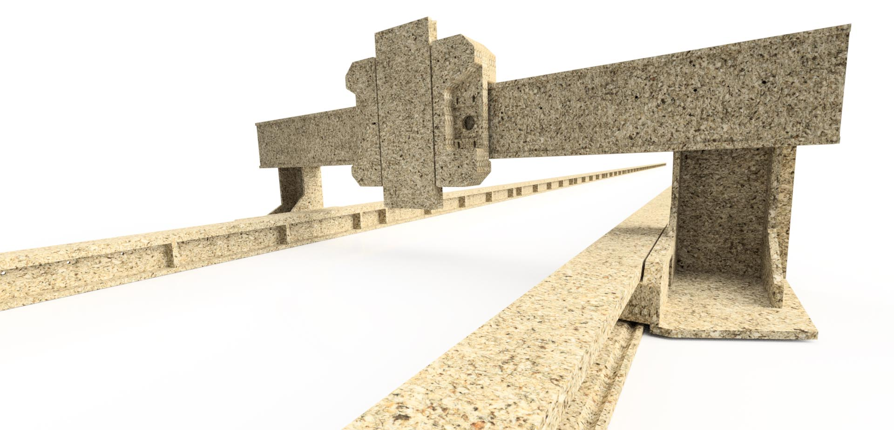
*An illustration on how multiple Y beams can make a really long work area*

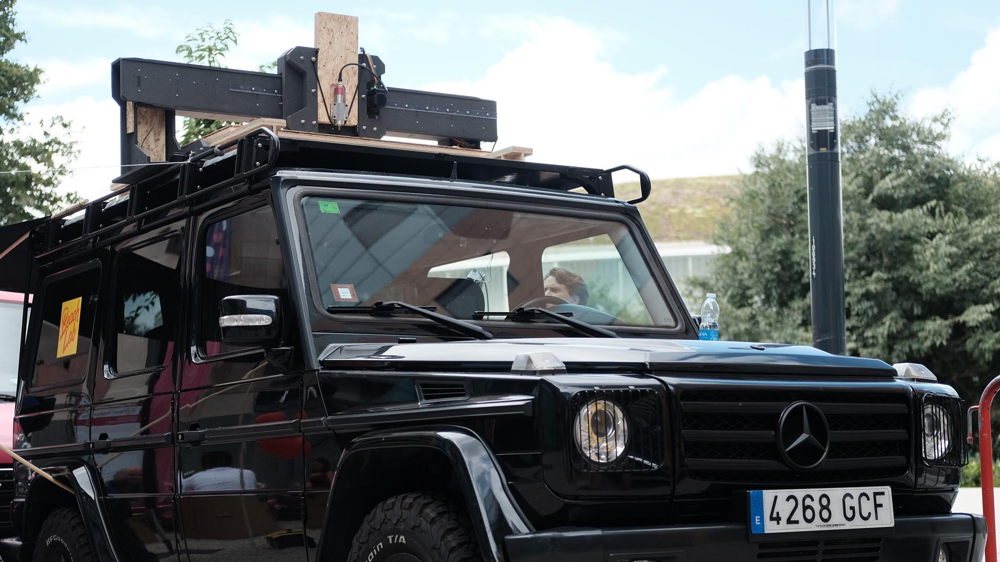
*Francisco is develpoing a Gelenderwagen based mobile lab. He was dreaming of fabing a custom full format CNC mill to have on the roof his car. We smacked Hobo on his roof to get a taste of the concept*

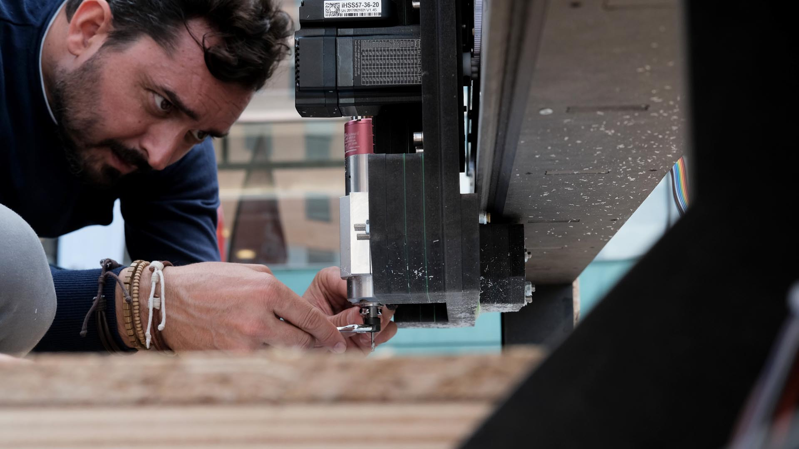
*Francisco doing the milling thing*

*Local hip-hop crew [Robtherichman](https://www.youtube.com/user/HGoonVEVO/videos) thought the car with cnc hat was pimp and asked to shoot a music video in front*
