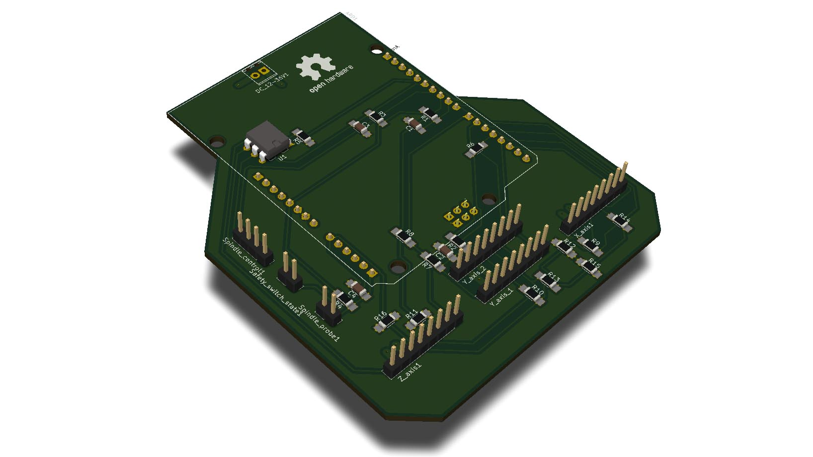
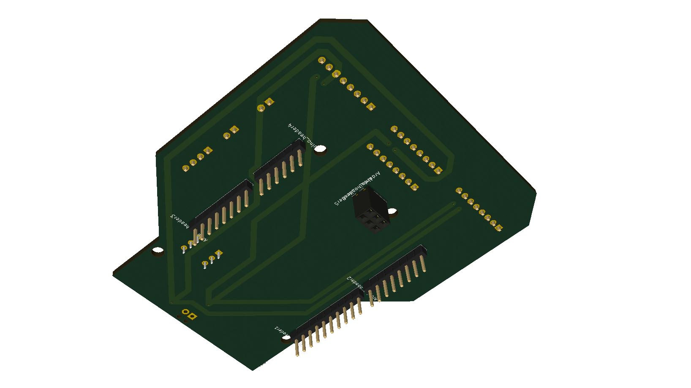
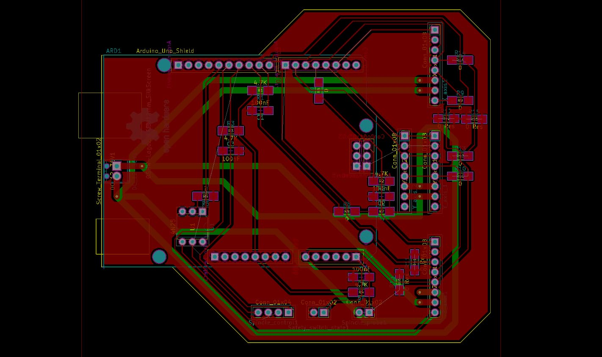

# Hrbl - Grbl shield for integrated motors

A shield aiming to simplify connecting motors, limit switches, safety and spindle to an ardunio board. Tailor made for fabricatable CNC milling machine needs. Potentially great to combine with [Hertz - axis monitoring board](https://github.com/fellesverkstedet/fabricatable-machines/tree/master/hertz-axis-monitor). Optimized for ihss57 integrated closed loop stepper motors.

*The goal is give the same super easy connection as when working with RC servos on a breakout shield*

### Status

*First version almost ready for testing. Needs quality control and final component decisions*

### Functionality

* 4 x 8 pole cable connections that combine all connections needed per axis in one  *(Power, gnd, step, dir, limit switch, alarm, enable, signal gnd)*
* Dual output for Y
* The included limit switch signal connection has pull-up with resistors and capacitors for normally open limit switches running on same dc power as the motor drives
* Z axis milling bit probe connection with external pull-up
* Spindle control with start and speed control. Uses optocoupler for safe handling of 24v start signal
* Connection for safety contactor helper connection. Needs to be jumped if not used. Contactor helper need to be normally open

### BOM

*coming soon*

### Dependables

* Arduino UNO
* JMC ihss57 clsed loop integrated stepper motors
* 8 pole cable with 0.5mm2 wires
* Power supply and cables
* Control computer or pi
* Limit switch to place next to motor (optional)
* Spindle and VFD (optinal)

*Power is routed in the bottom layer. The board is deaigned to be easy to CNC mill from a 2 sided FR1 board*

*Current PCB layout*

*The shield is deign to work with these ihss57 integrated motors. One cable in each end, thats it!.*

### To do

* Find optimal smd connectors and update routing
* Refine vias and connector type for 36v power
* Find optimal smd optcupler and update routing (for 4N25 or 4N35 use 390 Ohm resistor)
* Inspect for errors and unfabricatable geometry
* CNC mill, solder and test the board

# Notes new version

* Careful with which layer you mirror!
* 8mm/s with a Ø0.4mm china endmill worked! (did most with 4.5mm/S)
* Milling order: Start with side where you will mill most vias. 1st 3mm bit, outline and index holes for flipping. 2nd drill holes 3rd 0.4 mm trace milling 4th flip card and keep working with same bit. This order gives few toolchanges and good precision.
* attacvh with double sided skotch tape (jernia)
