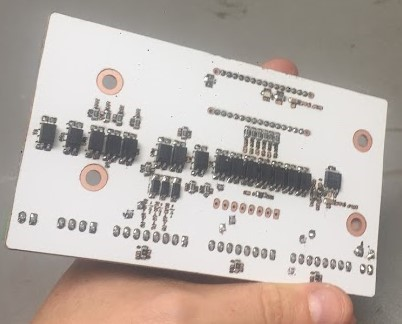
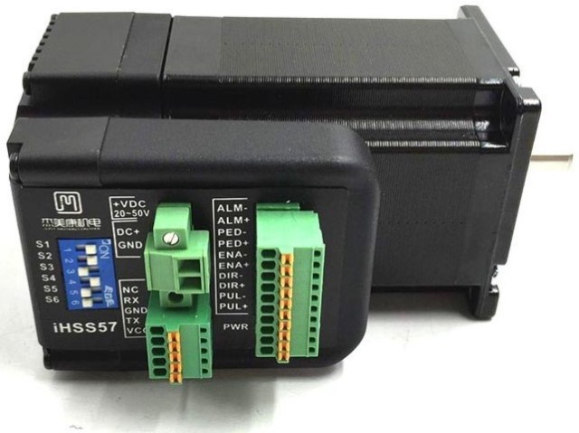
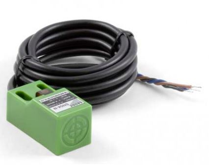
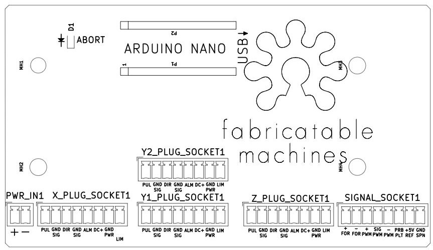
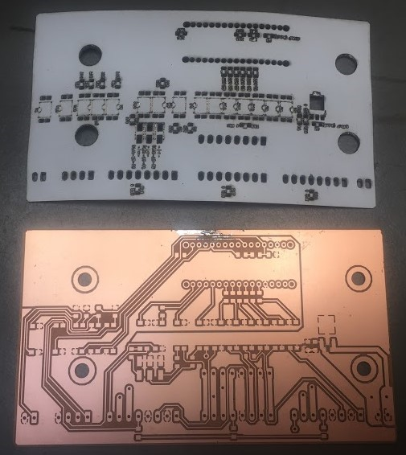

# Hrbl - Grbl shield for integrated motors

A shield aiming to simplify connecting motors, limit switches, safety and spindle to an ardunio board as well as providing electrical noise protection. It's tailor made for fabricatable CNC milling machine needs. Both sides can be covered with a [special laser-engraving sicker film](img/laser_sheets_specs.JPG) which protects the card, functions as a solder mask and silkscreen print.

*The goal is give the same super easy connection as when working with RC servos on a breakout shield*

*The shield is deign to work with these ihss57 integrated motors and SN04-N inductive proximity sensors. One cable in each end, thats it!.*

### Connections

[Connections SVG](img/hrbl_shield.svg)

## Files

* [All dxf files for milling and laser engraving the foil](nano/CNC/nano-all_DXFs.zip)
* [KiCAD Schematic](nano/nano.sch)
* [KiCAD Board](nano.kicad_pcb)
* [KiCAD project file](nano.pro)
* [KiCAD project folder](nano/)

### Status

HRBL is currently in use in:
* [Hedy v1](https://github.com/fellesverkstedet/fabricatable-machines/blob/master/hedy-pcb-cnc/readme.md) A CNC milling machine made to mill circuit boards like this one.
* [Humphrey v3](https://github.com/fellesverkstedet/fabricatable-machines/blob/master/humphrey-large-format-cnc/humphrey_v3/Readme.md) A large size CNC milling machine built as a kit by Makerspace in Brumundal.

### Functionality

* 4 x 8 pole pluggable connections that combine all connections needed per axis in one connector per motor
* Dual connections for the y-axis, (if only one is needed this can be skipped.)
* Full optoisolation separates the computer-arduino circuit from all signal and power wires.
* Z axis milling bit probe connection with external pull-up
* Spindle control with start and speed control. Uses optocoupler for safe handling of extrernal start signal
* External power loss detection, keeps the controller in ABORT mode when there is no power to the motors.

### BOM
* [BOM PDF](https://github.com/fellesverkstedet/fabricatable-machines/raw/master/hrbl-shield/nano/CNC/nano_BOM.pdf)
* [BOM ODS format](https://github.com/fellesverkstedet/fabricatable-machines/raw/master/hrbl-shield/nano/CNC/nano_BOM.ods)

### Dependables

* Arduino UNO
* JMC ihss57 clsed loop integrated stepper motors
* 8 pole cable with 0.5mm2 wires
* Power supply and cables
* Control computer or raspberry pi
* Limit switch to place next to motor (optional)
* Spindle and VFD (optinal)

# Notes while fabricating new version

* Careful with which layer you mirror when you mill it!
* 8mm/s @18000rpm with a Ø0.4mm 2 flute china endmill worked! (did most with 4.5mm/s)
* Attach with double sided skotch tape (Jernia-brand worked well)
* Mill and drill from the side where you will solder the most thorugh hole components first
* Drilled Ø1mm holes were too tight for the contacts, mill them to at least Ø1,2mm next time.
* Don't make the alignment holes for flipping the card too tight.

### Future ideas and things to do
* HRBL-shield is potentially great to combine with [Hertz - axis monitoring board](https://github.com/fellesverkstedet/fabricatable-machines/tree/master/hertz-axis-monitor). Optimized for ihss57 integrated closed loop stepper motors.
* Create a version with a onboard 328p microprocessor to be able to skip the arduino uno altogether, remember to breakout programming pins for the MCU
* Consider replacing the 16 single channel SFH6206-3T optocouplers with 4 channel 4TLP291-4(GB) for reduced part count and cheaper BOM. 
* (From [issue 20](https://github.com/fellesverkstedet/fabricatable-machines/issues/20) consider if we should change the 5V voltage regulator.
* Establish a maximum current that we can draw through the card to the motors without overheating the traces (or ribbon cable).

# Pictures

