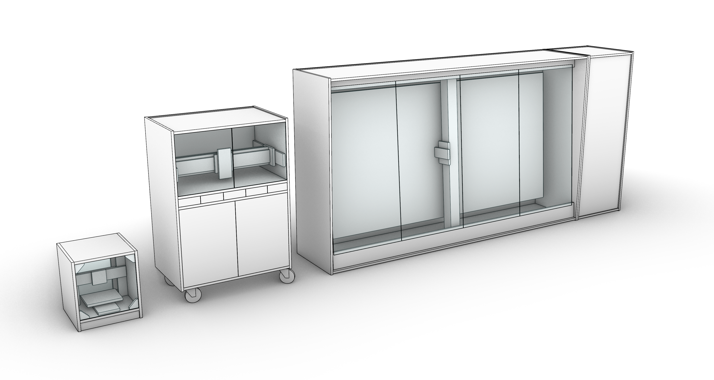
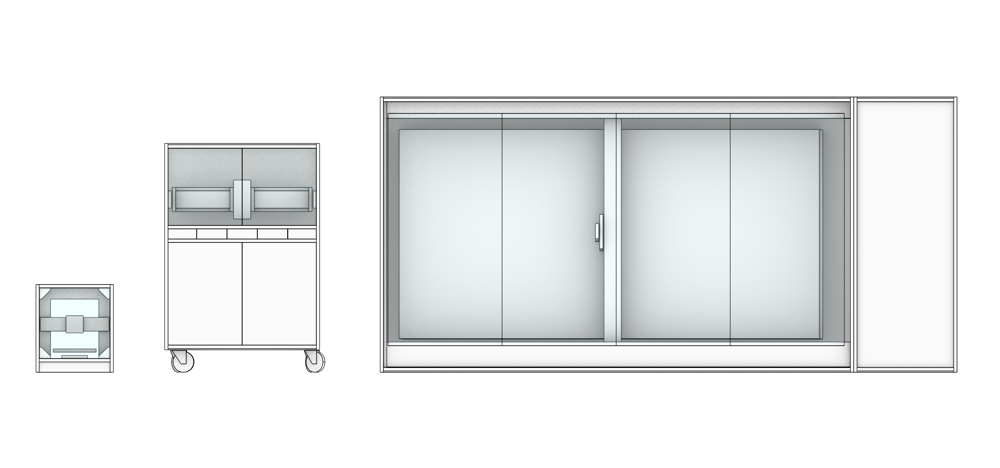

# Hübel - Home friendly CNC mill
by Jens Dyvik

* *status april 2020: Work in progress, only sketches so far*
* *update december 5th 2020, added freecad sketch+screenshots of openbuilds c-beam based design for Ikea Pax*

The hubel machine series is home and human friendly. Dust, noise and fumes are contained inside integrated enclosures. Dust extractors / shopvacs are are located inside each enclouere *(behind cabinet doors)*. Noise and dust leakage from dust exctration will be reduced compared to traditional setups.

Left machine form factor: Prusa style 3D printer or rigid small CNC mill, middle: Medium size CNC mill, right: Large format CNC mill

The series might have potential for replacing the entire set of standard fab lab machines. The medium sizzed milling machine might be able to replace the lasercutter with the help of a vacuum bed, high rpm spinlde, pen and oscilating knife attachment *(Zund type etc.)*

### Design drivers:
* Integrated machine frame and enclosure *(cabinet walls support axis rails, speeds up and simplifies fabrication)*
* Focus on safety *(machine cannot be touched whhile running thanks to transparent doors)*
* Focus on health and comfort *(sound and dust is contained inside enclosure, machine and dust extraction share the same environment)*
* Matches standard kitchen grid *(450mm, 600mm, 900mm)*
* Matches standard kithen fabrication techniques? *(CNC milled melamine with edgebanding?)*

### Potential construction materials
Frame:
* 19mm Melamine with edgebanding
* 6mm or 10mm HPL *(Trespa etc)*

Windows/doors:
* 5mm Polycarbonate *(Lexan etc.)*
* 5mm PMMA *(Acrylic tc.)*

### Potential rail types
* Openbuilds v-rail and v-wheels https://openbuildspartstore.com/openrail-linear-rail/
* Bearings directly on melamine/hpl, similar to humphrey and hootstrap https://github.com/fellesverkstedet/fabricatable-machines/blob/master/hootstrap/README.md
* Standard type HGR15 linear guide and bearing block: https://www.cnc-store.eu/

### Potential drive types
* Standard fabricatable rack and pinion with modular rack *(like on wooden-humphrey)* https://github.com/fellesverkstedet/fabricatable-machines/blob/master/humphrey-large-format-cnc/wood_version_how_to_make.md
* Geared bearing pinion *(to be tested and documented)*

### Roadmap
Small and medium sized machine to be built and tested in 2020

This is an open project. Please feel free to contribute through pull requests and git issue comments!

### Sketches

These sketches are based on the Openbuilds C-beam aluminum extrusions sold by Openbuilds parts store in the us and Ooznest in the UK/EU- The thought is to tailor make the alu frame to fit in an Ikea Pax closet (100cm wide, 58cm deep and 200cm high). This machine would have a work area of 800mm x 1220mm x 55mm, but the same gantry can easily be used with with longer rails to make full sheet size machine (2440mm x 1220mm). A larger machine would require making a custom safety cabinet though, while this one could be put in a ready made Ikea pax closet. The doors could either be self made or store bought Ikea Undredal tempered glass doors. The cost of only the extrusions for the config bellow would be about 310 USD excluding shipping and sales tax.

