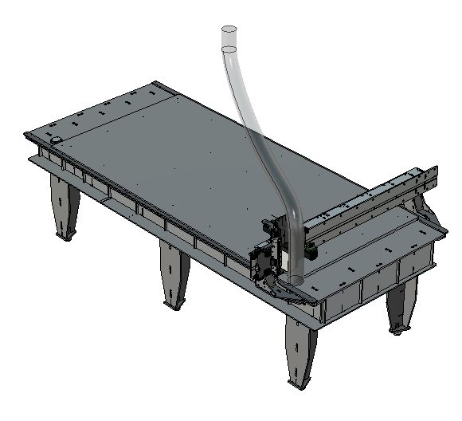

# Dust Extraction

It's very important to have a proper dust extraction system for your milling machine before you start using it. It will generate copius amounts of fine dust which is unhealthy to breathe and end up everywhere, unless you have a good dust extraction system in place!

The dust exctration system consist of these parts:
1. Fan with motor 
 * [Felder AF12 example](https://www.felder-group.com/fg-en/products/dust-extractors-extraction-units/mobile-dust-extractor-with-steel-impeller-af-12--120-mm.html) 
 * [Cheap over the counter version](https://www.jula.no/catalog/verktoy-og-maskiner/el-verktoy-og-maskiner/sponsugere-og-tilbehor/sponsugere/sponsuger-232008/#tab02) 
 * [A guy who built his own](http://woodgears.ca/dust_collector/v1.html)
2. Fine dust filter
1. Dust collector bag
1. **Optional** Cyclone chip separator
1. Conduits (hose or pipe) to lead the air to the fan
1. A flexible hose mounted over the machine
1. A removable dust shoe on the machine [See dust extraction 3D prints](https://github.com/fellesverkstedet/fabricatable-machines/blob/master/humphrey-large-format-cnc/humphrey_v2/3d_prints/README.md#dust-skirt)

This picture is a commerical [Felder AF12 dust extractor](https://www.felder-group.com/fg-en/products/dust-extractors-extraction-units/mobile-dust-extractor-with-steel-impeller-af-12--120-mm.html)

A cyclone is a way to separate out all the bigger dust particles and letting them settle into a container before the air is led to the filter and bag. They can be bought or home-made very cludely and still be effective.

The flexible hose should start ca 2 m from the floor, centered over the machine table. It needs to be 2,5m long. I 100-120 mm diameter hose.

