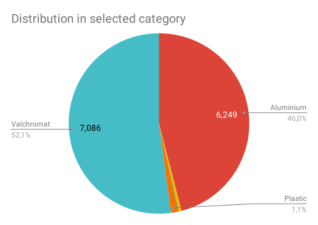
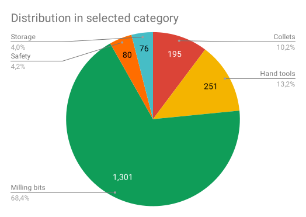
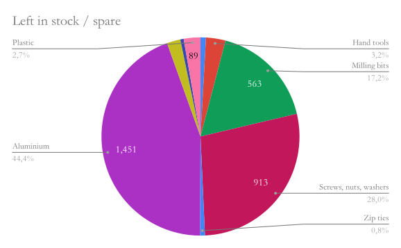

# Cost breakdown for building a Humphrey

These are the costs for all the raw materials like aluminum bars, all hardware like the motors and spindle and small things like glue, safety googles and all fasteners. This include everything needed to make and operate the machine, except the machines to make the parts on. All prices include shipping (to Oslo). 

## Spreadsheet with all costs and supplier links

Use this to purchase all the parts

* [BOM - Google sheet](https://docs.google.com/spreadsheets/d/1O0V0Yyn-vt2MoGoZ2DiTqdFMecpRSYYsnOq32u6BHwU/edit?usp=sharing)
* [BOM in ODS](img/graphs/BOM.ods)
* [BOM in PDF](img/graphs/BOM.pdf)

## Costs of all raw materials and components

*(January 2019, based on Humphery v4 costs in Norway):*

| Total costs of materials                        | NOK       | USD    |
|-------------------------------------------------|-----------|--------|
| **Parts, raw materials and equipment:** | **29 281 kr** | **$3 404** |
| Spare / Left in stock after delivery            | 3 265 kr  | $380   |

| Cost by category                                | NOK       | USD    |
|-------------------------------------------------|-----------|--------|
| Consumables                                     | 1 540 kr  | $179   |
| Electronics                                     | 1 268 kr  | $147   |
| Fasteners                                       | 2 018 kr  | $235   |
| Hardware                                        | 8 962 kr  | $1 042 |
| Raw material                                    | 13 590 kr | $1 580 |
| Tools and Equipment                             | 1 903 kr  | $221   |

The categories can be broken down further:

### Consumables

| Sub category | NOK  |
|--------------|------|
| Drill bits   | 67   |
| Hand tools   | 96   |
| Lubricant    | 49   |
| Milling bits | 1328 |

### Electronics

| Sub category | NOK |
|--------------|-----|
| Cable        | 476 |
| Connectors   | 16  |
| Controller   | 589 |
| Sensors      | 84  |
| Switches     | 103 |

### Fasteners

| Sub category          | NOK  |
|-----------------------|------|
| Glue                  | 82   |
| Magnets               | 79   |
| Screws, nuts, washers | 1825 |
| Zip ties              | 32   |

### Hardware

| Sub category     | NOK  |
|------------------|------|
| Bearings         | 635  |
| Cable management | 387  |
| Motors & drivers | 3613 |
| Power supply     | 333  |
| Spindle & driver | 3994 |

### Raw material

| Sub category      | NOK  |
|-------------------|------|
| Aluminium         | 6249 |
| Elastic cord      | 80   |
| Leather and cloth | 21   |
| Plastic           | 154  |
| Valchromat        | 7086 |

### Tools and Equipment

| Sub category     | NOK  |
|------------------|------|
| Collets          | 195  |
| Hand tools       | 251  |
| Milling bits     | 1301 |
| Safety equipment | 80   |
| Storage          | 76   |

### Left in stock / Spare

Fasteners are bought by the box and aluminium stock in 6 m lengths, this means that there will be some parts left over after the project is delivered. That is provided that no extra aluminium was used up as spare to cover from milling mistakes etc. This is a representation of the values that will be left in stock and can be used in the next project.  

Note that this category does NOT include the tools that is "bound" to the machine, like wrenches for changing bits or safety glasses. Those are considered "consumed" by the building of the machine since they should not be removed from the machine.

[Back to How to make a Humphrey](Humphrey_how_to_make.md)

