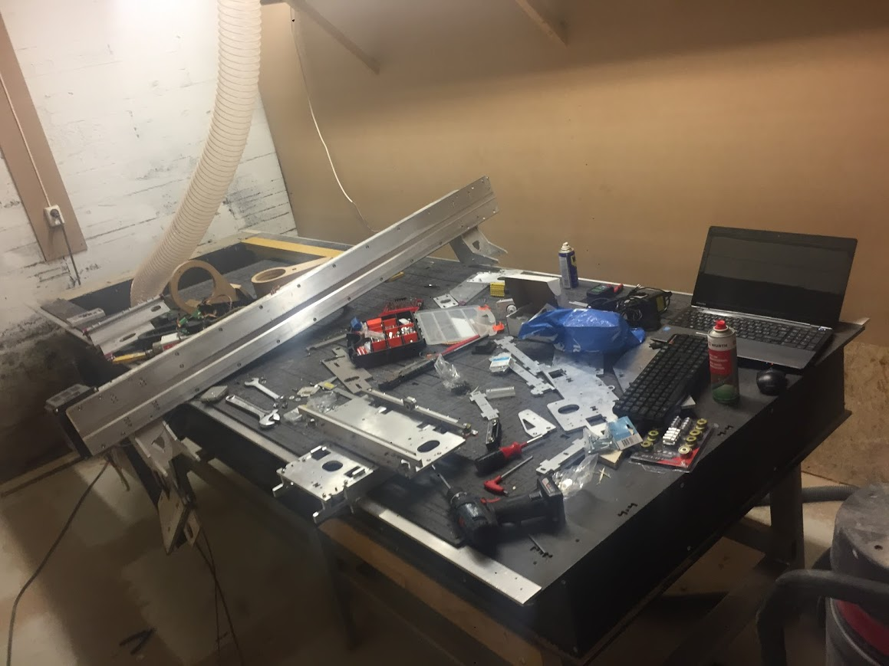

# How to assemble a Humphrey

*Hupmhrey v3 being assembled at [Dalamakers](https://dalamakers.no) the [Makerspace in Brumunddal (facebook)](https://www.facebook.com/pages/category/Nonprofit-Organization/Makerspace-i-Brumunddal-199245720667673/)*

This is a guide on how to build the Humphrey CNC millling machine from a kit of parts.

To learn how to machine the parts yourself see [How to make the kit](Humphrey_how_to_make.md)

## Putting it together

These are instructions for how to assemble Humphrey v3 from a kit of parts, in the recommended order of assembly:

* [Table assembly](Table_assembly.md)
* [Gantry assembly](Gantry_assembly.md)
* [Carriage assemby](Carriage_assembly.md)
* [Tuning the motion system](tuning.md)
* [Electronics and programming](electronics.md)
* [How to run a milling job](https://github.com/fellesverkstedet/fabricatable-machines/wiki/How-to-use#humphrey)

### Assembly times

For a five person group of inexperienced people plus one experienced and using the online manuals the Table assembly, Gantry assembly and Carriage assembly was completed in 6-7 hours of workshops spread over two days, without stressing.

The drilling and threading of the aluminium parts took up a large portion of that time, so extra bits and drills makes the work faster.

### Assembly Pictures

*All parts of Humphrey v4 before assembly*

*Makers from Dalamakers posing during the assembly of Humphrey v3*

*Humphrey v2 being worked on at Newtone AS in Oslo*

[Back to Humphrey overview](README.md)

