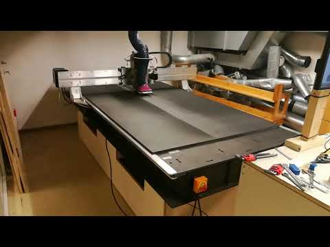
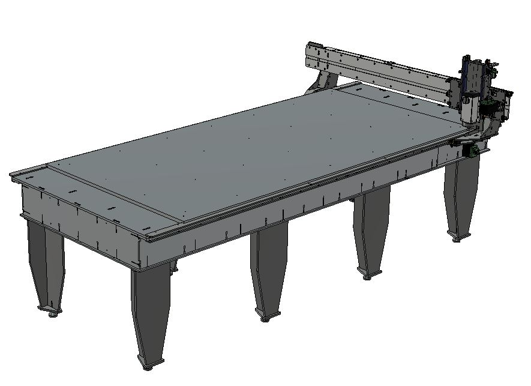

# Humphrey version 3 

A full size CNC milling machine of the [Humphrey machine family.](https://github.com/fellesverkstedet/fabricatable-machines/tree/master/humphrey-large-format-cnc#humphrey---large-format-cnc-mill)

This version of Humphrey was commissioned by [MiB - Makerspace i Brumunddal](https://www.facebook.com/Makerspace-i-Brumunddal-199245720667673/) and developed and manufactured as a kit by [Jakob Nilsson from Norlink](https://norlinkmakes.com/marketplace/). The MiB members then assembled the kit from the [online instructions.](Humphrey_how_to_make.md)

[Video on Youtube of Humhprey v3 planing its spoilboard](https://youtu.be/zEsviWFEUS8)

## How to use

* [Fabricatable machines wiki instructions](https://github.com/fellesverkstedet/fabricatable-machines/wiki/How-to-use#humphrey)
* [Dalamakers  instructions](https://dalamakers.no/wikipedia/index.php/Fresing)

## Stats

* Work area 2440x1220 mm (standard size of sheet stock)
* 3 axis CNC milling machine
* [Grbl](https://github.com/gnea/grbl/wiki) motion controller
* [Roller Axis](https://github.com/fellesverkstedet/fabricatable-machines/wiki/Fabricatable-axis#roller-rail)
* 800W 24000 rpm spindle
* Valchromat torsion box bed
* [Integrated Closed loop 3Nm Nema24 stepper motors](https://topcnc.aliexpress.com/store/group/Integrated-closed-loop-stepper-Motor/1932111_504161502.html)

## Complete machine files

* [Fusion360 assembly](https://a360.co/2AF6yjp)
* [STEP assembly](https://github.com/fellesverkstedet/fabricatable-machines/raw/master/humphrey-large-format-cnc/humphrey_v3/Assembly_h3%20v5_step.zip)
* [Detailed BOM and raw material costs](https://docs.google.com/spreadsheets/d/1O0V0Yyn-vt2MoGoZ2DiTqdFMecpRSYYsnOq32u6BHwU/edit?usp=sharing)
* [BOM in ODS](img/graphs/BOM.ods)
* [BOM in PDF](img/graphs/BOM.pdf)

# Pictures

