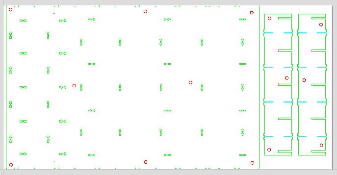
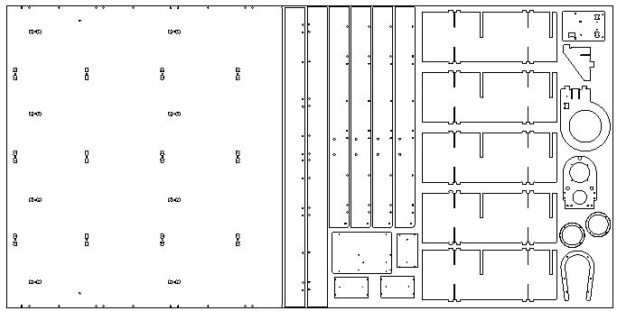
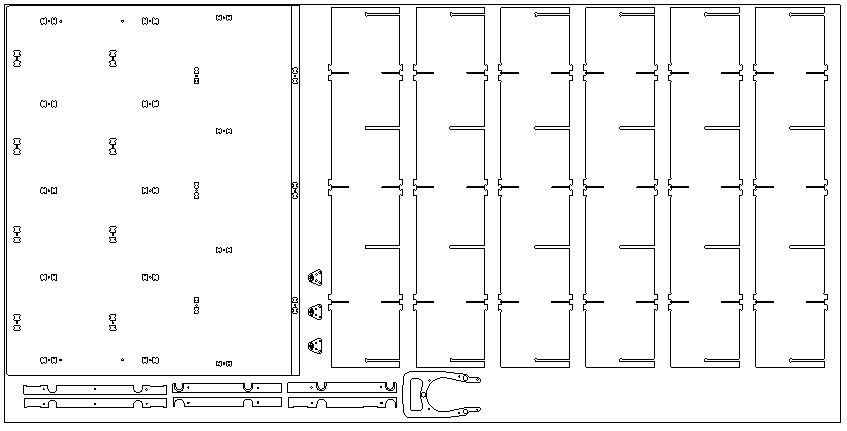
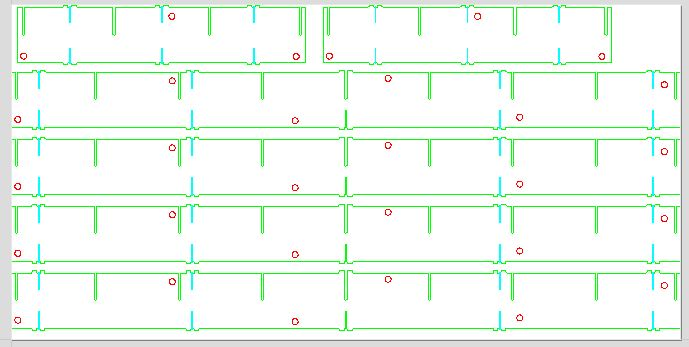
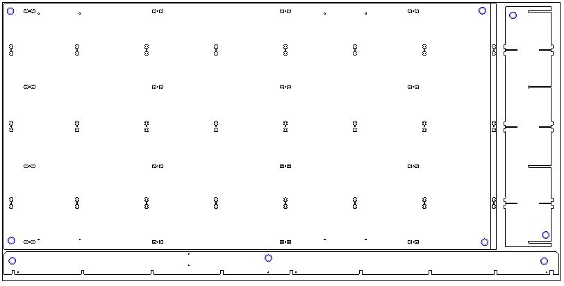

# Milling the valchromat parts for the table

_"A torsion box consists of two thin layers of material (skins) on either side of a lightweight core, usually a grid of beams."_

[Torsion boxes on wikipedia](https://en.wikipedia.org/wiki/Torsion_box)

The purpose of the tosion box is to make a stiff bed for the CNC machine to travel and operate on while keeping the parts easy to transport.

## Materials required

Valchromat sheets 1220X2440 mm

* 1 of 19 mm 
* 3 of 8 mm 
* 3 of 12 mm

Equipment required

* CNC milling machine
* Holddown screws 
* 6 mm milling bits
* 3 mm milling bits

## Files
* [DXF files for milling](DXF_valchromat.zip)
* [Fusion model with layouts and most parts](https://a360.co/2Mzsrp2)
* [Fusion model with the main torsion box core parts](https://a360.co/2OGe8wh)
* [Fusion model with the legs](https://a360.co/2MuRitT) 

* [Online 3D model containing all parts](https://a360.co/2AF6yjp) *Currently broken, fix coming*

## General

* The parts are modelled with dogbones for a 6mm bit.
* Additonal holddown screw-holes can and should be be added, also inside parts where needed.

## 12 mm sheets

The 3mm wide slots are 9 mm deep

* Sheet 1: 12 mm torsion box parts 1 

* Sheet 2: 12 mm torsion box parts 2. 12.5 mm pockets are 3.5mm deep.

* Sheet 3: 6 legs probe and VFD stiffeners 

### Production notes v3
* One 12 mm short rib was missing in the cutsheet
* Screw holes should be moved so that feet attach better
* Screws on top of feet should be countersunk so that they do not protrude during assembly.
* Include diagonal stiffeners

## 8 mm sheets

The 3mm wide slots are 6.5 mm deep

The pockets on the top edges is 4mm deep in both cases.

* Sheet 1: 8 mm torsion box parts 1. 12.5 mm pockets are 3.5mm deep.

* Sheet 2: 8 mm torsion box parts 2 

* Sheet 3: 8 mm torsion box parts 3 

## 19 mm sheet

The pockets on both long edges are 9 mm deep.

* Sheet 1: 19mm spoilboard with pre-drilled holes and ledges on the sides

[Back to How to make the other parts](Humphrey_how_to_make.md)

[Back to Humphrey overview](README.md)

