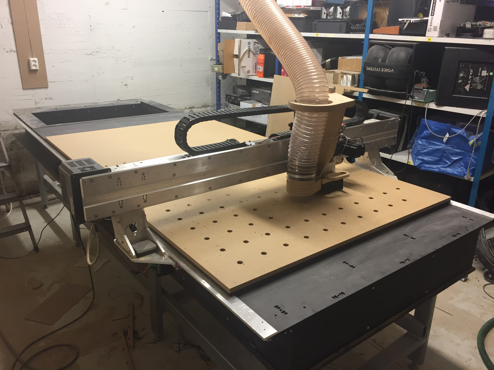

# Humphrey - Large format CNC mill

## Humphrey v2
*April 2018 Jakob Nilsson*

**Stats**
* 3.1 m * 1.22 m work area
* 4 of Nema24 closed loop stepper motors, 3Nm
* 2,2 kW 24000 RPM aircooled spindle
* Torsion box bed
* Square cross-section aluminium gantry
* Grbl + arduino UNO controller, USB communication
* Full auto homing using inductive limit switches and Z-plate on gantry "foot"
* Modelled and CAMed in Fusion360

[Production and installation pictures](.img/humphrey_V2)

[STEP model assembled machine](./new-dev-files/humphrey%20v2%20STEP.zip)

## Humphrey v1
*June-July 2017, by Jens Dyvik and Alex Schaub*

*Humphrey with first cuting job, a mega rack and pinion*

*The two pice rail on the Y axis is what made it possible to make an equally large machine as the shopbot mother. Mounting them upside down protects from dust and makes the machine super compact*

* A gantry based cnc milling machine capable of cutting standard size sheet material (2440mm x 1220mm).
* Based upon the [chamfer rail](https://github.com/fellesverkstedet/fabricatable-machines/tree/master/chamferrail) system.
* [Videos](https://vimeo.com/album/4881878) from the making of and [hello world first cuts](https://vimeo.com/album/4881878/video/225453047)

**Design wins**
* Spitting rails to make an axis as large as or larger than the mother machine works with our chamfer rail system
* The chamfer rail system performs decent with long axes
* Placing the Y axes upside down underneath the machine beds works very well for gantry type machines
* The torsion box based gantry became super stiff and quite light
* The machine was used to mill its own legs and physical end stops
* Milling the parts in Oslo,Norway(at Fellesverkstedet Fab Lab) and assembling the machine and fabricating the bed locally in Amsterdam, the Netherlands (at Contact Amsterdam) worked well
* We have managed to make a large CNC machine with high enough performance for small business and open workspaces!

**Design fails**
* The one sided and easy milling of the chamfer rails lead to a small varaition in axis thickness. This gave a small amount of backlash in certain places on the X and Y axes (0.1-0.3mm)
* It takes a long time to drill and tap all the holes in the assembly
* Gluing up the machine bed sandwhich requires some skill and good preperation
* The glide blocks warped a little (solved by split block design in latest generation [chamfer rail](https://github.com/fellesverkstedet/fabricatable-machines/tree/master/chamferrail))
* Tuning the postion off the glide blocks and motor plates requires patience and determination
* Aligning the split Y axes is tricky. (can be solved by milling helper tools, or helper geometry in bed sandwhich)

### Status

**In operation at Contact Amsterdam**

### Source files

* [3D assembly, Fusion360 - In work](http://a360.co/2GzDQQc)
* [3D assembly, Rhino source](./humphrey-3d-model.zip)
* [3D assembly, STEP](./humphrey-3d-model-stp.zip)

* [Cutsheet 10mm aluminium, Rhino source](./Humphrey-CNC_layout%-10mm_aluminium.zip)
* [Cutsheet 12.7mm POM, Rhino source](./Humphrey-CNC_layout%-12.7mm_POM.3dm)
* [Cutsheet 25mm Ertalyte-TX, Rhino source](./Humphrey-CNC_layout%-25mm_Ertalyte_TX.3dm)

### To do
* Document final installation
* Document safety front wall
* Document the wiring and autohome system with the Oriental motor drivers
* Update BOM in general(and include link to cheap JMC ihss57 motor alterntive to the luxury Oriental motor option)
* Update axes to latest rack and pinion geometry and glideblock design
* Incorporate electronics enclosure in design
* Incorporate e-chain mangagement in design
* Upload leg design
* Design helper-tools and helper-geometry in bed sandwhich for easier alignment of the split Y axes

### The making of
For feeds and speeds and how to make chamfer rail parts in aluminium see the [chamfer rail documentation](https://github.com/fellesverkstedet/fabricatable-machines/blob/master/chamferrail/README.md)

*All the aluminum parts fit inside a 2m x 1m sheet. We used 10mm material, but the gantry became so stiff that we have shifted to 8mm as standard*

*Milling of the rack teeth with a 2mm bit. The cnc friendly rack and pinion design on the chamfer rail has given such good performance, our new standard is now optimized for milling with a 6mm bit*

*The Y axes are complete. Note that each axis has been split into two pieces in order to make a long enough axis (2.9m) with a work area of 2.5m. We oriented the parts in opposing directions when we milled them, which gave offset erros after homing. We reccomed milling them with all the rack sides pointing in the same direction. The cutsheet has been updated with this orientation*

*Close-up of the rack teeth. Note the small chamfer to reduce wear on the POM pinion*

*Gantry feet parts and motor plates. Note how we have milled all the internal holes first, placed screws with washers and then milled the cutout last with the parts securely held down by the screws*

*Shiny! All the axes and gantry parts ready for transport*

*The machine builders pose with the gantry axis in front of the gantry of the mother-machine. The machine was designed by Jens Dyvik and made by Jens Dyvik and Alex Schaub*

*Milling the glide blocks from Ertalyte-TX, a super smooth a wear resistant bearing grade plastic. We had some problems with the glideblocks warping due to the one sided milling and material surface tension. So our new improved design has split glideblocks. Check the [chamfer rail repo folder](https://github.com/fellesverkstedet/fabricatable-machines/tree/master/chamferrail) for the latest glideblock design*

*Milling the pinions. Our motor shaft diameter was 10mm, while this design was optimized for 8mm shafts (a smaler pinion circumference gives higher torque and resolution). So we went fancy with a two-sided milling job*

*Placing the pinions in the jig. Note how the pinions are attached only in rows, and not in a grid. This is to minimize the imprecisions caused by a potentially non-square gantry*

*Milling the backside of the pinoins. This layout got a little tight, but we managed*

*Comparision of pinions. Our regular nema23 size motor pinon on the left, the Oriental motor with 10mm shaft adapted pinion center and a standard ShopBot pinion on the right. Note that the ShopBot pinion has a circumference that is 2.5 times as large as on our design. This gives the shopbot smooth movement with traditional involute gears, but also necitates a gearbox with backlash. Our cnc friendly pinion design gives reasonably smooth movemnt, and needs no gearbox*

*All the aluminium and plastic parts fit in one suitcase and a ski-sized package. The parts where actually checked in as ski-luggage from Oslo to Amsterdam for no extra cost*

*Purchased parts on the left, self-fabricated parts on the right*

*The machine bed was made locally in Amsterdam with hand tools. It is a brutal sandwhich from three layers of 19mm HDF plates, pluss a fourth 19mm HDF plate as a sacraficial layer. If the machine is to be CNC milled and assembled in the same city, we reccomend CNC milling a torsion box design from thinner materials*

*Assembling the gantry feet*

*Gantry feet ready assembled, with gantry assembly in progress in the background*

*Gantry alomst done. Note the torsion box design, this gives great stiffness to the gantry*

*Gantry assembled*

*Drilling and tapping all the holes in this design took a long time. It is durable and reliable method, but we are exploring alternatives like wedges or pockets that a machine screw can self tap into*

*Glide block and pinion in place. Note that the only thing we don't fabricate ourself in this drive system is the motor and the screws*

*Gantry and machine bed complete. The XZ axis plate and Z axis are lying in the bed awaiting assembly. Note how the the machine is temporaily resting on a [Hat systems module](https://github.com/fellesverkstedet/hat-systems/blob/master/README.md) awaiting to make its  own legs.*

*The completed Z axis. Note the spring to keep the axis up when power is out.*

*The gantry backside with e-chain. The bed for the e-chain was freestyled with a pressbrake, and should be refined and included in future iterations*

*One of the first things Humprhey did once operational was to mill its own legs. Such a clever little child... ehm, I mean machine*

*One of Humphreys first batch productions. Six sound absorber frames designed and produced by Alex Schaub*

*Birch plywood chair parts milled by Alex Schaub on Humphrey. The design is based on a re-used Ajax stadium seat*

### Development log

*Early sketch of basic design principle, note the sideways Y rails like on Hank. Swapping to upside down Y axes was a huge success*

### Original requirements:
* all structural parts machinable on a Shopbot PRS Standard or alpha 96 x 48" model
* all linnear rails and drive systems machinable on a Shopbot PRS Standard or alpha 96 x 48" model
* racks from aluminium
* pinions and plain bearings from POM plastic (acetal/delrin)
* torsionbox systems for table made from HDF?
* torsionbox systems for gantry made from aluminum and POM
* Z axis <5cm
* high prescision stepper motors: closed loop stpper motors 0,36deg >2Nm (85mm housing), or open loop stepper motors 0,36deg >2.3Nm (60mm housing)
* should also be compatible with regular NEMA23 1.8deg steppers
* air-cooling 800w 4bearing cnc spindle motor and matching vfd
* end stops xyz axis
* hot swappable Z axis for fast and easy toolchange
* auto z zeroing?
* protective bellows for all axis?
* touchscreen operation with tablet or laptop?
* it shold look good!

### Sketches

*sketch of casette concept, compact and suitable for meeting health and safety standards*

*Alex's sturdy full frame sketch*

*Jens's skexth of updside down axis principle*

*Refined sketch*

*Backside of gantry*

*Ghosted view showing alu and pom torsion box. Finger tabs and bolts not yet drawn*

*Front view. Not the the Valchromat be dparts *(blue)* can be fabricated with regualar woodworking tools*

*Part overview*

### Bill of materials *(BOM)*

**
