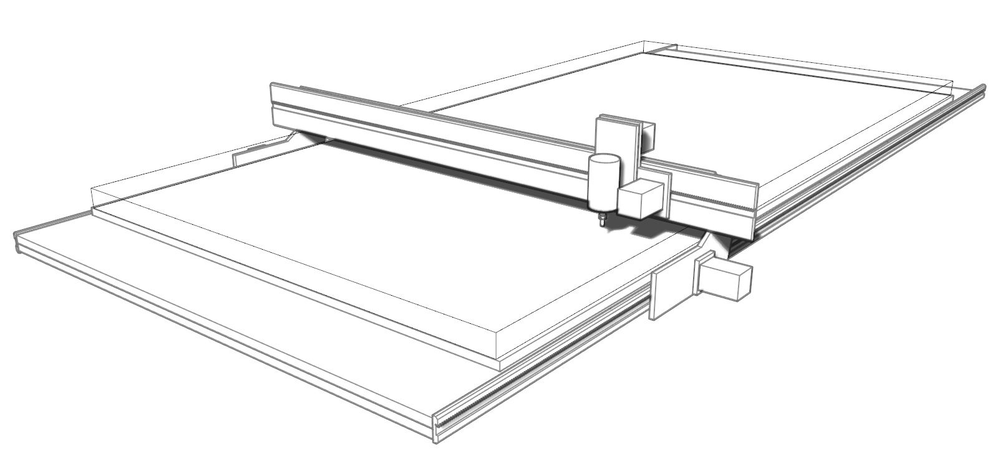

# Humphrey large format CNC mill

A gantry based cnc milling machine capable of cutting standard size sheet material (2400mm x 1220mm). Based upon the [chamfer Rail](https://github.com/fellesverkstedet/fabricatable-machines/tree/master/chamferrail) system.

*sketch of basic design principle*