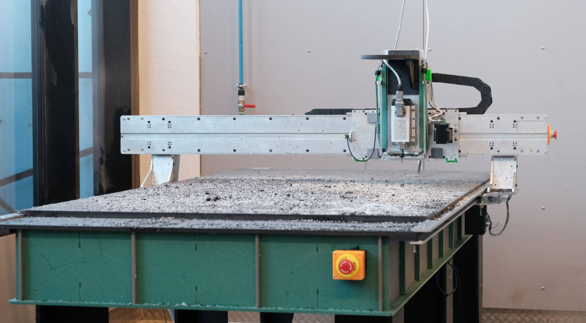
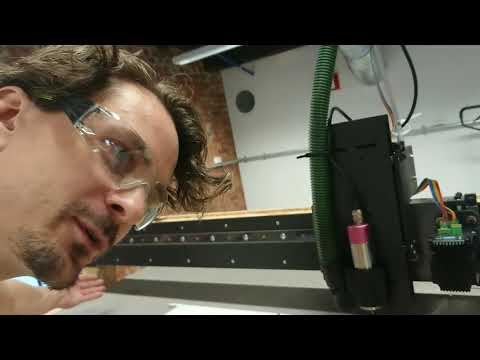
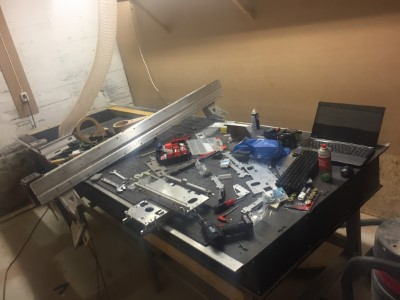
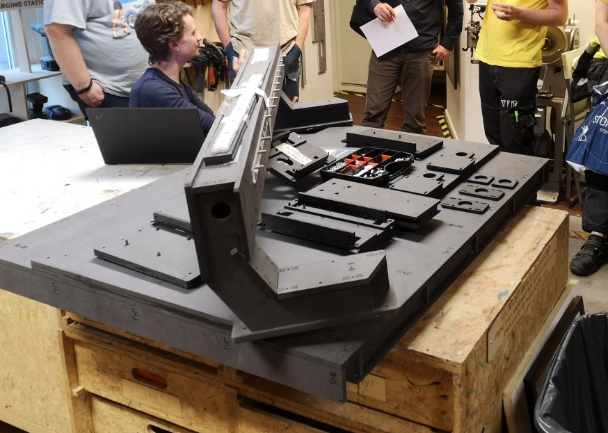
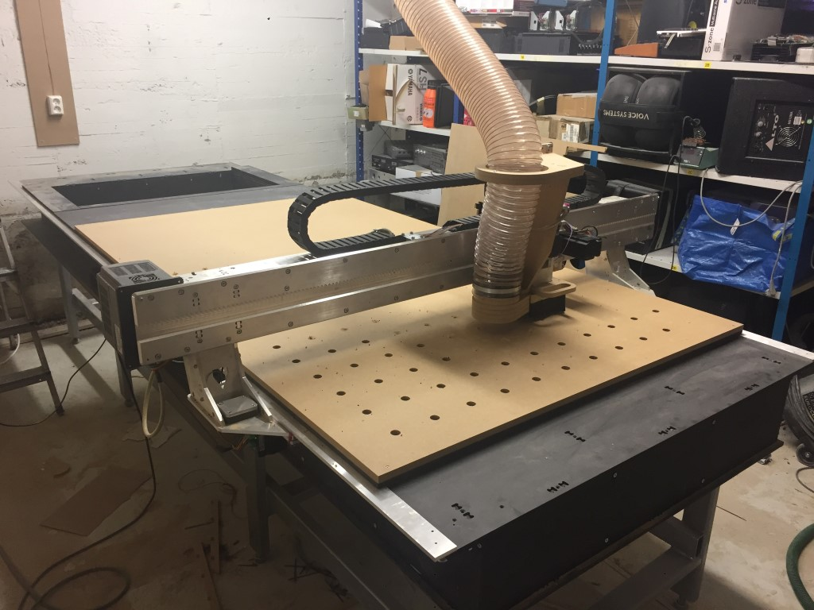
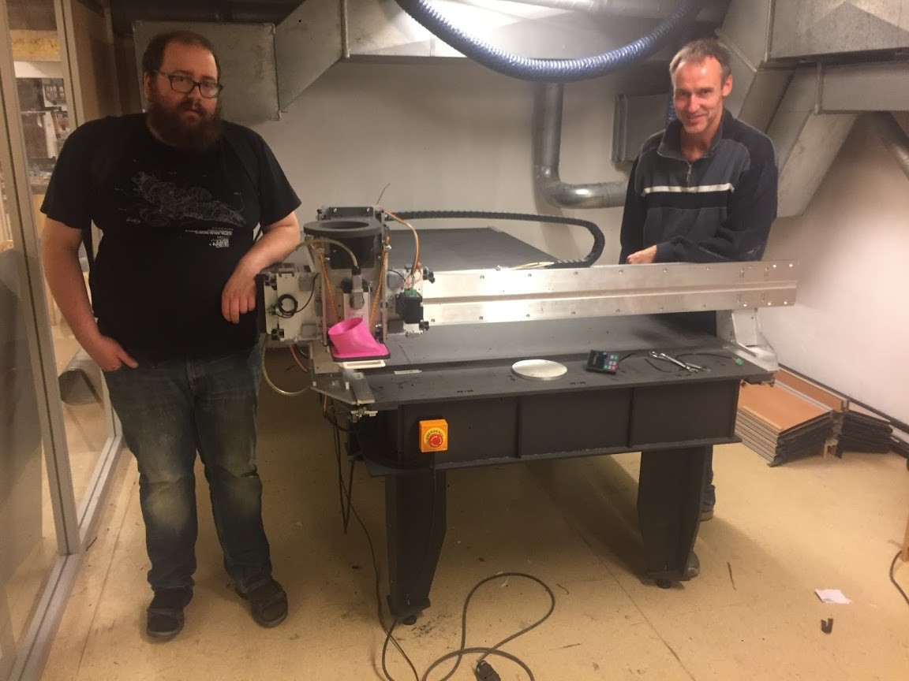

# Humphrey - Large format CNC mill

* A CNC platform for 3 axis milling
* Fabricatable with a CNC mill and is self replicating _(can make most of its own parts)_
* Uses a [Roller axis](https://github.com/fellesverkstedet/fabricatable-machines/wiki/Fabricatable-axis#roller-rail) system
* Has a work area 1220 x 2440 mm *(can easily be extended or shortened)*
* Traveling gantry with integrated electronics
* Metal version is made from 200mm x 8mm aluminium flat bar stock and 8 and 12mm Valchromat
* Wood version is made from 8mm Valchromat and 12mm OSB

### Index
 - Metal Humphrey documentation
   - [How to make a kit of parts](Humphrey_how_to_make.md)
   - [How to assemble the kit](Humphrey_how_to_assemble.md)
   - [Tuning guide](tuning.md)
   - [How to run a milling job](https://github.com/fellesverkstedet/fabricatable-machines/wiki/How-to-use#humphrey)
 - Wood Humphrey documentation
   - [How to make a kit of part](https://github.com/fellesverkstedet/fabricatable-machines/blob/master/humphrey-large-format-cnc/wood_version_how_to_make.md)
   - [How to assemble the kit](https://github.com/fellesverkstedet/fabricatable-machines/blob/master/humphrey-large-format-cnc/wood_version_how_to_make.md#fabriaction-and-assembly-gallery)
   - [Tuning guide](https://github.com/fellesverkstedet/fabricatable-machines/blob/master/humphrey-large-format-cnc/wood_version_how_to_make.md#how-to-tune)
   - [Troubleshooting](https://github.com/fellesverkstedet/fabricatable-machines/blob/master/humphrey-large-format-cnc/wood_version_how_to_make.md#troubleshooting)
 - Videos of machines in action
 - Version history

*Matal version takes 1,5-2 weeks to make. Quite sturdy if tuned well.*
 

*Really fast to make (few days), much less sturdy than aluminium*

 
### Videos of machines in action

*Video of humphrey v5 milling solid oak at Kuben High school, Oslo Norway*
 

*Video demonstration of a wooden Humphrey at Fellesverkstedet, Oslo Norway*

](Humphrey_how_to_make.md)

### Version history
_As of January 2021_

Click the links for more pictures!

The Humphrey model has been made in eight completed versions and three more is in production.

1. [Humphrey v1](humphrey_v1.md) - Designed by [Jens Dyvik](http://www.dyvikdesign.com/site/) - Made in [Fellesverkstedet](https://www.fellesverkstedet.no/) by [Jens Dyvik](http://www.dyvikdesign.com/site/) and [Alex Schaub](http://www.fabguru.com/), installed at [Contact Amsterdam.](https://contactamsterdam.nl/)
2. [Humphrey v2](humphrey_v2.md) - Redigned by [Jakob Nilsson](http://www.norlinkmakes.com)- Made in [Fellesverkstedet](https://www.fellesverkstedet.no/) by [Jakob Nilsson](http://www.norlinkmakes.com), installed at [Newtone](https://newtone.no/) in Oslo.
3. [Humphrey v3](Humphrey_v3.md) - Made in [Fellesverkstedet](https://www.fellesverkstedet.no/) by [Jakob Nilsson](http://www.norlinkmakes.com), installed in [Dalamakers](https://dalamakers.no) the [Makerspace in Brumunddal (facebook)](https://www.facebook.com/pages/category/Nonprofit-Organization/Makerspace-i-Brumunddal-199245720667673/)
4. [Humphrey v4](Humphrey_v4.md), installed at [Buene AS](http://buene.com) in Oslo - Parts produced in [Bitraf](https://bitraf.no/) by [Jakob Nilsson](http://www.norlinkmakes.com).
5. Humphrey v5 was produced as a kit of parts by Nikolai Kolstad at [Fellesverkstedet](https://www.fellesverkstedet.no/) and assmebled by pupils and teachers at [Kuben upper secondary school](https://kuben.vgs.no/) in Oslo.
6. Humphrey v6, the first wood version - Designed by [Jens Dyvik](http://www.dyvikdesign.com/site/) - Made in [Fellesverkstedet](https://www.fellesverkstedet.no/) by [Jens Dyvik](http://www.dyvikdesign.com/site/)
7. Humphrey v7 - Made in [Fellesverkstedet](https://www.fellesverkstedet.no/) by Miguel Valenzuala, pending assembly
8. Humphrey v8 - Made in [Fellesverkstedet](https://www.fellesverkstedet.no/) by Miguel Valenzuala, pending assembly
9. Humphrey v9 - Made in [Fellesverkstedet](https://www.fellesverkstedet.no/) by Haakon Walseng, assembled and operational
10. Humphrey v10 - Made in [Fellesverkstedet](https://www.fellesverkstedet.no/) by Christer -insert surname-, assembly in progress
11. Humphrey v11  Made at KHIO by Frido Evers, assembly in progress

### Humphrey v1

[Humphrey v1](humphrey_v1.md) - Made in [Fellesverkstedet](https://www.fellesverkstedet.no/) by [Jens Dyvik](http://www.dyvikdesign.com/site/) and [Alex Schaub](http://www.fabguru.com/), installed at [Contact Amsterdam.](https://contactamsterdam.nl/)

### Humphrey v2

[Humphrey v2](humphrey_v2.md) - Made in [Fellesverkstedet](https://www.fellesverkstedet.no/) by [Jakob Nilsson](http://www.norlinkmakes.com), installed at [Newtone](https://newtone.no/) in Oslo.

[Back to Machine family on the wiki](https://github.com/fellesverkstedet/fabricatable-machines/wiki/Machine-family)

### Humphrey v3 

[Humphrey v3](Humphrey_v3.md) - Made in [Fellesverkstedet](https://www.fellesverkstedet.no/) by [Jakob Nilsson](http://www.norlinkmakes.com), installed in [Dalamakers](https://dalamakers.no) the [Makerspace in Brumunddal (facebook)](https://www.facebook.com/pages/category/Nonprofit-Organization/Makerspace-i-Brumunddal-199245720667673/)

### Humphrey v4 

[Humphrey v4](Humphrey_v4.md), installed at [Buene AS](http://buene.com) in Oslo - Parts produced in [Bitraf](https://bitraf.no/) by [Jakob Nilsson](http://www.norlinkmakes.com).

### Humphrey v5

 
The 5th iteration of Humphrey, assembled at [Kuben upper secondary school, Oslo Norway](https://kuben.vgs.no/).

[Back to index](https://github.com/fellesverkstedet/fabricatable-machines/blob/master/humphrey-large-format-cnc/README.md#index)
