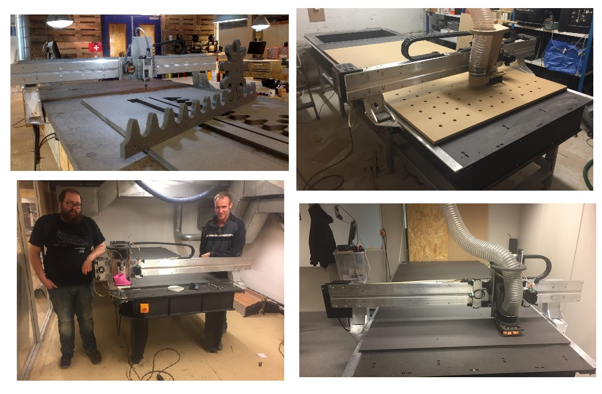

# Humphrey - Large format CNC mill

Humphrey type CNC mills can been made in different materials. Some are entirely made from valchromat (wood particle board) others have valchromat beds with aluminium axis and gantries. 

## Humphrey made entirely from wood
Really fast to make (few days), less sturdy than aluminium.
 
  
 
 *Wooden Humphrey with 1/4th length bed and a laser-cut scale model at Bitraf, Oslo Norway*
 
 
 
 *Video demonstration of a wooden Humphrey at Fellesverkstedet, Oslo Norway*

## Humphrey made with aluminium gantry and axis
Takes 1,5-2 weeks to make. Quite sturdy if tuned well.
 
  
 
 *The 5th iteration of Humphrey at Kuben upper secondary school, Oslo Norway*
 
 
 
 *Video of humphrey v5 milling solid oak at Kuben High school, Oslo Norway*

 ### What is a Humphrey CNC mill?
 
* A "full size", workshop size CNC platform for 3 axis milling
* Fabricatable with a CNC mill
* Uses a [Roller axis](https://github.com/fellesverkstedet/fabricatable-machines/wiki/Fabricatable-axis#roller-rail) system
* Typical work area 1220 x 2440 mm *(can easily be extended or shortened)*
* Traveling gantry with integrated electronics
* Made from 200mm x 8mm aluminium flat bar stock and 8 and 12mm valchromat

 
 
 *The first 4 iterations of Humphrey right after assembly*
 
### How to build and use an aluminium gantry Humphrey

* [How to make a kit of parts](Humphrey_how_to_make.md)
* [How to assemble the kit](Humphrey_how_to_assemble.md)
* [Tuning guide](tuning.md)
* [How to run a milling job](https://github.com/fellesverkstedet/fabricatable-machines/wiki/How-to-use#humphrey)

### How to build a wood gantry Humphrey

* [How to make a wooden humphrey](https://github.com/fellesverkstedet/fabricatable-machines/blob/master/humphrey-large-format-cnc/wood_version_how_to_make.md)

### Completed versions of Humphrey
_As of November 2019_

Click the links for more pictures!

The Humphrey model has been made in four completed versions and one more is in production.

1. [Humphrey v1](humphrey_v1.md) - Made in [Fellesverkstedet](https://www.fellesverkstedet.no/) by [Jens Dyvik](http://www.dyvikdesign.com/site/) and [Alex Schaub](http://www.fabguru.com/), installed at [Contact Amsterdam.](https://contactamsterdam.nl/)
2. [Humphrey v2](humphrey_v2.md) - Made in [Fellesverkstedet](https://www.fellesverkstedet.no/) by [Jakob Nilsson](http://www.norlinkmakes.com), installed at [Newtone](https://newtone.no/) in Oslo.
3. [Humphrey v3](Humphrey_v3.md) - Made in [Fellesverkstedet](https://www.fellesverkstedet.no/) by [Jakob Nilsson](http://www.norlinkmakes.com), installed in [Dalamakers](https://dalamakers.no) the [Makerspace in Brumunddal (facebook)](https://www.facebook.com/pages/category/Nonprofit-Organization/Makerspace-i-Brumunddal-199245720667673/)
4. [Humphrey v4](Humphrey_v4.md), installed at [Buene AS](http://buene.com) in Oslo - Parts produced in [Bitraf](https://bitraf.no/) by [Jakob Nilsson](http://www.norlinkmakes.com).
5. **Humphrey v5** produced as a kit of parts by Nikolai Kolstad at [Fellesverkstedet](https://www.fellesverkstedet.no/) for [Kuben upper secondary school](https://kuben.vgs.no/) in Oslo.

### Humphrey v5

 
The 5th iteration of Humphrey, assembled at [Kuben upper secondary school, Oslo Norway](https://kuben.vgs.no/).
 
### Humphrey v4 

[Humphrey v4](Humphrey_v4.md), installed at [Buene AS](http://buene.com) in Oslo - Parts produced in [Bitraf](https://bitraf.no/) by [Jakob Nilsson](http://www.norlinkmakes.com).

### Humphrey v3 

[Humphrey v3](Humphrey_v3.md) - Made in [Fellesverkstedet](https://www.fellesverkstedet.no/) by [Jakob Nilsson](http://www.norlinkmakes.com), installed in [Dalamakers](https://dalamakers.no) the [Makerspace in Brumunddal (facebook)](https://www.facebook.com/pages/category/Nonprofit-Organization/Makerspace-i-Brumunddal-199245720667673/)

### Humphrey v2

[Humphrey v2](humphrey_v2.md) - Made in [Fellesverkstedet](https://www.fellesverkstedet.no/) by [Jakob Nilsson](http://www.norlinkmakes.com), installed at [Newtone](https://newtone.no/) in Oslo.

### Humphrey v1

[Humphrey v1](humphrey_v1.md) - Made in [Fellesverkstedet](https://www.fellesverkstedet.no/) by [Jens Dyvik](http://www.dyvikdesign.com/site/) and [Alex Schaub](http://www.fabguru.com/), installed at [Contact Amsterdam.](https://contactamsterdam.nl/)

[Back to Machine family on the wiki](https://github.com/fellesverkstedet/fabricatable-machines/wiki/Machine-family)
