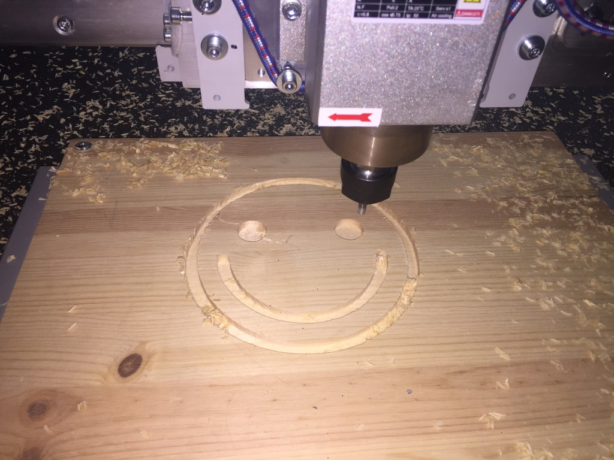
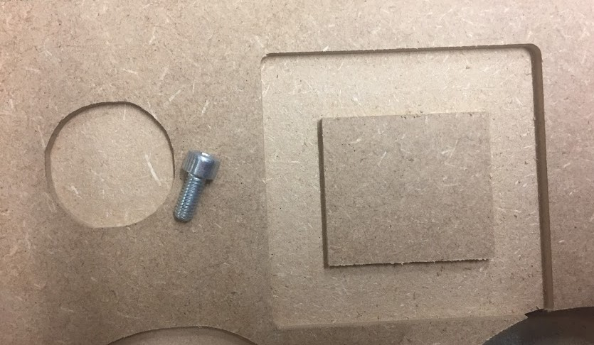
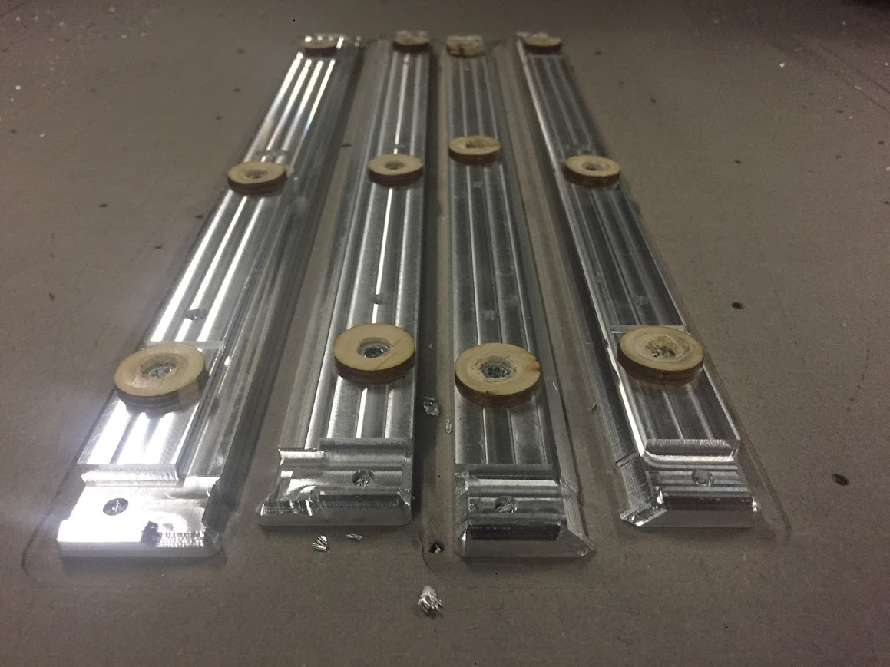
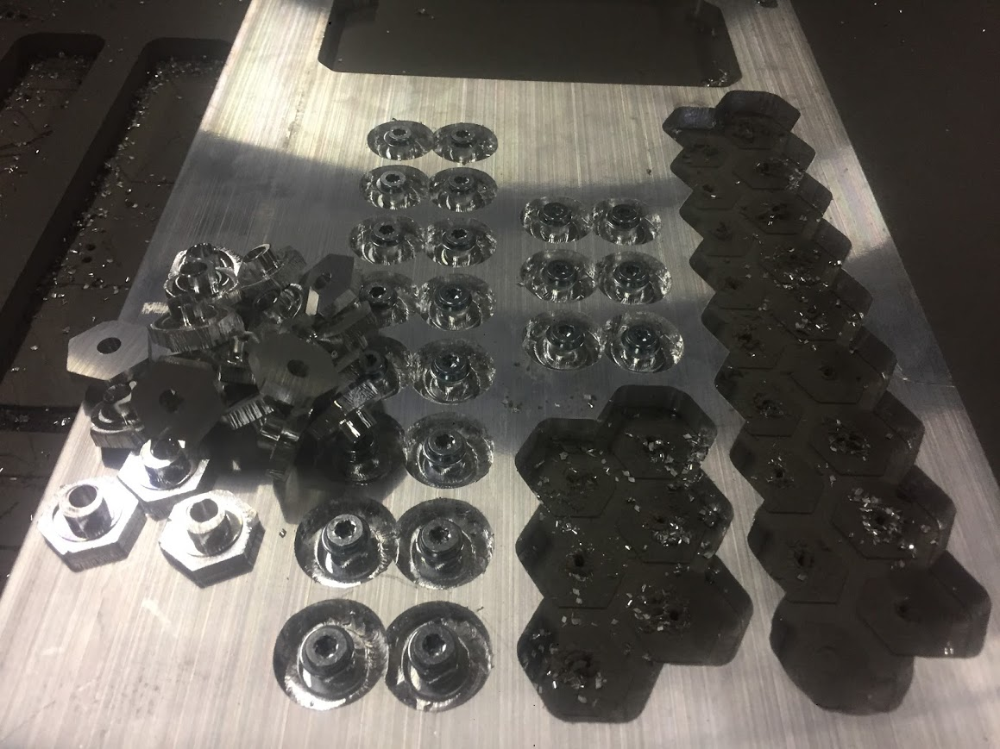
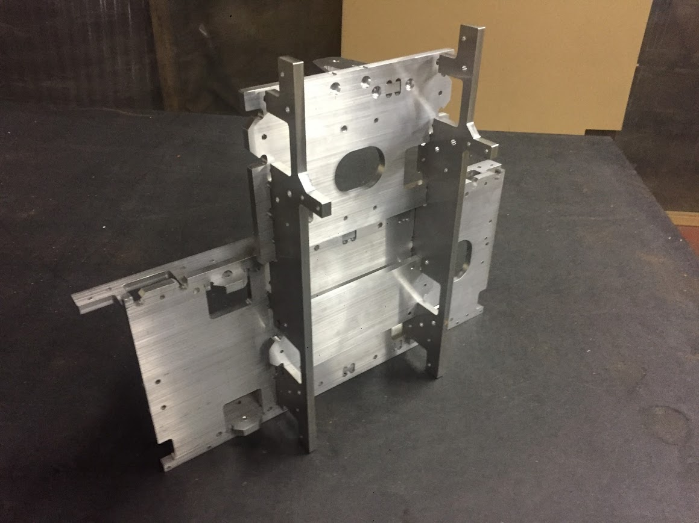
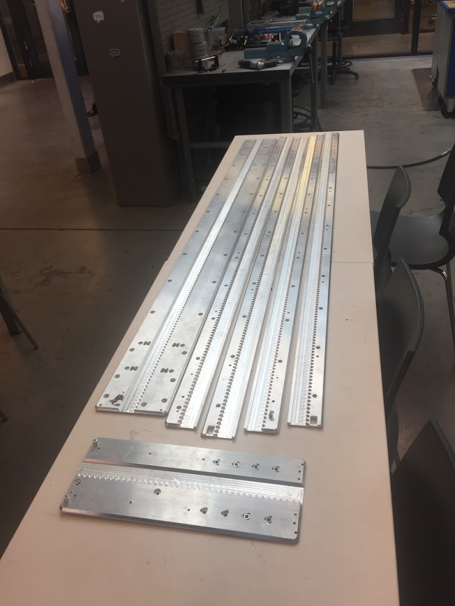
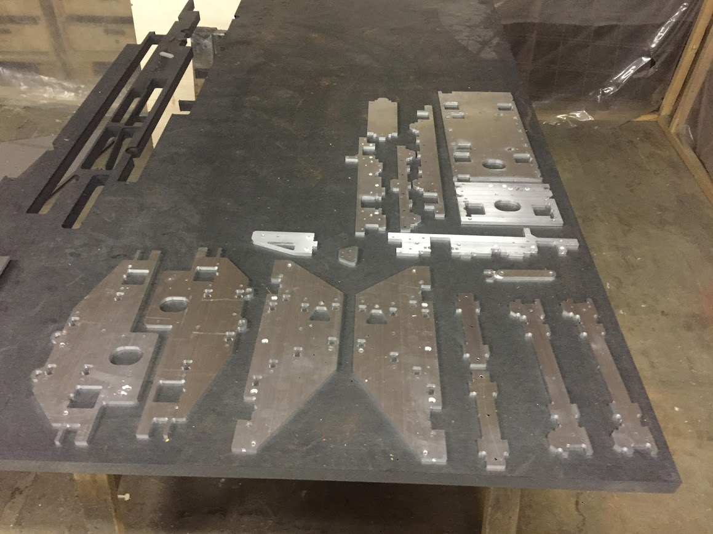
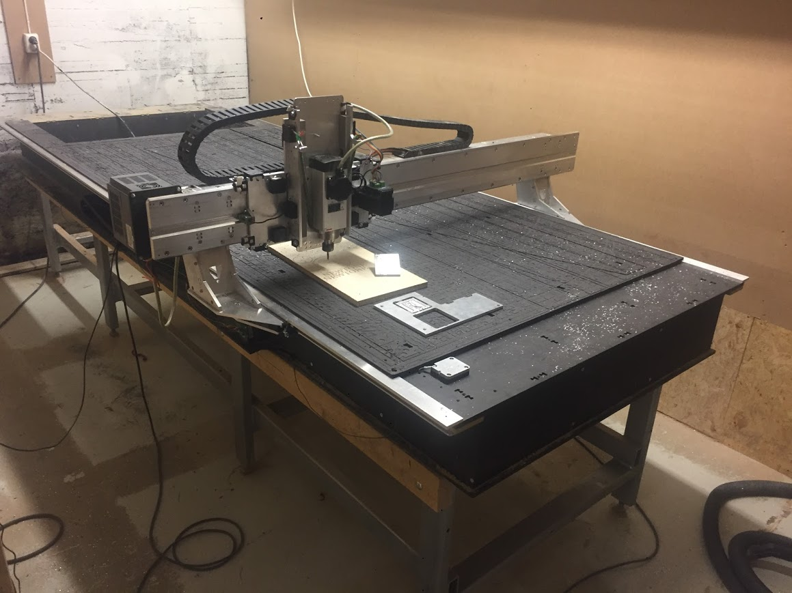
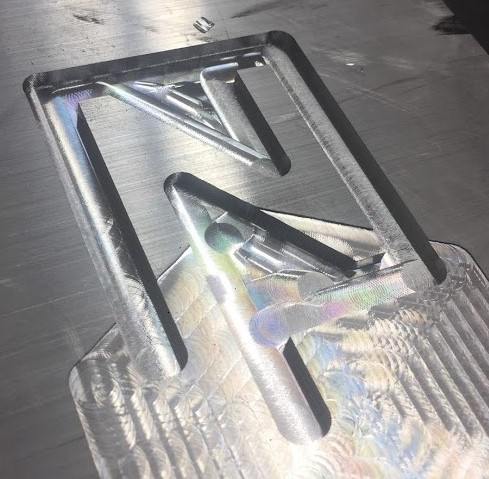
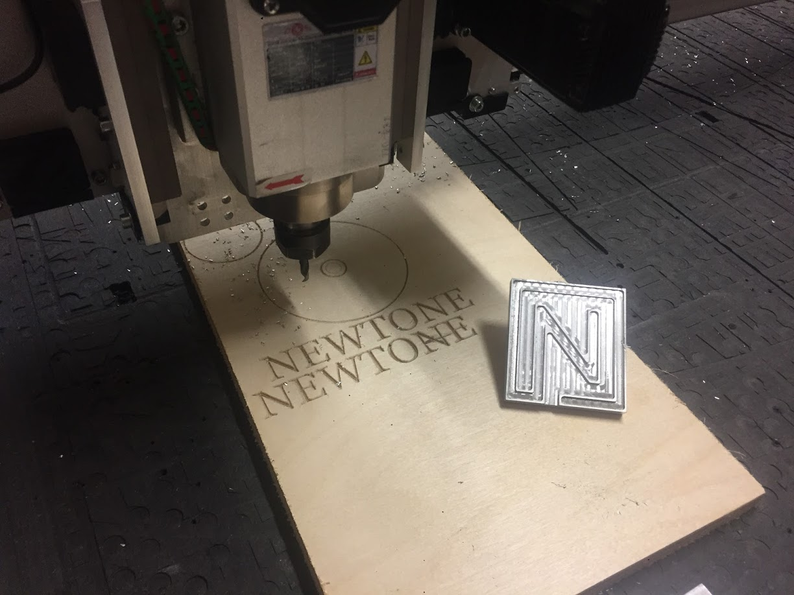

# Humphrey v2 - Large format CNC mill
 
 

*Humphrey v2 doing it's first production cuts at [Newtone AS](https://newtone.no/) in Oslo.*

### Summary 

Humphrey v2 was comissioned by [Newtone](https://newtone.no/), which is a joint venture and shared creative workspace for recording, mixing and making music, they also build, repair and restore stuff need to create music. They have used their humphrey CNC to mill lots of custom acustic wall elements when building Norways biggest professional recording studio on their premisies. 

The design of Humphrey v2 was based on the lessons learned from Humphrey v1 (documented below) and upgraded with some additional request for new features. It was modeled from the base up in [Fusion360](https://www.autodesk.com/products/fusion-360/overview) [(3D model cloud link](https://a360.co/2Okah8P) using [cycloid rack and pinion](https://github.com/fellesverkstedet/fabricatable-machines/wiki/Fabricatable-axis#rack-and-pinion) to drive the motion and (initially) [Chamfer rails](https://github.com/fellesverkstedet/fabricatable-machines/wiki/Fabricatable-axis#chamfer-rail) as linear guides. All machined parts were produced at [Fellesverkstedet's](https://www.fellesverkstedet.no/) old facilites in [Urtegata, Olso.](https://goo.gl/maps/r2fua3EC7Hw). Fellesverkstedet is a shared workshop open for everyone who has and idea that they wants to make themselves.  

Humhprey v2 was modeled, produced and installed by Jakob Nilsson, a [Fab Academy](http://fabacademy.org/about/) 2017 [graduate](http://archive.fabacademy.org/archives/2017/fablabverket/students/100/), mechanical design engineer and "maker freelancer". He makes a  living creating open hardware machines using the fabricatable machines project as a working team and rents commercial access to open workspaces in the Oslo region. You can read more about [Making Money with Fabricatable Machines](https://github.com/fellesverkstedet/fabricatable-machines/wiki/Making-money) of if you want to you can [contact Jakob directly](mailto:jakob.a.nilsson@gmail.com) or see his webpage [here](norlinkmakes.com).

After some [substantial updgrades](https://github.com/fellesverkstedet/fabricatable-machines/tree/master/humphrey-large-format-cnc#initial-backlash-and-tuning-issues) Humphrey v2 is currently operational and performing very well at Newtones facilities i [Kalbakkveien, Oslo](https://goo.gl/maps/iQA1DNBF3Ak). It has an "hand measured" backlash of less than 0.1 mm and feels very solid. During testing it milled aluminium with a 6mm single flute upcut carbide bit at 24000 rpm speed and 16 mm/s (960mm/min) feed at 2.6mm pass depth with very little chatter. [Aluminium milling picture](img/alu-milling_still.JPG)  and [Aluminium milling video [2:41]](https://photos.app.goo.gl/FRxFFRnpFdPw9nKu7). More pictures [below](https://github.com/fellesverkstedet/fabricatable-machines/tree/master/humphrey-large-format-cnc#pictures).

### Changes from v1
The most notable planned changes from v1 were:

* Longer 3.1 m * 1.22 m work area (v1 had 2.44m * 1.22 m)
* 4 of Nema24 closed loop stepper motors, 3Nm
* 2,2 kW 24000 RPM aircooled spindle (v1 had 800w which was considerably lighter weight)
* Torsion box bed
* Prefabricated steel legs (v1 made it's own legs after temporary assembly)
* Square cross-section aluminium gantry with place for all electronics and cable drag-chains (v1 had a lighter triangular gantry profile)
* CNC cut slots for easy screwing during torsion box assembly
* Full auto homing using inductive limit switches and Z-plate on gantry "foot"
* Pre milled marks and reliefs for easier sideways threading of aluminium parts
* Larger rack and pinion teeth for faster milling 
* CNC threading of vertical holes
* Split glide blocks to aviod warping, made from [Ertalyte TX](http://www.boedeker.com/ertaly_p.htm?utm_source=google&utm_medium=cpc&utm_campaign=Ertalyte&utm_content=ertalyte&utm_term=ertalyte&gclid=Cj0KCQjwu_jYBRD8ARIsAC3EGCJTTdM0VmiQMfy559bWI8msx-GFd42NzXiWPIiUJrVDcyjbf4ZEix4aArsJEALw_wcB) a low friction plastic, with compressing screws.
* Y-axis glide blocks placed so that the machine rest on the glide block instead of hanging from it.
* Dust vipers integrated into the glide blocks
* Metal links to simplify positioning the split y-rails
* Custom GRBL connection shield with full opto-insulation

### Initial backlash and tuning issues 

Humphrey v2 is slightly heavier than v1. We think that this caused too high friction forces between the plastic glide blocks and the rails. What happened was that the glide block surfaces within a days use would be covered in a layer of aluminium oxide, which would dramatically increase the friction and make the machine underperform. We measured that [it took 16 kg pull on a luggage scale to move the X-carriage](img/pull_test.jpg). This caused backlash of 1-2 mm (without any extra milling load) and caused the motors to jerk and sometimes stall. This also made tuning the chamfered glide blocks very challanging since the margins were so small between too loose and too tight to move. 

[See issue 14 for more in depth discussion and pictures of the problem](https://github.com/fellesverkstedet/fabricatable-machines/issues/14)

**Log of attempted fixes and upgrades:**

* Endless and recurring tuning of the glide blocks and motor positons

  Result: Slight tempoprary improvement but the glide blocks shifted from the load and this quickly loosened the tuning.
  
* Increasing the [motor](https://www.aliexpress.com/item/NEMA-23-2N-m-283ozf-in-Integrated-Closed-Loop-Stepper-motor-36VDC-JMC-iHSS57-36-20/32712473144.html) torque by reprogramming their firmware using a [HISU adjuster with RS232 cable for JMC driver](https://www.aliexpress.com/item/HISU-for-Andriy-Kyrychenko/32805819281.html?spm=2114.search0204.3.1.2e5f22b096LPf6&ws_ab_test=searchweb0_0,searchweb201602_3_10152_10065_10151_10344_10068_10869_10342_10868_10343_10340_10059_10341_10696_100031_10084_10083_10103_10618_10624_10307_10623_10622_10621_10620,searchweb201603_6,ppcSwitch_5_ppcChannel&algo_expid=75d93e7b-17cd-46cd-bf5e-ac884c644ff8-0&algo_pvid=75d93e7b-17cd-46cd-bf5e-ac884c644ff8&priceBeautifyAB=0)

  Result: Slight improvement, less stalling, increased shifting of the glide blocks.

* Roughing the surface under the glide blocks to make tuning last longer

  Result: Tuning lasted longer but backlash and reliability was still not good enough.

* The X-rail was removed and all precision surfaces were remachined to remove small imprefections

  Result: Tuning and backlash in X got improved but the machine still jerked and had >1 mm backlash.
  
* All rails and pinions were replaced with new smaller rack and pinon tooth size versions to [increase the gearing ratio](https://github.com/fellesverkstedet/fabricatable-machines/wiki/Fabricatable-axis#pinion-size-and-maximum-rack-pushing-force)

  Result: Smoother motions and less stalling but backlash in X was still around 1 mm. However the motors are now strong enough to damage the pinon teeth. 
  
* All aluminium glide surfaces were treated with PTFE dry film lubrication spray
  
  Result: Any benefit wore off quickly, the vipers might be partly to blame for rubbing it off.

* All glide blocks were replaces with aluminium glide blocks covered in UHMW-low-friction-tape
  
  Result: Tuning got easier and backlash seemed better(?) but they had even quicker oxide buildup(?) and no clear improvement in friction forces. (This was not tested for long.)

* [Roller axis developed and tested](https://github.com/fellesverkstedet/fabricatable-machines/wiki/Fabricatable-axis#roller-rail), all axis plates and glide blocks replaced, now using ball bearings and needing [dust covers](https://github.com/fellesverkstedet/fabricatable-machines/blob/master/humphrey-large-format-cnc/humphrey_v2/3d_prints/).

  Result: Incredible reduction in friction, all three axis can be moved at the same time using two fingers. Backlash seems to be <0.1mm. Smooth running so far. [Test](https://github.com/fellesverkstedet/fabricatable-machines/wiki/Fabricatable-axis#roller-rail) indicate that the roller-axis is vounerable to dust. (Currently being evaluated.)

### Fails

* We think that the chamfer rail gets in a self-reinforcing spiral of increasing friction when it is over-loaded. This made it impossible to reach good performace on Humphrey v2 with chamfer rail.
* Compressing plastic glide block screws made glide block tuning difficult.
* Fixing the performance problems took lots of unforseen effort.
* The gantry feet often clashed with the Z-rail and dust skirt, it's inner sides should be lower to avoid this.
* The steel legs were welded together and could therefore not be adjusted to be level with each other, after some time the torsion box sank down to match the lower legs, this caused it to stretch in the top and deform the links keeping the y-rails together. It was solved by bolting long horizontal wooden beams to the sides of the legs, supporting the torsion box evenly.
* Electrical noise from the unshielded spindle triggered the alarm pin on the Arduino-GRBL controller. 
* The Arduino-GRBL controller is not effected by cutting power with the emergency stop button and can start the machine when power is restored.

### Wins 

* Humphrey v2 has the highest precison, is most powerfull and is the biggest machine we have made with the fabricatable machines system.
* Using a special linking part to align the Y-rails worked well. 
* Using the CNC to mark all spots that should be manually drilled with a notch and step prevented the drill bit to slip and made it easy to see where to drill.
* Milling a [relief pocket](https://github.com/fellesverkstedet/fabricatable-machines/raw/master/Module%20development/Thread%20test/thread_test.png) for all the hand drilled holes saved lots of time drilling (clamp to a fixed table and drill horizontally!)
* Threading holes in aluminium with a [spiral fluted threading drill bit](https://nettbutikk.wuerth.no/boring-gjenging-kapping-og-sliping/gjenging/maskingjengetapp-hss-e-din-for-staal-bunnhull) and power drill worked great (Always use oil!!) This and the above tricks made it possible to thread 40 holes / h for one person.
* The torsion box bed was easy to assemble and glue together thanks to [pre-milled slots for screws](https://github.com/fellesverkstedet/fabricatable-machines/tree/master/humphrito-medium-format-cnc#screw-and-glue-joints-for-valchromat) and loose tolerances.
* Extending the split glide blocks and adding cloth vipers to them worked well as dust protection for glide blocks. [Model files](https://github.com/fellesverkstedet/fabricatable-machines/wiki/Fabricatable-axis#soft-rack-material---large-teeth). (They vere later changed to roller axis with [different 3D-printed dust protection](https://github.com/fellesverkstedet/fabricatable-machines/tree/master/humphrey-large-format-cnc/humphrey_v2/3d_prints).
* Newtone developed a opto-isolated connection board with headers for an arduino Nano (link coming!)

### Files

[Components BOM with supplier links and prices](BOM.pdf)

#### 3D models using glide blocks - OLD!

[STEP model assembled machine](humphrey%20v2_with_glide_blocks.zip)

[Fusion360 cloud link, full assembly](http://a360.co/2GzDQQc) 

#### 3D models using roller axis - LATEST! 

[Fusion360 cloud link, full assembly](https://a360.co/2Okah8P) 

[STEP model assembled machine](./humphrey_v2/Assembled_with_rollers-step.zip)

### Pictures

_Humphrey v2 Torsion box cut patterns_

.jpeg)

_Assembly of the torsion box_

.jpeg)

_Assembly of the gantry_

.jpeg)

_Mounting of all axis together_

_First tests_

_First cuts_

_Milled test pockets that shows typical imperfections from backlash_

_New aluminium glide blocks being produced_

_Comparission of the rack and pinion sizes during the upgrade to higher gear ratio_

_Machining of 40 excenters for the roller axis conversion_

_Test fitting the Roller-axis X-carriage aluminium parts_

_Humphrey v2 being upgraded to use rollers instead of glide blocks_

_All 3D printed components for the dust protection of the roller axis_

.JPG)

_All the aluminium in the original delivery_

_New aluminium parts for the gearing upgrade_

_New aluminium parts for the roller axis upgrade_

_Humphrey v2 after the roller axis upgrade_

_Aluminium milling on Humphrey v2!_

_Aluminium milling on Humphrey v2 video_

_Humphrey v2 roller axis first test results, check out those circles!_

## Humphrey v3 in it's workshop in Novmeber 2018 at [Newtone AS](https://newtone.no/)

.jpg)

.jpg)

.jpg)

.jpg)

.jpg)

.jpg)

.jpg)

.jpg)

.jpg)

.jpg)

.jpg)

[Back to Humphrey index](./README.md)
