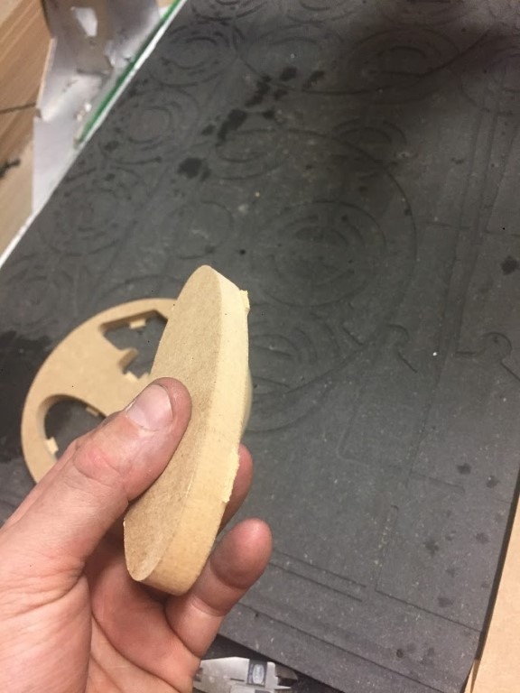
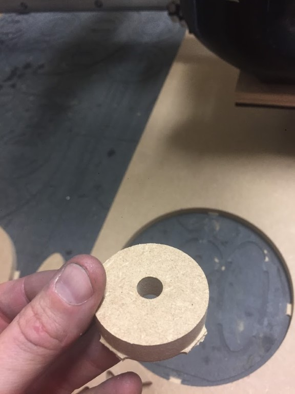
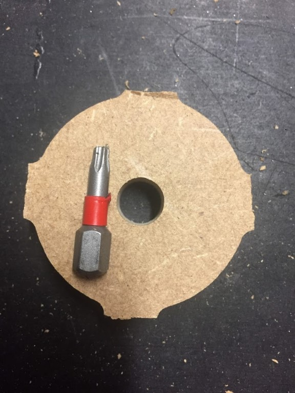
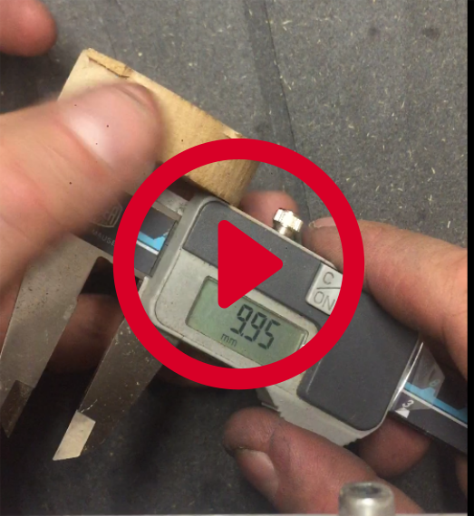
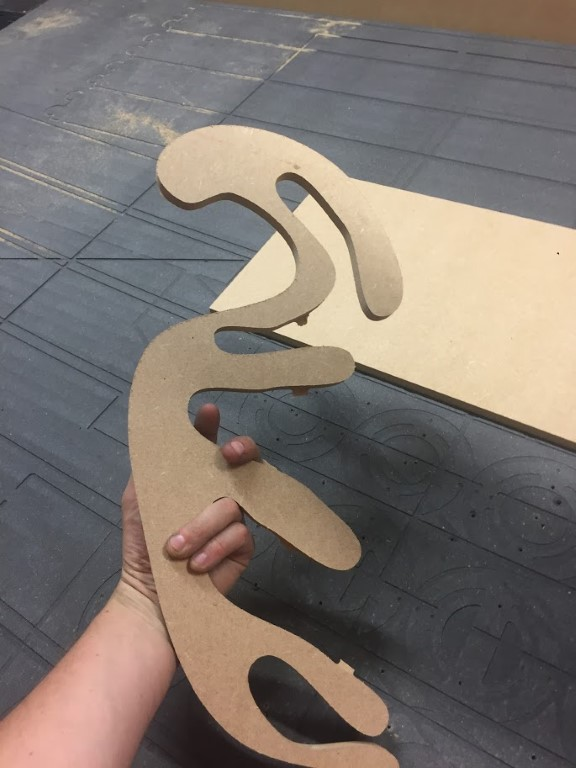
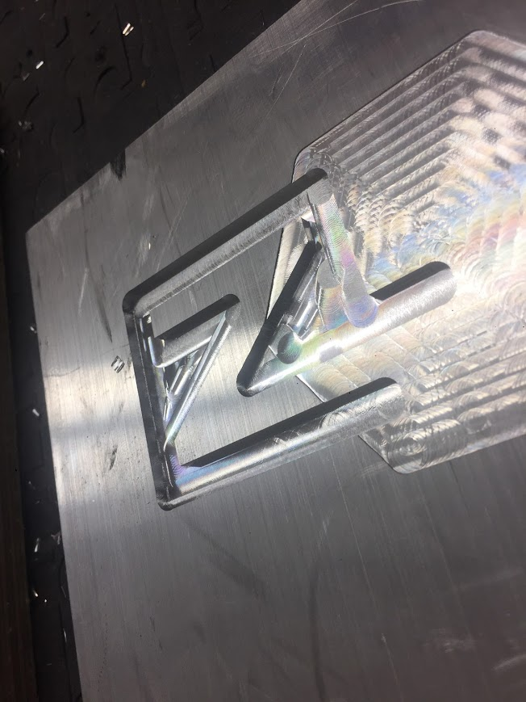
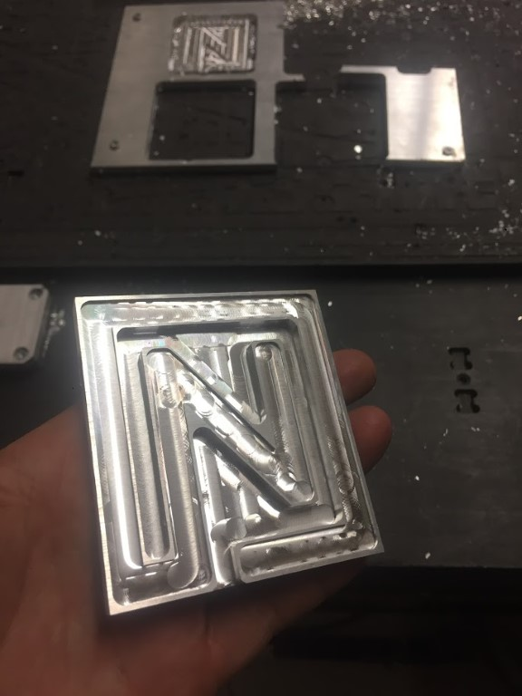

# Milling examples Humphrey v2
These are a series of test shapes milled on Humphrey v2.

## Well tuned in wood

[*Click to view in Google photos*](https://photos.app.goo.gl/qn35tccbV4Q5kNfY8)

[Download video from git](https://github.com/fellesverkstedet/fabricatable-machines/raw/master/humphrey-large-format-cnc/humphrey_v2/img/ring3_10mm_hole_6mmbit.MOV)

The hole is milled with a 6mm bit in one pass with default speed.

## Well tuned in aluminium

(Toolmarks on bottom could have been greatly reduces by adding a finish pass.)

## Test axis experiments

Precision test using heavily loaded test axis after 2000 repetitions 

[Youtube playlist, 7 videos](https://www.youtube.com/playlist?list=PLKSI6XgWmHYbdBKBy4OpFnty4vu3g5wap)

