# Carriage assembly

## X axis carriage

* Find these parts:

*NOTE!* Humphrey v4 is updated to use two identical bearing holders here, they both look like the top one.

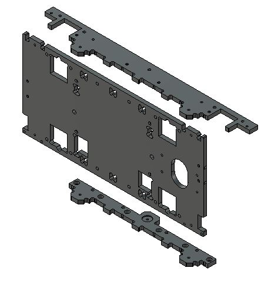

* Find bearings and the *fixed* bearing cores. They are as default assembled without washers.

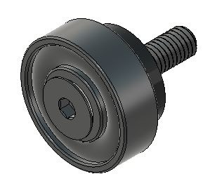

* Find the bearings, large washers and the *excentric* bearing cores. Note that the excenters always should have two washers on top of the bearing and as default one washer below the excenter. 

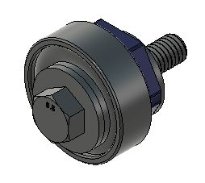

* NOTE: Immedietly tighten the screws holding *fixed* bearings and leave the screws holding the *excenters* loose.

### Top and bottom parts

*  Build two of these: (Shown with the bearings hidden for visibillity)

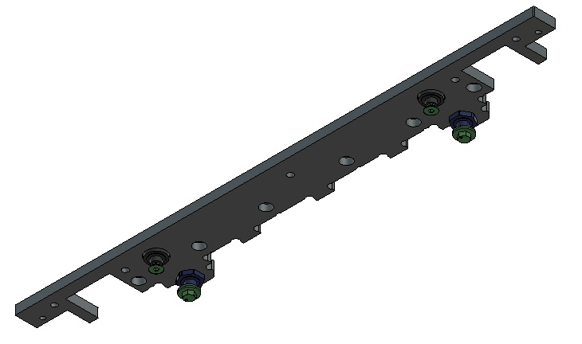

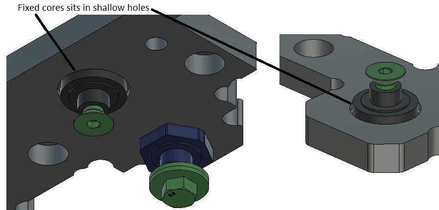

* It should look like this when done:

* REMINDER: Tighten the screws holding *fixed* bearings and leave the screws holding the *excenters* loose.

### X-axis plate
*  Arrange the bearings like this: (Shown with the bearings hidden for visibillity)

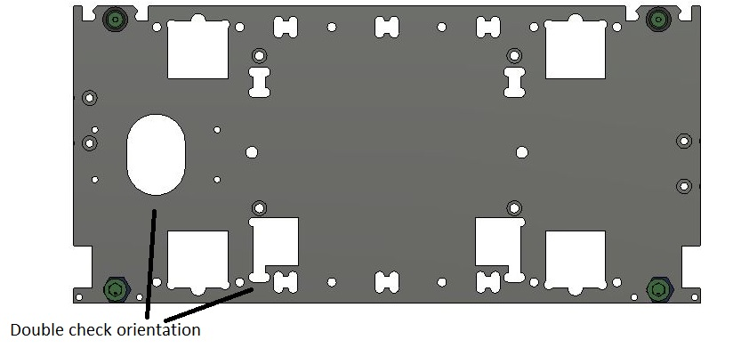

* It should look like this when done:

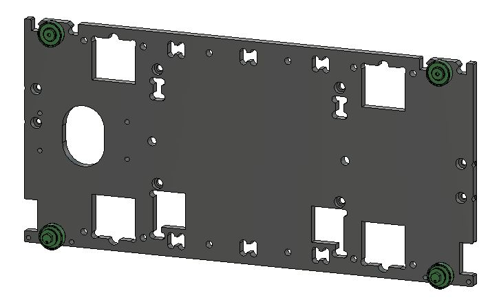

* REMINDER: Tighten the screws holding *fixed* bearings and leave the screws holding the *excenters* loose.

### Putting the X-axis carriage together

* Screw the x-carriage together but don't tighten the screws for the lower part it needs to come off to mount the carriage on the gantry.

## The Z axis carriage

*  Arrange the bearings like this: (Shown with the bearings hidden for visibillity)

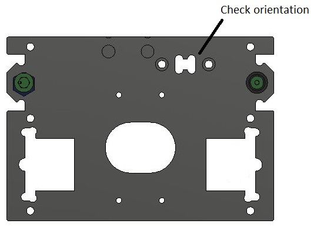

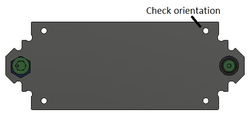

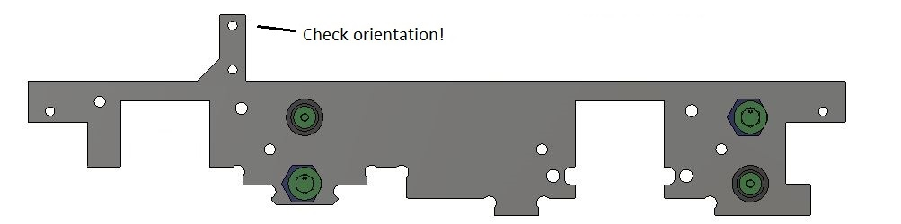

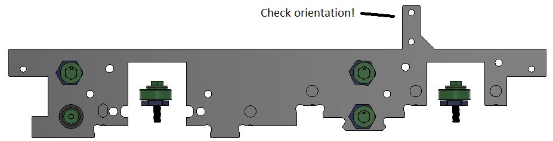

* Screw the lower part to the sides first. All bearings facing inwards. Don't tighten the screws yet.

* Then screw on the Z-axis plate AND tigthen its mounting screws.

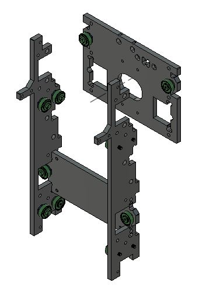

## Combine the carriages

* Screw the carriages together and tighten the screws holding them to each other.

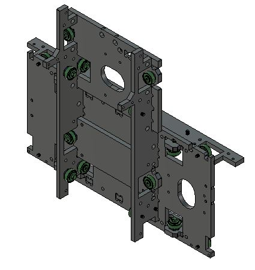

## Add drag chain mount and sensor mounts

* Find these parts

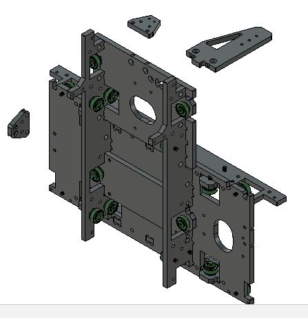

* Screw them to the carriage and tighten those screws.

# Mounting the carriage on the gantry

* In order to mount the completed carriage on the gantry you need to take off the lower plate like this:

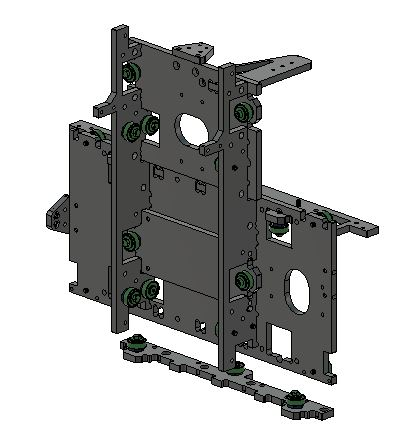

* Then you should be able to hang the carriage on the gantry

* And reattach the lower plate. Now tighten the screws and double check that the screws holding the upper is tight as well.

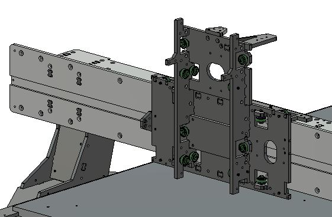

# Z axis, spindle and dust skirt

* Find these parts:

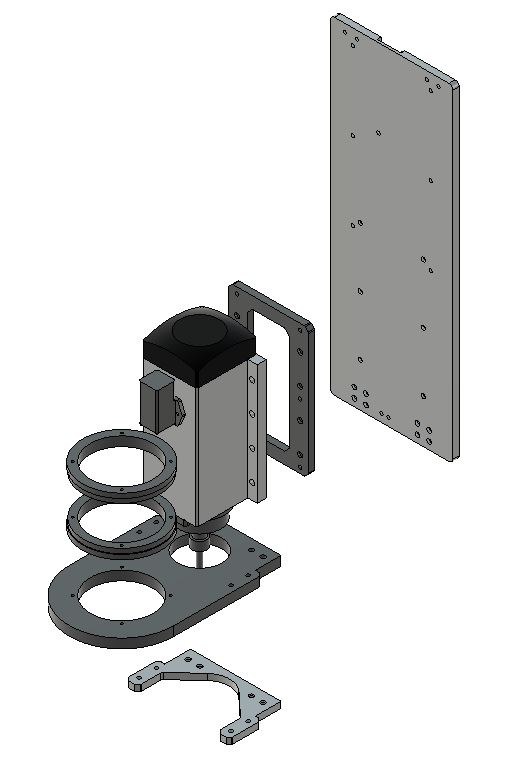

* When mounting the spindle to the z-axis. Measure it so that it gets paralell with the sides of the Z-axis. 
* The wooden parts form the dust skirt ledge. 
* Glue the wood pieces together using screws as guides in the holes.

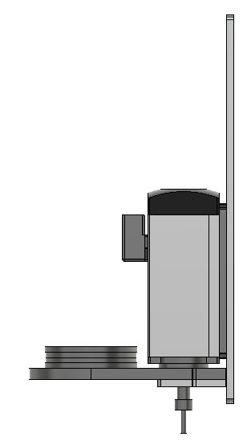

* Find these wooden parts, they will create a strain relief for the dust extraction hose:

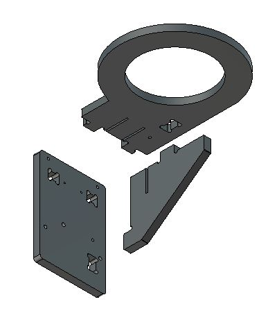

* Assemble and glue them like this:

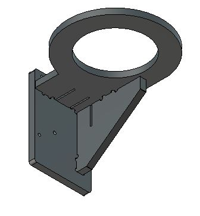

* Screw the wooden pieces to the Z axis (wait till the glue has dried and remove the screws from the back for a snug fit)

* Find these wooden pieces: 

* Assemble them like this, glue them together using screws as guides in the holes.

* Attach a leather skirt to the perimeter, predrill the wood or it will crack. Cracks can be fixed with glue :)

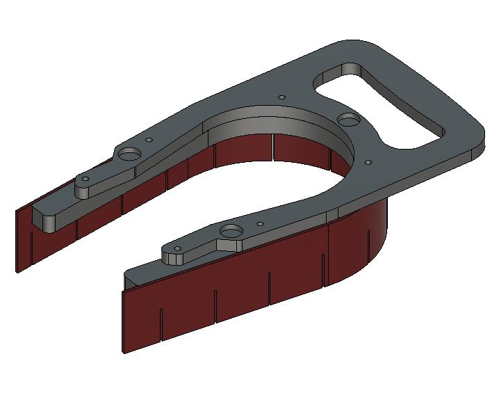

* Attach a leather skirt to bottom of the Z axis

[Leather skirt DXF files](https://github.com/fellesverkstedet/fabricatable-machines/raw/master/humphrey-large-format-cnc/humphrey_v3/laser_leather_skirt.dxf)

* Expoy 6 magnets into the holes in the handle and the dust ledge. Take care to match the polarity of the magnets and not to glue the wood to each other. Vaseline on the wood prevents the glue from sticking were it shouldn't. We want the handle to be removeable.
* It should look like this when done: 

# Mounting the z axis on the X-carriage

* We want to prevent the spindle from dropping into the material when the emergency stop is pressed now we will add a lifting spring.
* Find two small aluminium clips that look like this: 

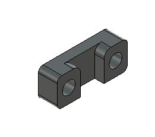

* Thread the string down behind, below the spindle.

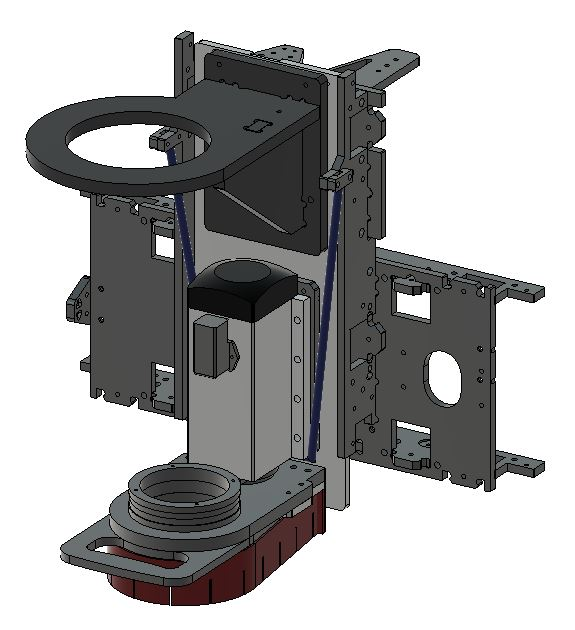

* The tense the string so that the spindle is lifted 20-40mm from the bed when you release it. The motor will also add resistance later. 

_CONGRATULATIONS! THAT CONCLUDES THE CARRIAGE ASSEMBLY_

[Instructions continues in: Tuning the motion system](https://github.com/fellesverkstedet/fabricatable-machines/tree/master/humphrey-large-format-cnc/humphrey_v3/tuning.md)

[Back to assembly main page](https://github.com/fellesverkstedet/fabricatable-machines/tree/master/humphrey-large-format-cnc/humphrey_v3#how-to-make-humphrey-v3)

