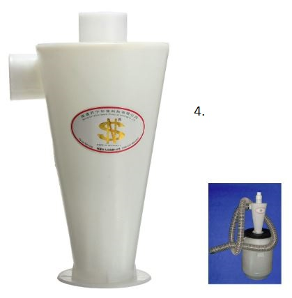

# Dust Extraction

It's very important to have a proper dust extraction system for your milling machine before you start using it. It will generate copius amounts of fine dust which is unhealthy to breathe and end up everywhere, unless you have a good dust extraction system in place!

The dust exctration system consist of these parts:
1. Fan with motor
1. Fine dust filter
1. Dust collector
1. **Optional** Cyclone chip separator
1. Conduits (hose or pipe) to lead the air to the fan
1. A flexible hose mounted over the machine
1. A removable dust shoe on the machine [See dust extraction 3D prints](https://github.com/fellesverkstedet/fabricatable-machines/blob/master/humphrey-large-format-cnc/humphrey_v2/3d_prints/README.md#dust-skirt)

