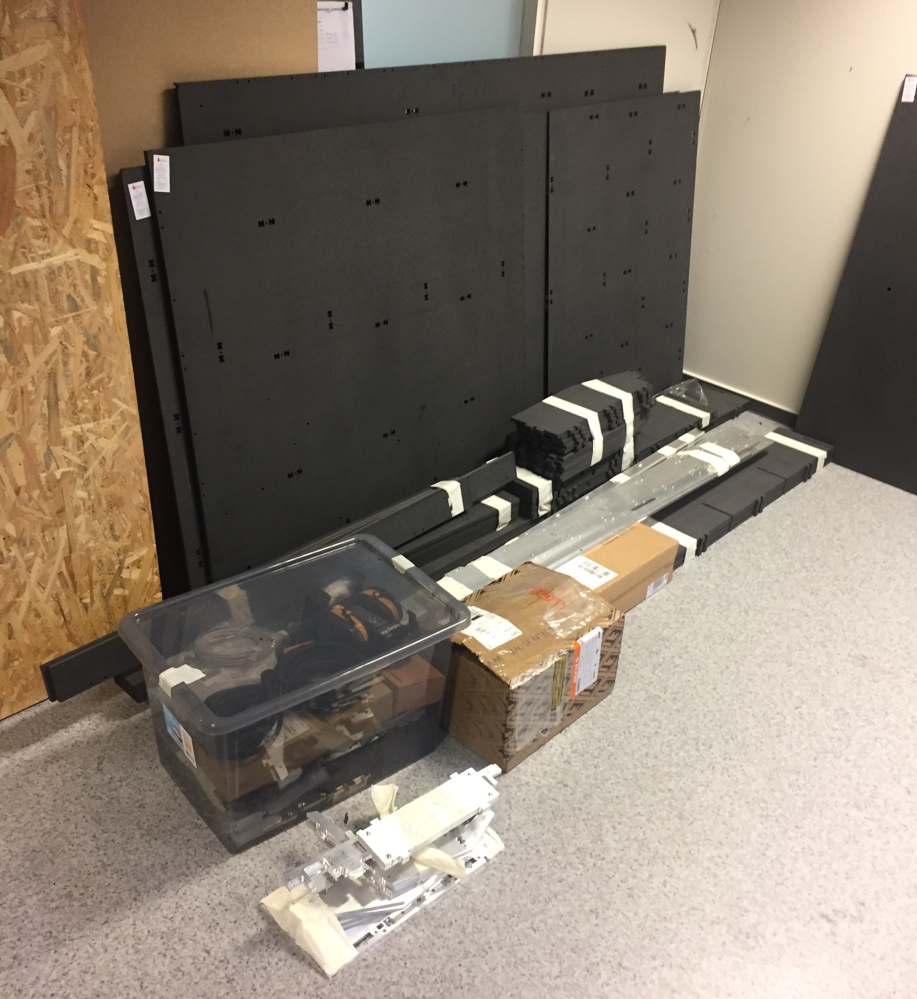
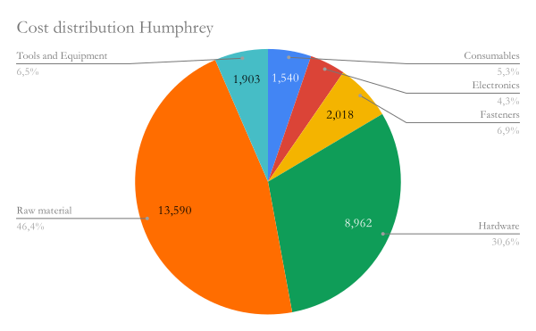
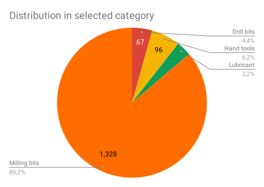
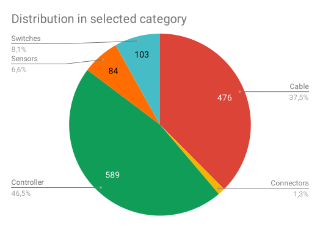
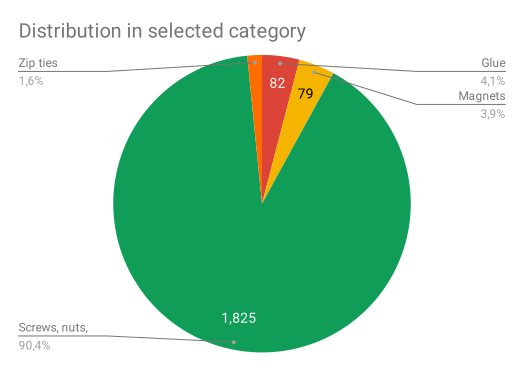
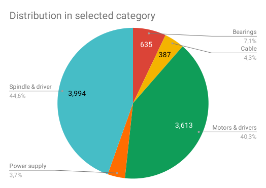

# Humphrey version 3 

A full size CNC milling machine of the [Humphrey machine family.](https://github.com/fellesverkstedet/fabricatable-machines/tree/master/humphrey-large-format-cnc#humphrey---large-format-cnc-mill)

This version of Humphrey was commissioned by [MiB - Makerspace i Brumunddal](https://www.facebook.com/Makerspace-i-Brumunddal-199245720667673/) and developed and manufactured as a kit by [Jakob Nilsson from Norlink](https://norlinkmakes.com/marketplace/). The MiB members then assembled the kit from the [online instructions below.](https://github.com/fellesverkstedet/fabricatable-machines/tree/master/humphrey-large-format-cnc/humphrey_v3#making-the-kit-of-parts)

[Video on Youtube of Humhprey v3 planing its spoilboard](https://youtu.be/zEsviWFEUS8)

### [CLICK FOR INSTRUCTIONS ON HOW TO USE](https://github.com/fellesverkstedet/fabricatable-machines/wiki/How-to-use#humphrey)

## Stats

* Work area 2440x1220 mm (standard size of sheet stock)
* 3 axis CNC milling machine
* [Grbl](https://github.com/gnea/grbl/wiki) motion controller
* [Roller Axis](https://github.com/fellesverkstedet/fabricatable-machines/wiki/Fabricatable-axis#roller-rail)
* 800W 24000 rpm spindle
* Valchromat torsion box bed
* [Integrated Closed loop 3Nm Nema24 stepper motors](https://topcnc.aliexpress.com/store/group/Integrated-closed-loop-stepper-Motor/1932111_504161502.html)

## Complete machine files

* [Fusion360 assembly](https://a360.co/2AF6yjp)
* [STEP assembly](https://github.com/fellesverkstedet/fabricatable-machines/raw/master/humphrey-large-format-cnc/humphrey_v3/Assembly_h3%20v5_step.zip)
* [Detailed BOM and raw material costs](https://docs.google.com/spreadsheets/d/1O0V0Yyn-vt2MoGoZ2DiTqdFMecpRSYYsnOq32u6BHwU/edit?usp=sharing)

# How to make Humphrey v3

## Summary
This is a guide on how to make the Humphrey CNC millling machine.
Each section list the parts you will need to complete the stage. Please contribute by offering improvements to these instructions, either by commenting in the Issues or as a Pull-request.

[Interactive 3D model](https://a360.co/2AF6yjp)

# The the kit of parts

These are instructions for how to make and purchase the kit of parts that later will be built into the machine.

## Components and raw materials that must be purchased

These are all the raw materials like aluminum bars, all hardware like the motors and spindle and small things like glue, safety googles and all fasteners. This include everything needed to make and operate the machine, except the machines to make the parts on. All prices include shipping (to Oslo). 

* [Google sheet with all costs and supplier links](https://docs.google.com/spreadsheets/d/1O0V0Yyn-vt2MoGoZ2DiTqdFMecpRSYYsnOq32u6BHwU/edit?usp=sharing)

### Costs of all raw materials and components

*(January 2019, based on Humphery v4 costs in Norway):*

| Total costs of materials                        | NOK       | USD    |
|-------------------------------------------------|-----------|--------|
| **Parts, raw materials and equipment:** | **29 281 kr** | **$3 404** |
| Spare / Left in stock after delivery            | 3 265 kr  | $380   |

| Cost by category                                | NOK       | USD    |
|-------------------------------------------------|-----------|--------|
| Consumables                                     | 1 540 kr  | $179   |
| Electronics                                     | 1 268 kr  | $147   |
| Fasteners                                       | 2 018 kr  | $235   |
| Hardware                                        | 8 962 kr  | $1 042 |
| Raw material                                    | 13 590 kr | $1 580 |
| Tools and Equipment                             | 1 903 kr  | $221   |

The categories can be broken down further:

### Consumables

| Sub category | NOK  |
|--------------|------|
| Drill bits   | 67   |
| Hand tools   | 96   |
| Lubricant    | 49   |
| Milling bits | 1328 |

### Electronics

| Sub category | NOK |
|--------------|-----|
| Cable        | 476 |
| Connectors   | 16  |
| Controller   | 589 |
| Sensors      | 84  |
| Switches     | 103 |

### Fasteners

| Sub category          | NOK  |
|-----------------------|------|
| Glue                  | 82   |
| Magnets               | 79   |
| Screws, nuts, washers | 1825 |
| Zip ties              | 32   |

### Hardware

| Sub category     | NOK  |
|------------------|------|
| Bearings         | 635  |
| Cable management | 387  |
| Motors & drivers | 3613 |
| Power supply     | 333  |
| Spindle & driver | 3994 |

### Raw material

| Sub category      | NOK  |
|-------------------|------|
| Aluminium         | 6249 |
| Elastic cord      | 80   |
| Leather and cloth | 21   |
| Plastic           | 154  |
| Valchromat        | 7086 |

### Tools and Equipment

| Sub category     | NOK  |
|------------------|------|
| Collets          | 195  |
| Hand tools       | 251  |
| Milling bits     | 1301 |
| Safety equipment | 80   |
| Storage          | 76   |

## Parts that can be made

The machining of the parts has been broken down into sub sections:

* [Milling the valchromat parts](Making_the_parts_for_the_table.md)
* [Milling the aluminium parts](alu_parts.md) 
* [Making the plastic parts](plastic_parts.md)
* [Leather skirt DXF file](https://github.com/fellesverkstedet/fabricatable-machines/raw/master/humphrey-large-format-cnc/humphrey_v3/laser_leather_skirt.dxf) for lasercutting

### Production times for a solo experienced person
* Milling the aluminium parts took 5 regular workdays, CAM in Fusion360 and milled on a Shopbot
* Milling the valchromat parts took 1 regular workday, CAM in Rhino using [Bark Beetle](https://github.com/fellesverkstedet/Bark-beetle-parametric-toolpaths) on a Shopbot
* (Estimated from Cura) 20 h to print the 3D prints using one Ultimaker 

# Putting it together

These are instructions for how to assemble Humphrey v3 from a kit of parts, in the recommended order of assembly:

* [Table assembly](Table_assembly.md)
* [Gantry assembly](Gantry_assembly.md)
* [Carriage assemby](Carriage_assembly.md)
* [Tuning the motion system](tuning.md)
* [Electronics](electronics.md)

## Assembly times

### For a five person group of inexperienced people plus one experienced and using the online manuals

* Table assembly, Gantry assembly and Carriage assembly was completed in 6-7 hours of workshop spread over two days, without stressing.

# Pictures

