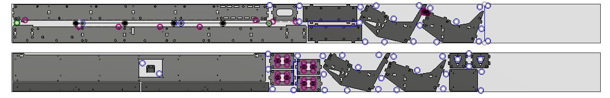
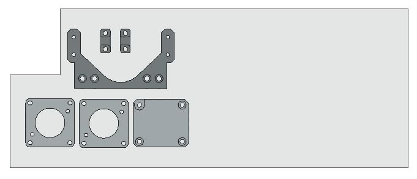

# Making the aluminium parts

These parts are milled from 200x8mm flat bar aluminium 6082-T6 grade. We buy them in 6 m lengths and cut them in half before milling.

The CNC we used for manufacturing has a 2440 mm long work area.

## Notes from milling Humphrey v3
Some parts were missing in the layout: 
* Homing plate.
* The small spindle spring mounting clamps.
* Dust skirt holder.
* Two motor plate spacers.

Recommended changes:
* When milling. Make sure there is a loose fit tolerance between the X-rail and the gantry, otherwise it's hard to fit it on and impossible to change it.

## Files

* Full 3D model files online view [(Fusion)](https://a360.co/2AF6yjp) 
* [Full step model](https://github.com/fellesverkstedet/fabricatable-machines/raw/master/humphrey-large-format-cnc/humphrey_v3/Assembly_h3%20v5_step.zip) 
* [All step files with the aluminium layouts](./parts/alu_parts_STEP.zip)

* Mega_nuts_long_motor_plates_2_motor_spacers [Fusion CAM](https://a360.co/2PiNYRo)

* Gantry bridge [Fusion CAM](https://a360.co/2PliVEu)

* Y-rails [Fusion CAM](https://a360.co/2MhuMFD)

* Roller axis plates [Fusion CAM](https://a360.co/2Bg37jq)

* X_Z_rails_cores [Fusion CAM](https://a360.co/2PhWqAk)

* 2_motor_plates_z_homeing_plate [Fusion CAM](https://a360.co/2PiNYRo)

## How to mill

* [Aluminium milling advice in the wiki](https://github.com/fellesverkstedet/fabricatable-machines/wiki/Fabricatable-axis#how-to-fabricate)

[Back to assembly main page](https://github.com/fellesverkstedet/fabricatable-machines/tree/master/humphrey-large-format-cnc/humphrey_v3#how-to-make-humphrey-v3)
