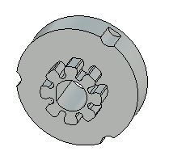
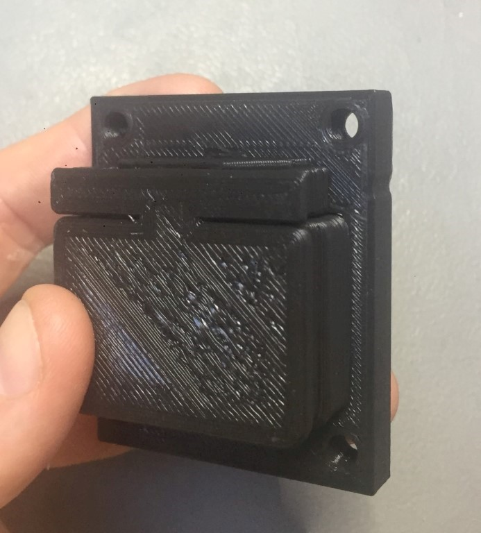
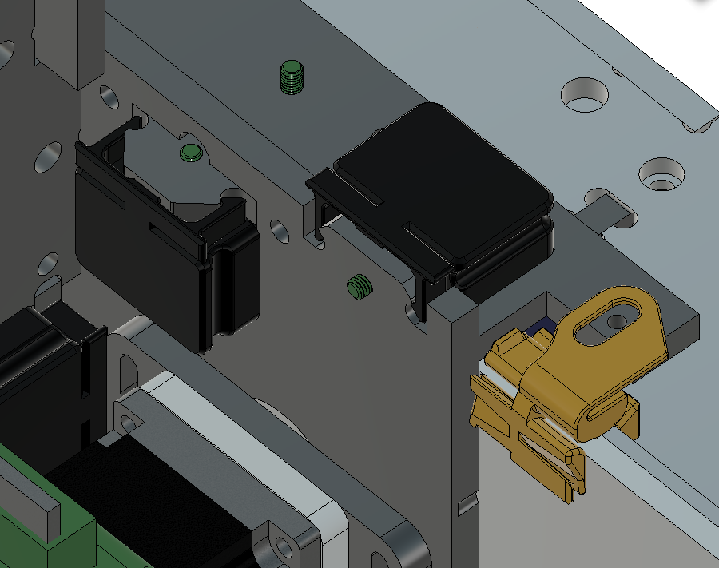

 # Making the plastic parts 
 
 The plastic parts for Humphrey v3 are the 3D printed dust covers and vipers and the milled pinons.
 
 # The milled pinons
 
 
 
 ## Files
 
* [Fusion File](https://a360.co/2MCFBlb) 
* [Step file](./parts/40_pinion_dual_gap_STEP.zip)
 
 Make at least 4 of these and a few spares.
 
 Use 11-13 mm thick POM plastic sheet.
 
 * [How to mill the pinions](https://github.com/fellesverkstedet/fabricatable-machines/wiki/Fabricatable-axis#how-to-fabricate) Follow our generic instruction on the wiki

# 3D prints for Humphrey 4

These are all the 3D prints needed for dust protection of Humphreys rollers. 

## Instructions

It takes in total ca 30h to print all parts.

_All the dust covers and vipers for Humphrey version 3 when freshly printed (some have a differnt design compared to Humphrey 4)_

You need a 3D printer and some patience, any FDM-3d-printer will do. PETG and PLA seems to work fine.

Start with printing a copy of the cover "test platform" (see filename) and a "Roller_cover" to see if they fit.

Download the zip-files, unzip. Print the 33 parts in the quantities listed below, the quantiy is also written in each filename.

### Print settings

I recommend PLA or PETG with double or triple wall thickness using a 0.4mm nozzle, 1.6 wall thickness and 20% infill but feel free to experiment with other settings. If you want to modify the parts, you can fish out the originals from the [assembly files here](https://a360.co/2NBCXcX). 

## Updated parts H4

### Covers

[Zip file](Roller_covers_stl_h4.zip)

* Roller_cover 18st
* Roller_cover_y_axis 4st

22 prints, 2 models. 

### Vipers

[Zip file](Viper_stl_h4.zip)

* Viper_h4 12st

12 prints, 1 model. 

### Pictures

[How to make the other parts](Humphrey_how_to_make.md)

[Back to Humphrey overview](README.md)
