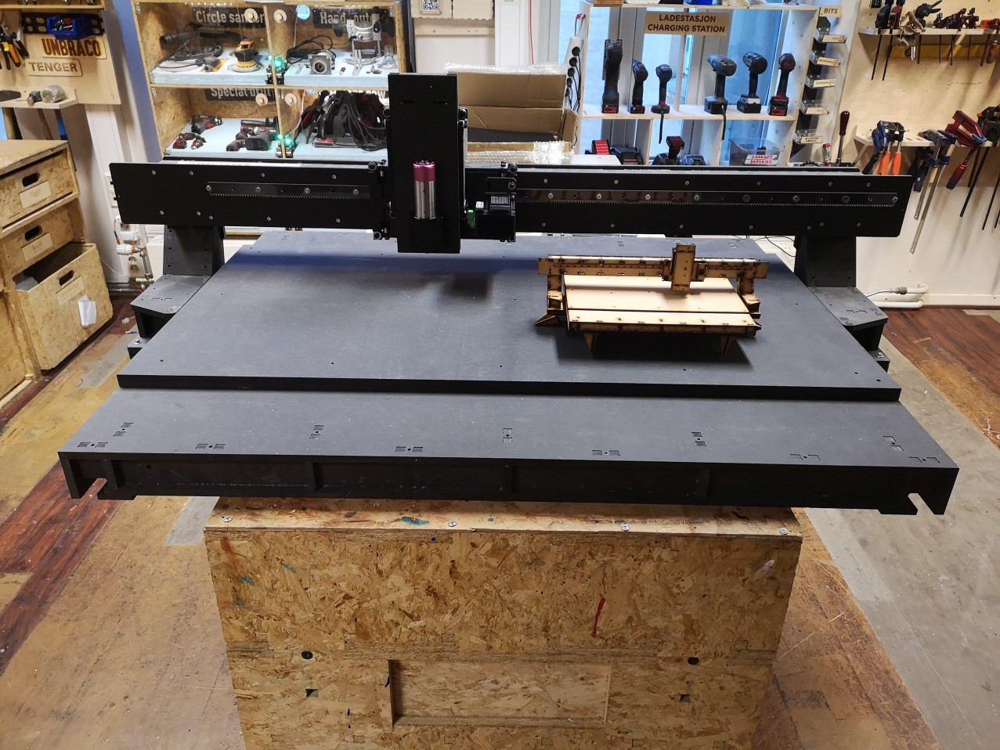

# Humphrey wood version - how to make
*(page in progress, please help improve this page)*

*Shortbed version (1/4th) wooden Humphrey at bitraf*

*Shortbed version inside safety enclosure*

## Pictures and videos of the making of a Wooden Humphrey
* Wooden Humphrey build by Haakon Walseng: [Media files](https://drive.google.com/drive/folders/1xZQbLe3GOX46Vw-eJBSd3kV14ufqdYzH)
*Unnamed and unsorted as of 21nd November 2019. Todo: Add pictures and commentary to own build readme. Feel free to upload and add pictures to this readme.*

### BOM
*(Bill of materials, the stuff you need to buy in order to make one)*

**Stock for milling:**
* For rails and axis carriages: 1pcs - 8mm Valchromat sheet 2440mm x 1220mm *(or similar type of HDF)*
* For gantry and bed torsion box struture: 2pcs - 12mm OSB, Valchromat, MDF or other type of cheap wood composite sheet in 2440mm x 1220mm size
* For rack piecs: 1pcs - 4-8mm thickness polycarbonate 800mm x 320mm *(or other strong plastic type; POM, UHMWPE etc)*
* For pinions: 1pcs  - 12mm POM 150mm x 100mm *(or other strong plastic type)*

**Bearings:**
* 16pcs - [non-adjustable KR16 stud type track rollers](https://www.kugellager-express.de/stud-type-track-roller-kr16-16x6x28-mm)
* 20pcs - [adjustable KRE16 stud type track rollers](https://www.kugellager-express.de/stud-type-track-roller-kre16-pp-16x9x28-mm)

**Safety:**
* 1pcs - [Emergency stop buttom](https://www.sick.com/se/en/safety-switches/safety-command-devices/es21/es21-sb10g1/p/p81746)
* 2pcs - [Door switch](https://www.sick.com/se/en/safety-switches/electro-mechanical-safety-switches/i16s/i16-sa203/p/p12219)
* 3pcs - [M20 Cable gland](https://www.sick.com/se/en/m20-gland/p/p315311)

**Electronics:**
* 4pcs - [ihss60 closed loop stepper motor with intergrated driver](https://www.aliexpress.com/store/product/NEMA-24-3N-m-425ozf-in-Integrated-Closed-Loop-Stepper-motor-36VDC-JMC-iHSS60-36-30/1932111_32713260490.html)
* 1pcs - [40000 RPM spindle and driver kit](https://www.aliexpress.com/store/product/250w-40000rpm-ER8-Brushless-spindle-motor-MACH3-driver-DC36V-for-CNC-drilling-milling-carving-kits/1932111_32757165445.html)
* Spindle alternative - [24000rpm 800 watt](https://www.aliexpress.com/store/product/Square-0-8KW-Air-cooled-Spindle-motor-ER11-24000rpm-400Hz-ENGRAVING-MILLING-GRIND-6-5A/907217_32665487318.html?spm=2114.12010612.0.0.54a41c927Yz5F6) and [VFD](https://inverterdrive.com/group/AC-Inverter-Drives-230V/Invertek-Optidrive-E3-1-1-kW-single-Inverter/)
* 1pcs - [36V power supply](https://no.farnell.com/mean-well/hep-480-36a/power-supply-ac-dc-36v-13-3a/dp/2815954?st=power%20supply) *to power the four stepper moters and spindle*
* 3pcs - [proximity switches](https://www.aliexpress.com/store/product/SN04-N-SN04-N2-SN04-P-SN04-P2-DC-NPN-PNP-NO-NC-4MM-DC-10/3105031_32842303693.html) or [green version](https://www.aliexpress.com/store/3105031/search?filterAllSearch=false&freeShipCountry=&minPrice=&maxPrice=&SearchText=sn04)
* 1pcs - Aruduino Nano microcontroller
* 1pcs - Breakout shield with easy connections and optocouplers for sensor inputs and spindle start output *[or fab your own HRBL shield](https://github.com/fellesverkstedet/fabricatable-machines/blob/master/hrbl-shield/README.md)*

**Cables:**
* 10m+- - two lead power cable 0.75mm2 cross section or higher
* 10m+- - 6 lead ribbon cable for signals

**Fasteners:**
* 0.5l - standard PVA wood glue
* 100pcs+- - 30mm torx20 wood screws, plus 1pcs wood drill of suitable diamter for predrilling
* 20pcs+- - M5 25mm socket head bolt *(DIN standard machine screw)*
* 8pcs+- - M5 30mm socket head bolt *(DIN standard machine screw)*
* 30pcs+- - M5 nuts
* 50pcs+- - M5 washers
* 12pcs - M5 10mm set screws *(for attaching the pinoins to the motor shafts)*
* 1pcs - M5 tap *(for tapping the set screw holes in the pinoins)*
* 20pcs+- - 6mm wood dowel pins *(for aligning the rack pices to the rails)*

### Cut sheets
Download work in progress cutsheets [here](https://github.com/fellesverkstedet/fabricatable-machines/tree/master/humphrey-large-format-cnc/wood-gantry-files)

### How to fabricate the parts
Download the [cutsheets](https://github.com/fellesverkstedet/fabricatable-machines/tree/master/humphrey-large-format-cnc/wood-gantry-files), order materials then CNC mill all the parts at your local fab lab, makerspace or hackerspace *(more info pending)*

You can also 3D print the four [pinions](https://github.com/fellesverkstedet/fabricatable-machines/blob/master/humphrey-large-format-cnc/wood-gantry-files/pinion_for_3Dprinting.stl) with fabrication service like Shapeways. We reccomend SLS nylon printing for maxiumum strength and wear resistance.

Vcarve and gcode files (including log files for aproximate milling times) have been added [here](https://github.com/fellesverkstedet/fabricatable-machines/tree/master/humphrey-large-format-cnc/wood-gantry-files/Vcarve%20and%20gcode)

### How to assemble
Step by step instructions are pending, for now you can study the [3D assembly STEP or Rhino file](https://github.com/fellesverkstedet/fabricatable-machines/tree/master/humphrey-large-format-cnc/wood-gantry-files) for guidance.

You can also check out the new [Fusion 360 file](https://github.com/fellesverkstedet/fabricatable-machines/tree/master/humphrey-large-format-cnc/wood-gantry-files/named-grouped-in-the-order-of-assembly-humphrey-wood-version-quarter-length-bed-v60.f3d) where all the parts have been named, put into groups and put into a suggested order of assembly. Tip: expand a group of bodies all the way, uncheck the lightbulbs for the individual bodies, not for the groups(!), and work your way through the assembly by turning on the lightbulbs starting at the top. Todo: mark the individual CNC-milled parts with an unique number, [1], [2], [3]... [148] etc and update the cutsheets with these numbers using blue stroke Hershey-text (for example using inkscape). When the 3D assembly CAD files and the cutsheets both have unique identification of the parts it will be much easier to make clear assembly instructions and to communicate about parts (for example when ordering spare parts, or talking about design improvemnts for a specific part).

### How to tune
* Carefully adjust the eccentric bearings towards the rail surfce with the help of an hex/allen key *(the bearings should not spin freely but follow the movement of the axis, but dont tighten too hard as this will create prematre wear of the valchromat rails)*
* Gently hold the motor with pinion against the rack, then tighten the screws on the motor plate *(too much pressure creates uneven motion while too much distance from the rack creates backlash)*

### How to wire electronics
Step and direcion signals from microcontroller to each of the intergrated motor drivers *(more info pending, also see [grbl documentation](https://github.com/gnea/grbl/wiki))*

### How to configure
Steps per mm = 40 *(more info pending)*

### Hard endstops for 3d printing
[endstop](https://drive.google.com/file/d/1bGgOnYXn5w3qPKVvl1ZfoLH06Uf3-SXC/view)  
[Design files and readme](\wood-gantry-files\Hard endstops 3d print)
