# Humphrito - Medium format CNC mill
*December 2017, by Jakob Nilsson and Jens Dyvik*

A **medium** sized gantry based CNC machine made to be able to machine an area the size of a quarter of a standard 1220x2400mm plate.

**Machine sizes reference table:**
* [Hattori](https://github.com/fellesverkstedet/fabricatable-machines/blob/master/hattori-small-format-cnc/README.md)  - Small size
* [Humphrey](https://github.com/fellesverkstedet/fabricatable-machines/blob/master/humphrito-medium-format-cnc/README.md) - Medium size (this machine)
* [Humphrey](https://github.com/fellesverkstedet/fabricatable-machines/blob/master/humphrey-large-format-cnc/README.md) - Large size

### Latest developments:

**First version kit has been fabricated, not yet assembled**

#### Video of the parts in the kit

[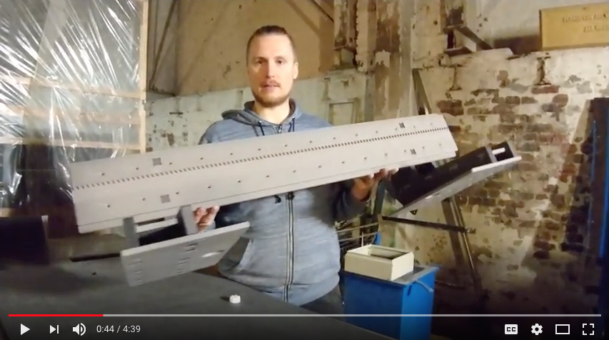](https://www.youtube.com/watch?v=Xjq5qzolGBw&t=1s)

#### Manufacturing pictures

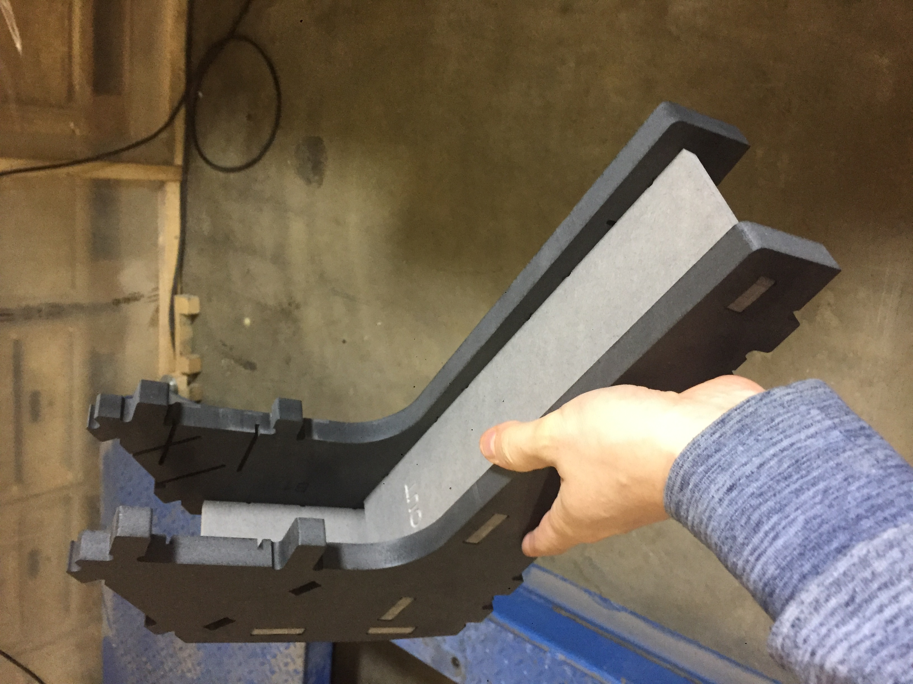
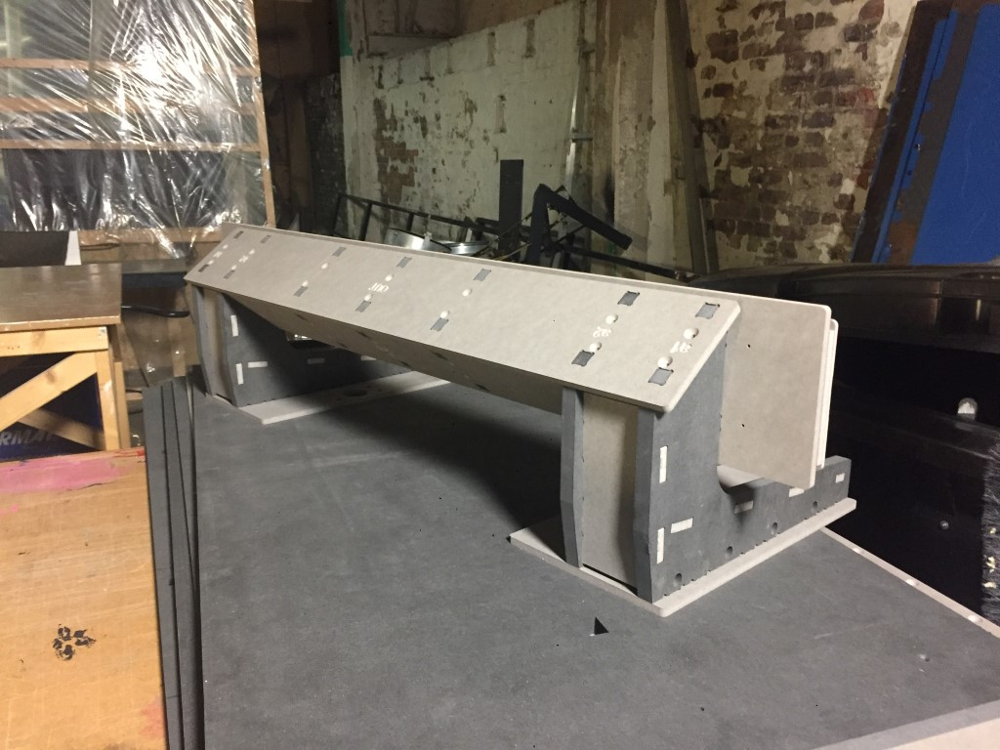
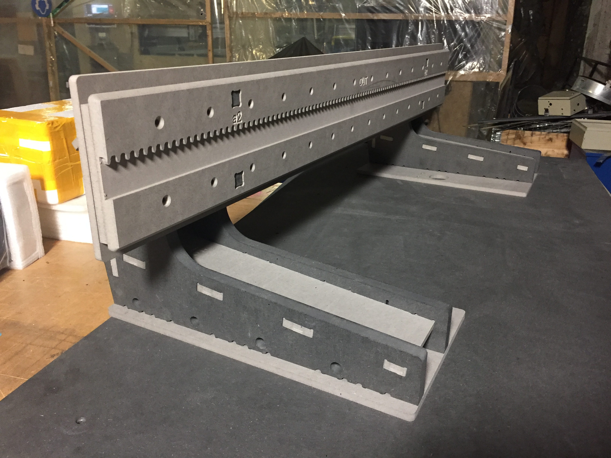
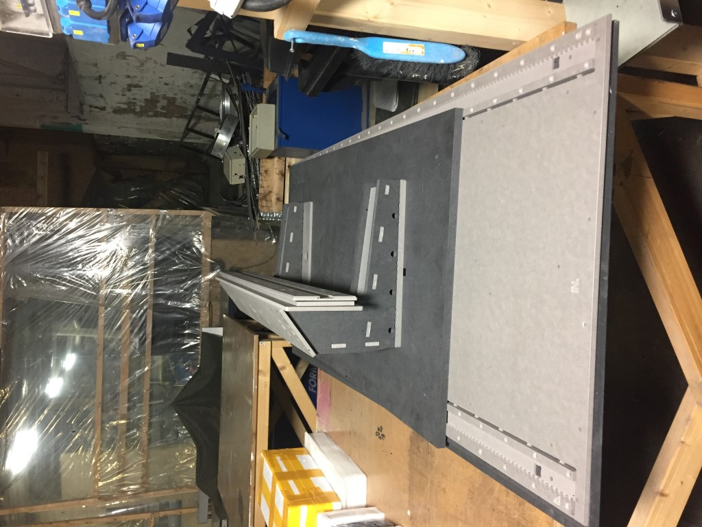
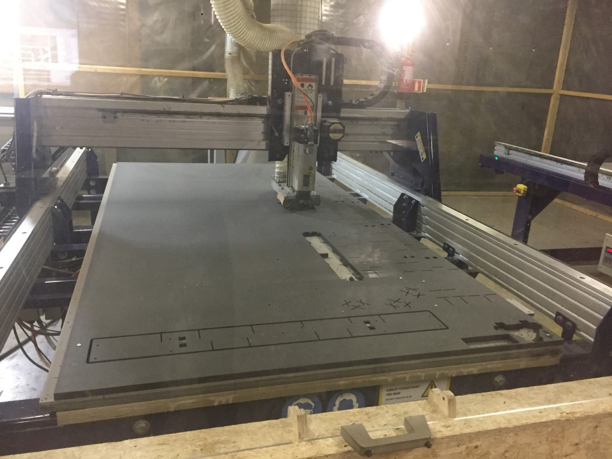
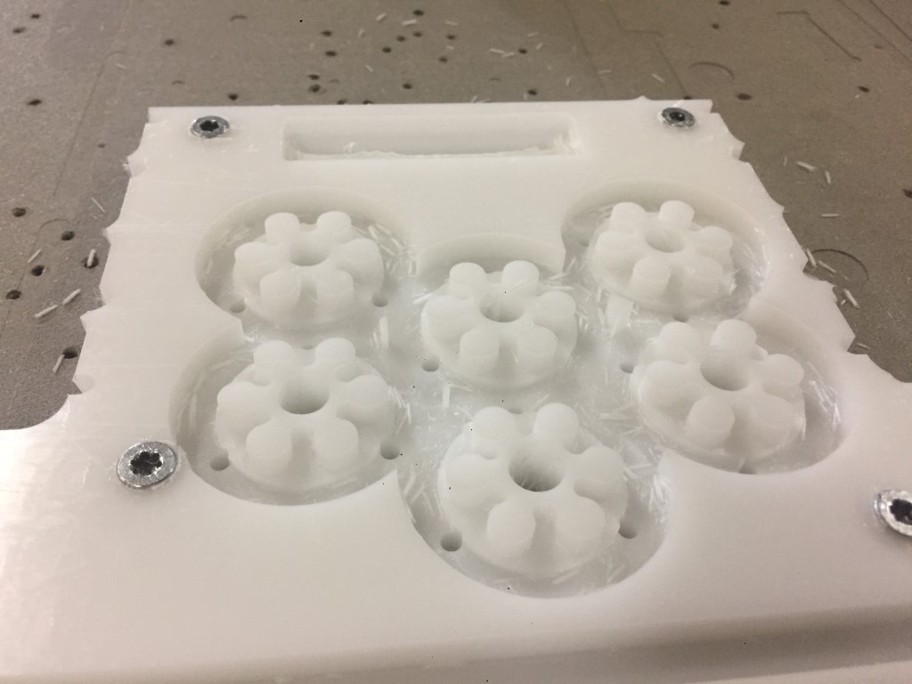
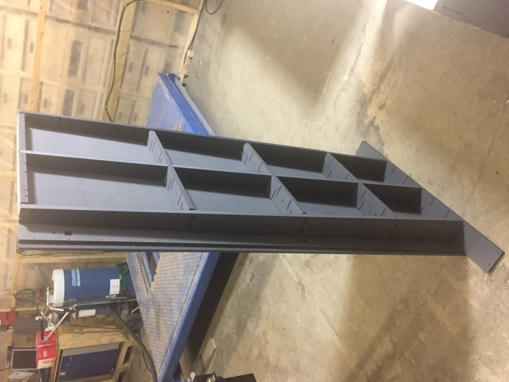
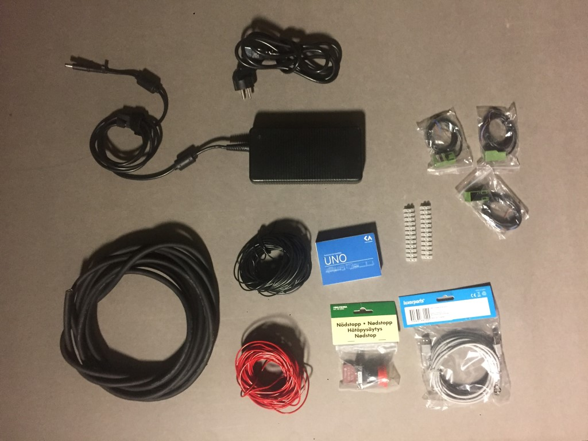

#### Model files
If you want to see it all together, use the latest step model.
I could not export the assembly as f3d from fusion so I uploaded it in parts.

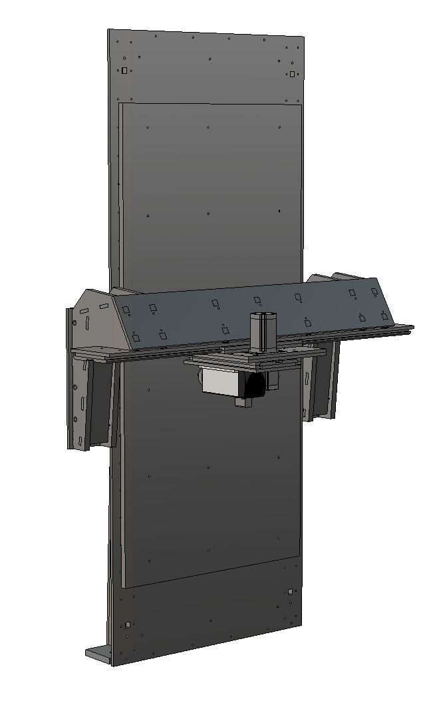

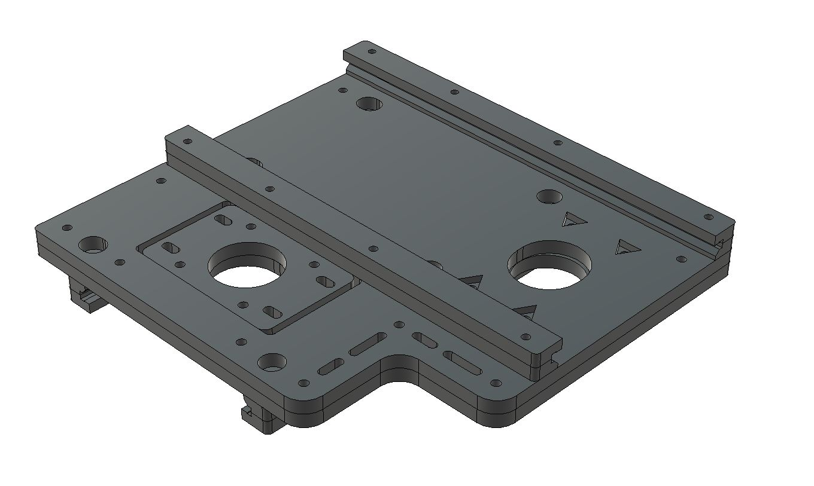

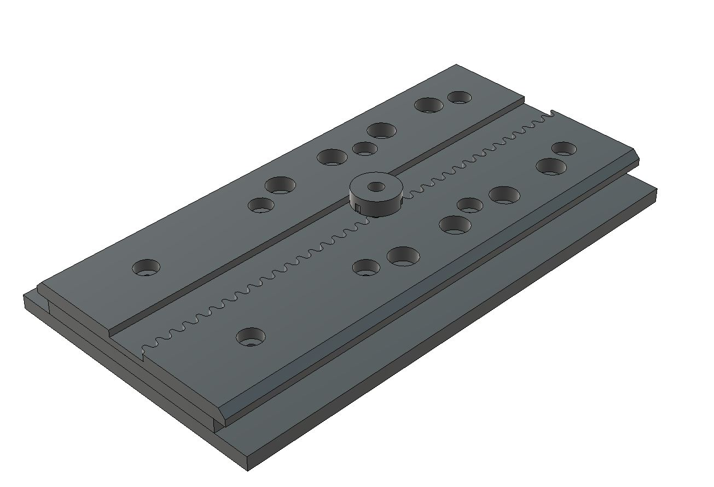

### BOM
*(bill of materials)*

**Materials**
* 2x sheets of 8mm high quality MDF *(we like [Valchromat](http://www.valchromat.pt/distribuidores.aspx?menuid=338) and [Spanolux](https://www.spanolux.com/en/solutions/black-mdf))*
* 1x sheets of 16mm high quality MDF (can be replaced by more 8mm if you tweak the design)
* *Alternatively additional 8mm aluminum if you want make high quality long lasting chamfer rails. We recommend that you make the rails from HDF first, then replace them with aluminum versions if you meet performance limitations*
* 12mm POM/Delrin for milling pinions *(pinions can also be 3D printed, but precision and performance will be reduced)*
* Glideblocks can be milled from 8mm aluminum or HDF. Apply [PTFE tape](https://www.amazon.co.uk/gp/product/B00DE2RUMC/ref=oh_aui_detailpage_o00_s00?ie=UTF8&psc=1) to the glideblock surfaces for a smooth, wear resistant and replaceable bearing surface
* *Alternatively the glideblocks can also be milled from the same POM/Delrin plastic stock as the pinions*
* Small piece of aluminum for homing/probing milling bit with Z axis
* Some type of transparent plastic and wood sheets to build a safety enclosure

**Fasteners**
* One type wood screw
* Other type of wood screw
* One length of M5 machine screw
* Other length of M5 machine screw
* M5 nuts
* M5 washers
* Wood glue

**Motors and end-effectors**
* 4x [JMC iHSS57-36-20](http://www.jmc-motor.com/products.php?cid=248&id=118) closed loop stepper motors - [Aliexpress link](https://www.aliexpress.com/store/product/NEMA-23-2N-m-283ozf-in-Integrated-Closed-Loop-Stepper-motor-36VDC-JMC-iHSS57-36-20/1932111_32712473144.html?spm=2114.12010612.0.0.652b10ccMEcLrM)
* 1x [800watt air cooled spindle](https://www.aliexpress.com/store/product/Square-0-8KW-Air-cooled-Spindle-motor-ER11-24000rpm-400Hz-ENGRAVING-MILLING-GRIND-6-5A/907217_32665487318.html?spm=2114.12010612.0.0.54a41c927Yz5F6)
* 1x [1500watt VFD](https://www.aliexpress.com/store/product/Variable-Frequency-Drive-VFD-Inverter-1-5KW-2HP-220V-7A/907217_695200328.html?spm=2114.12010612.0.0.3b24f1efj9cBe2)*(variable frequency drive)*
* *[Alternative spindle for high speed milling with small bits](https://www.aliexpress.com/item/250w-40000rpm-ER8-Brushless-spindle-motor-MACH3-driver-DC36V-for-CNC-drilling-milling-carving-kits/32757165445.html?spm=a2g0s.13010208.99999999.271.VrrmR0) (untested)* 

**Sensors**
* 3x [Proximity switches](https://www.aliexpress.com/store/product/10PCS-inductive-proximity-sensor-SN04-N-three-wire-NPN-normally-open-Waterproof/907217_1939241212.html?spm=2114.12010612.0.0.43e2fadfhDJbTT)*(10 pack)*

**Cables**
* Six lead wire for wiring motors and proximity switches to control board *(step, direction, enable, alarm, ground and proximty switch signal)*
* Two lead wire for carrying 36v power to motors and proximity switches
* Four lead VDF cable
* Single lead wire for aluminium homing plate and spindle circuit
* Two lead wire for carrying 220v from wall outlet to power supply and VFD *(via contactor for safety)*

**Safety**
* E-Stop
* Sensor on transparent door in front of the machine
* Contactor for killing power to Motors and VFD when the safety door is open
* Hinges for safety door
* Locking mechanism for safety door
* See our [European shopbot intallations](https://github.com/fellesverkstedet/European-ShopBot-installations) repo for ongoing research into safe and convenient installations of milling machines

**Control board**
* 1x [Arduino UNO](https://store.arduino.cc/genuino-uno-rev3)
* 1x [GRBL screw terminal shield](https://www.tindie.com/products/18robots/grbl-compatible-cnc-shield-for-arduino/) *(untested)*
* *Alternative control board is the awesome [Replicape](https://www.thing-printer.com/product/replicape/), removes the need for a dedicated computer to run the machine*

**Miscellaneous**
* 1x Power supply (we recommended 36v for the iHSS57 steppers)
* 2x E-chains or peasant style flexible strip of plastic

### Joint experiment
[Fulltext Joinery experiment](experiment.md)
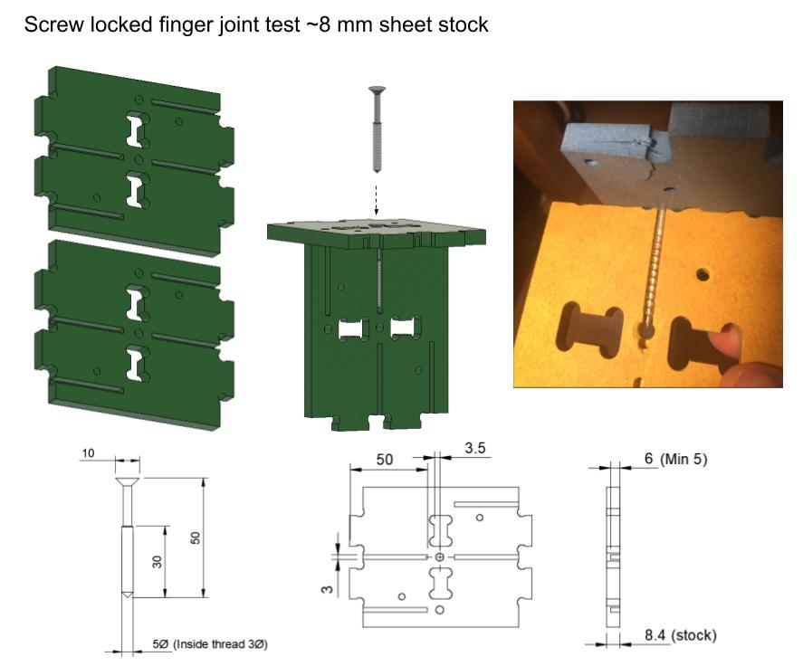

In development. Design files in Fusion360, step and Rhino format.

The Fusion 360 files are further progressed and will be completed and milled shortly. 

### Design decisions

#### Size and orientation
* Workarea 1200x600 mm.
* Should fit on top of a standard shipping pallet when mounted vertical.
* Z is the normal axis from the spoilboard.
* Y i vertical
* X is horizontal

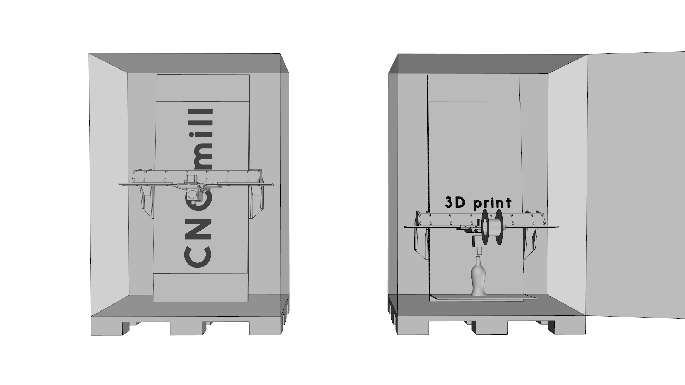

#### Materials
* 12 mm POM plastic sheet for the pinions and glide blocks.
* 16 mm Valchromat HDF sheet for the frame and ribs of the torsion box holding the spoilboard and some key parts of the gantry.
* 8 mm Valchromat HDF sheet for all other parts, including rails with rack, these can be swapped to aluminium later.

#### Fasteners
* M5 hex head machine screws for rails
* L50x5Ø 30mm Threaded wood screws for structure

### Notes on the Fusion model:
*Must be fixed:*
* Holes for easy glueing of spoilboard
* Fingers for aligning the tosion box to the y-axis and backing
* 8mm X and Z axis plates
* 8mm All Motor plates, sketches exist
* 8mm z-axis rail, spacer and backing   ((perhaps not enought 8mm material)
* Add perforation and guide for changing to alu later
* Add rack teeth (will lag so I do this last)
* All POM pieces (glide blocks and pinions) Sketches exists
* CAM

*Before milling*
* Test screw slot grip
* Tune dimensions for nut sizes and for screw lengths

*Check*
* Issues - enhancements
* Can the Y range be increased so that we have acces to the work area above the gantry in resting position

## Safety and human interaction

The machine has many moving parts. It should be mounted inside an enclosure so that no-one can reach in and get fingers trapped or touch a powered spindle. All power should be cut when the enclosure is open. Cutting the power means that the gantry wants to slide down to the bottom, making tool change awkvard. Therefore a spring could be used to keep the gantry somewhere where the spindle end is easy to reach. (A counter weight increases the mass that has to be accelerated.)

**User safety rules:**
* Mount the machine securely so that it can not fall over under operation.  
* Needs to be safe when power is removed 
* Connect emergency stop button so that it cuts all power in an easy to reach place

## Images

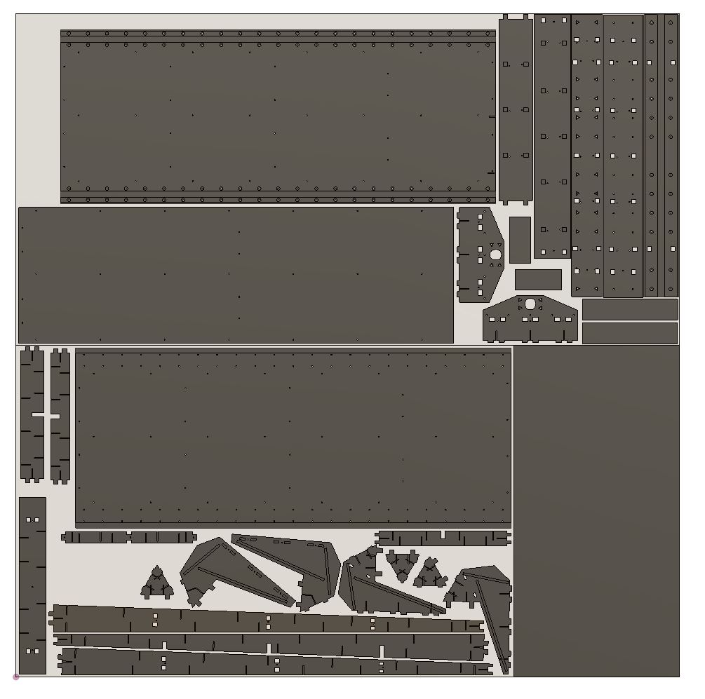
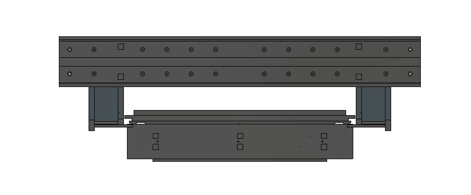

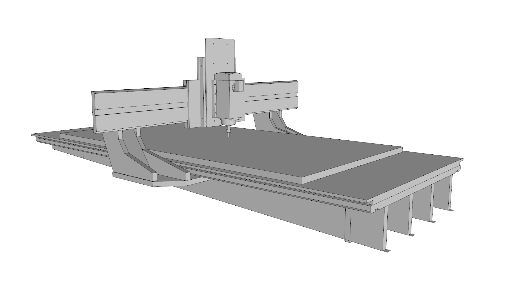

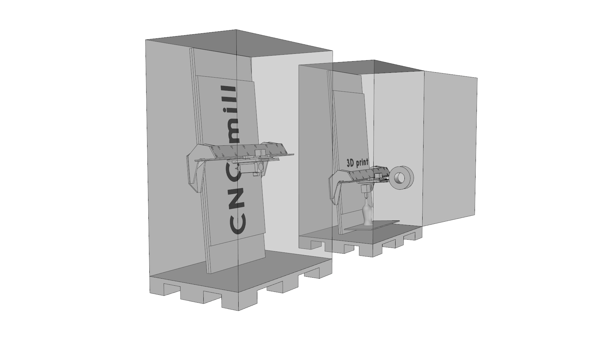
