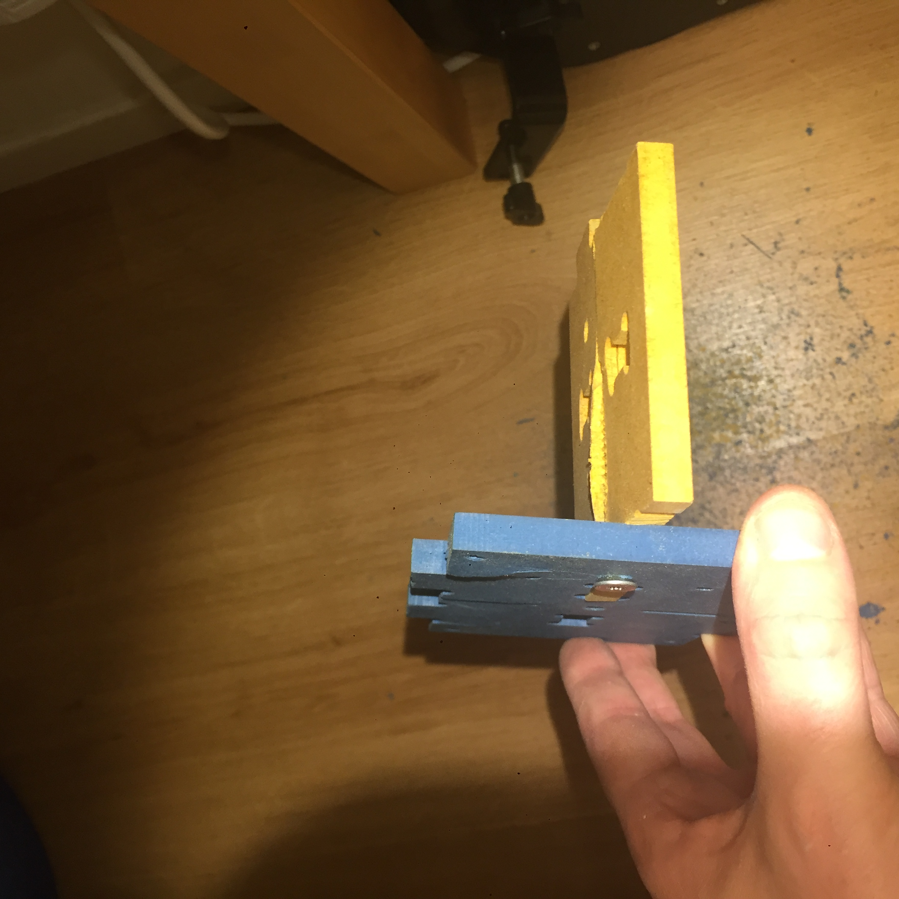
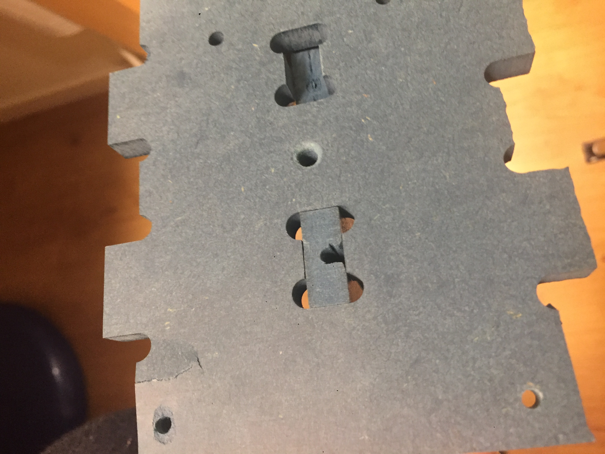
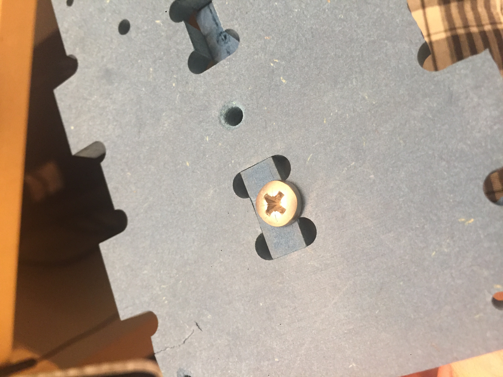
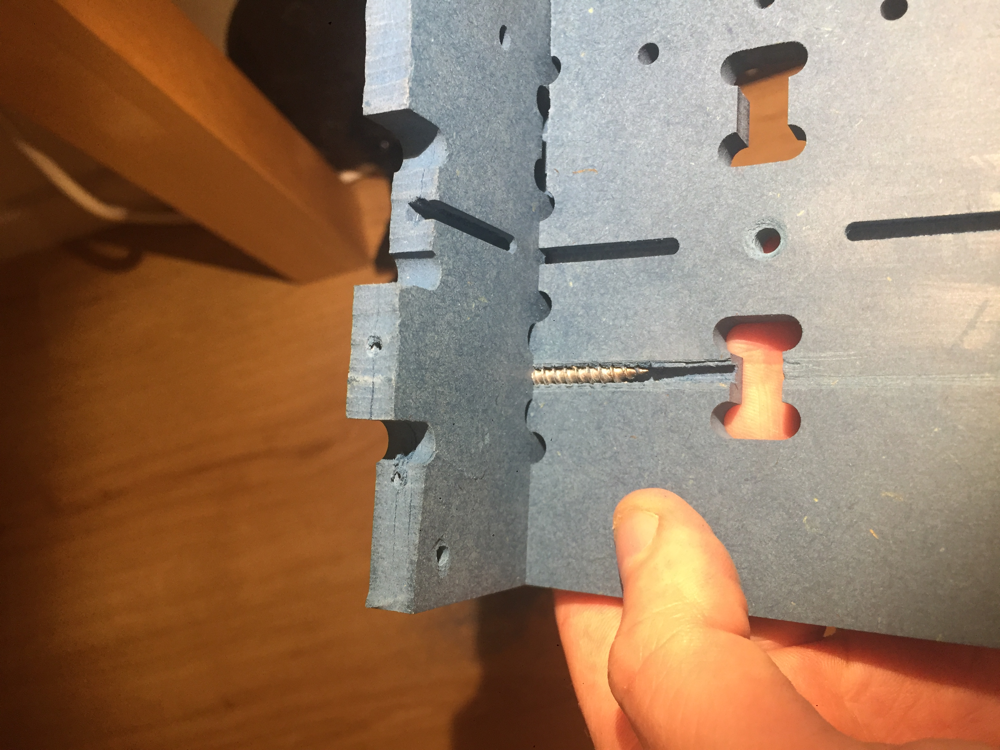

# Experiments

## Valchromat finger joint and scews

I tried various configurations of screwing valchromat pieces together without predrilling, instead using a 3-axis mill and a 3 mm endmill for slotting tracks for the screw to run in.

### Results
I found a few interesting things, some things needs more test to be more conclusive

### Max strenght version
*Using a 5x50 mm 30 mm threaded wood screw* 

My favourite configuration was a 5 mm diameter wood screw, 3 mm "core" diameter, 50 mm long with an unthreaded neck. This gave the  highest torque before the threads fail. 
The "core" fits prefectly in the 3mm milled slot and gives maximum pressure on the threads without uncessecary friction. 
I think the joint strenght can be increased by making the slot deeper than the outer diamater of the wood screw but this weakens the valchromat. I recommend 1 mm extra but Slot depth = screw diameter is the minimum.
The length of the slot should be longer than the screw to avoid uncecessary splitting forces from the tip pressing into the end of the slot. The hole should be a tight clearance hole for the thread to align the screw. It should be positioned so that the screw thread does not press into the bottom of the slot (would just generate splitting force).

The failure mode is always that the valchromat splits open and then the thread is dug away. Stopping the splitting is key, this keeps the pressure on the threads and prevents them from digging out. The finger joint holds the valchromat together and the unthreaded neck fo the woodscrew helps a lots in not splitting the valchromat from the top.

Another interesting thing to note is that the valchromat will always split on the side of the slot that is pushed out by the threads. This means that this method can be used with a single finger per screw.

*The valchromat bulges before it fails:*

**Increase strength**
If you need further strenght I recommend threading a fully threaded wood screw through the valchromat where it will bulge and fail, this increases the strength even further.

### Slot in finger version

I also tried an "extreme" version with the slot in the finger itself, it seemed to work well as well but needs more testing if the head needs a washer for it to work well.
*Some pics of that test:*

[More images here](https://github.com/fellesverkstedet/fabricatable-machines/tree/master/humphrito-medium-format-cnc/img/experiment)
