# Hymir - mega format CNC system
*May 2017, project state: Concept, to be tested*

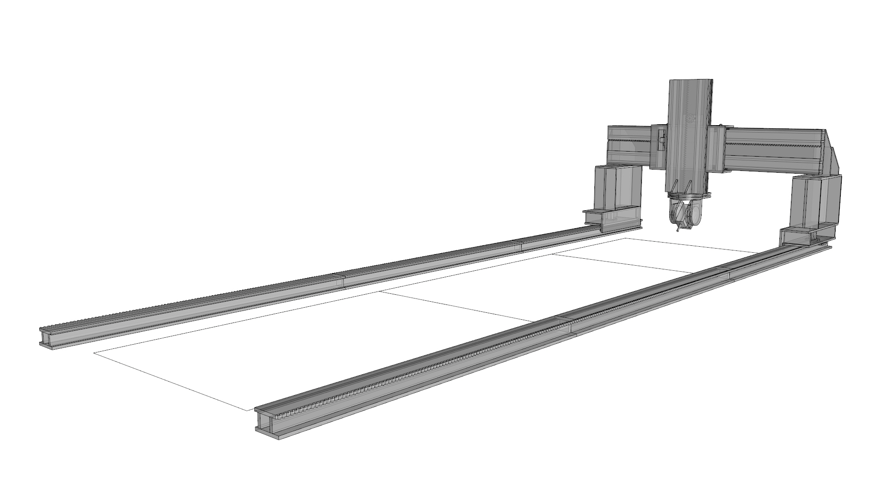
*5-axis CNC with 12 square meter work area*

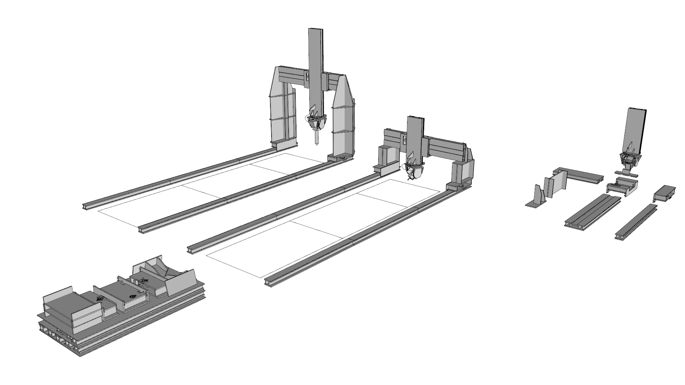
*Modular components give freedom in size and fabriction types*

* A modular fabiraction system for building size fabriaction
* Designed for super fast fabriaction using standard size MDF, HDF or plywood plates
* Aiming at medium to low accuarcy and rigidity
* Aliming at very low material and prduction cost
* There is also potential for a high performache version using steel plates and welding. Proof of principle test milling racks for this [here.](https://youtu.be/Pyblj0Z6MnE)
* Linear rails, rack and pinion can all be fabricated on a conventional CNC milling machine
* Inline skate wheels could be used for linear bearings
* Large rack and pinion makes fast fabriaction in both wood and steel
* Large teeth allow for more misalignment of modualar axes.
* Large teeth also allow for higher performce in weaker materials *(an 11mm wide tooth from 18mm MDF is quite strong)*
* We are currently exploring direct extrusion 3D printing, CNC milling and pick and place fabrication.
* Named after the giant [Hymir](https://en.wikipedia.org/wiki/Hymir) of Norse mythology

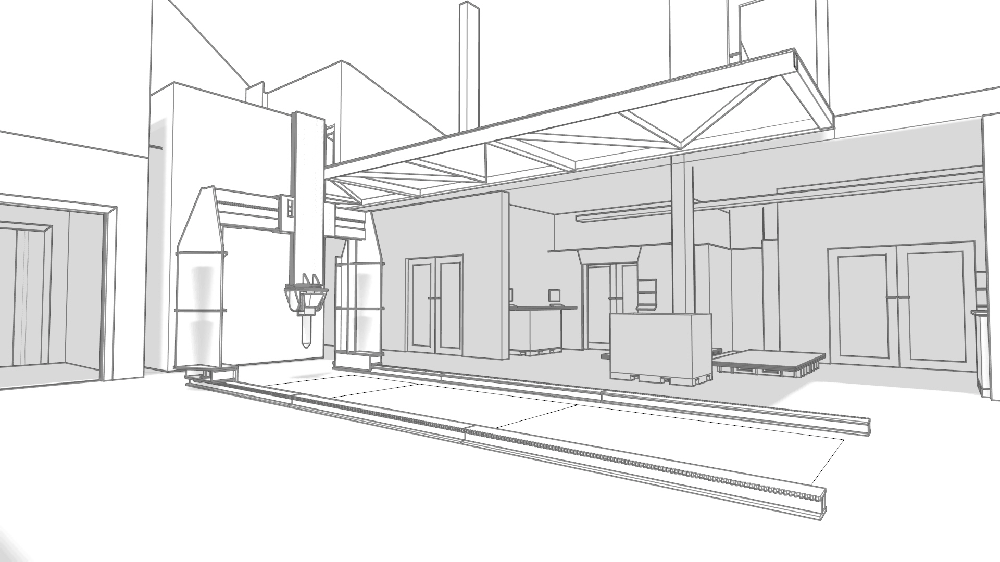
*5-axis 3D printer with 20m3 workarea*

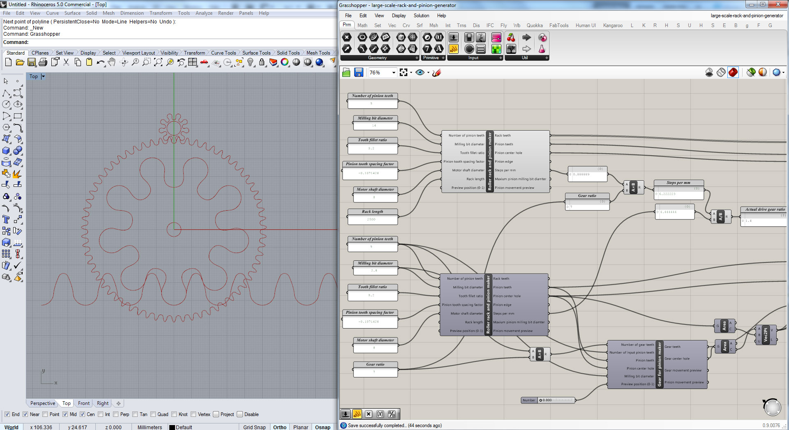
*The gearing has a ratio of 1.6 (despite the large pinion), helping move the heavier structures*

*The gearbox principle allow for fast fabrication of the racks and ultimately robust low-budget machines*

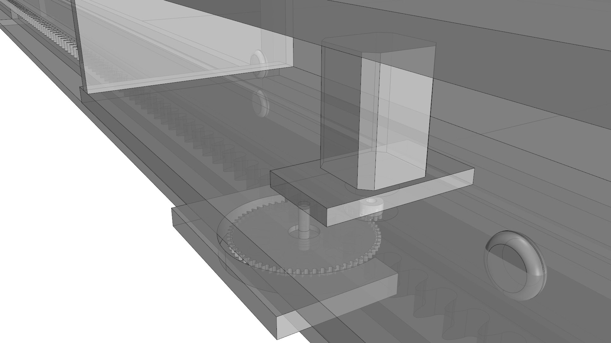
*Motor and pinion on axis*

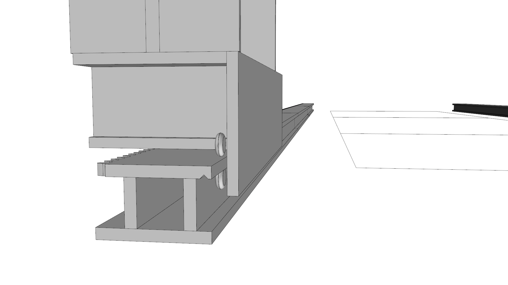
*In-line skate wheels might be the perfect low budget option*

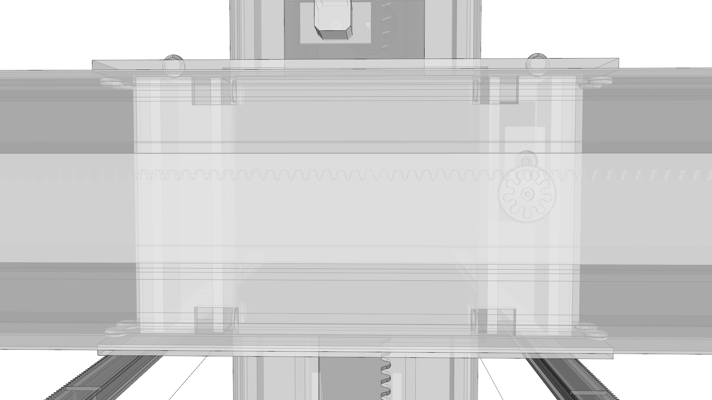
*Backside of the gantry*

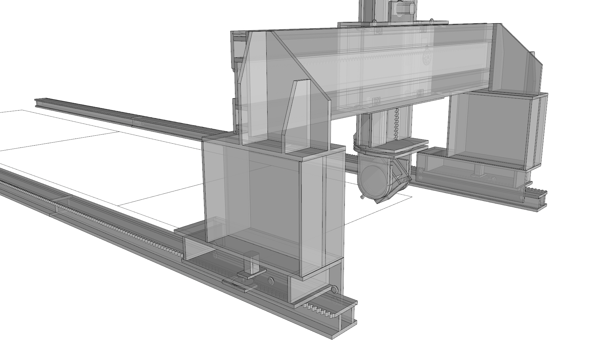
*The height of the gantry can easily be modified by swapping out the connecting pieces*

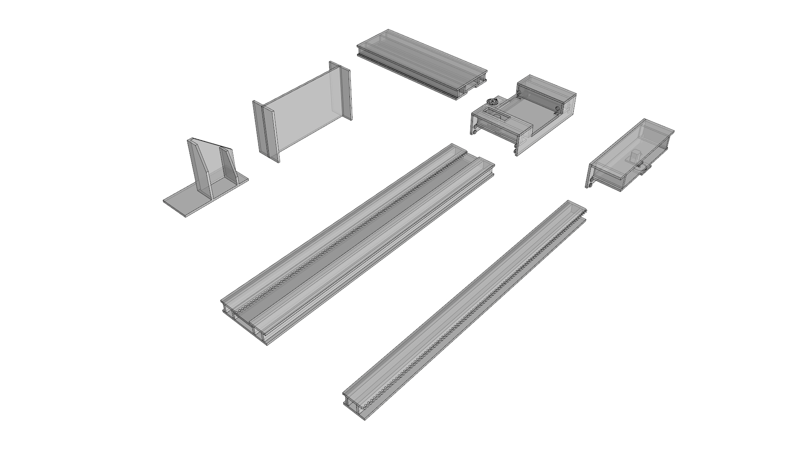
*The core components*

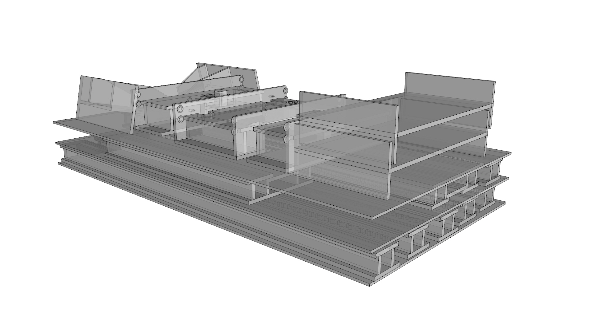
*A machine with all components can easily be stored on a large pallet when not in use*

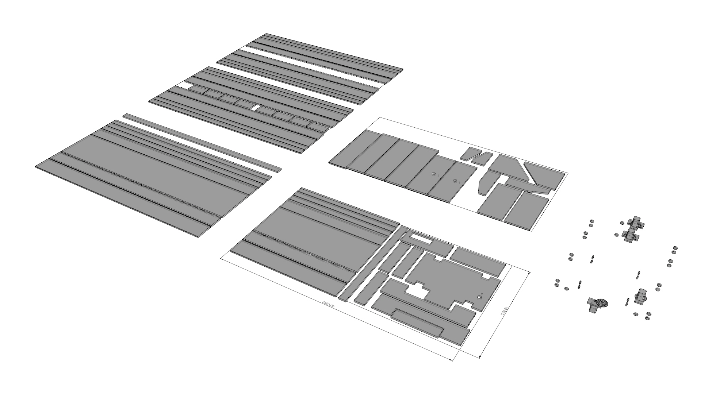
*5 standard size (2.5m x 1.25m) sheets are needed to make a gantry configuraiton with a 4m x 1.6m work area*

*Toolheads; left: 5 axis CNC milling, middle: pick and place fabriaction and right: direct extrusion 3D printing*

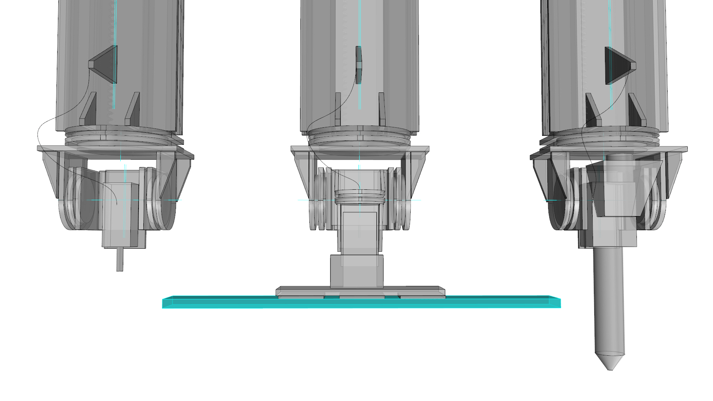
*The pick and place head has a suction cup to pick up planks and a nail gun to attach them after applying glue. An extra rotational axis allow for full 6 degrees of freedom construction*

