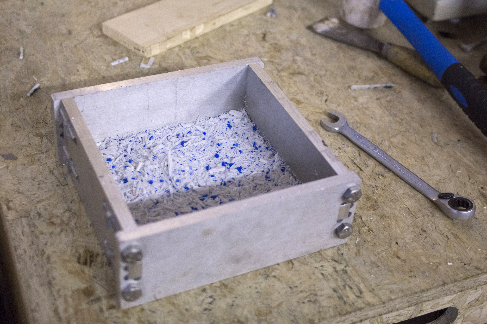
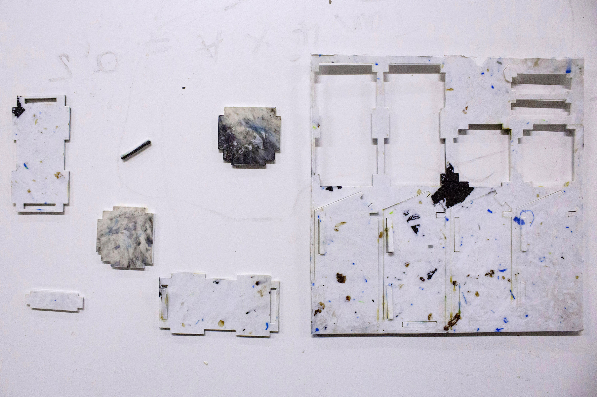
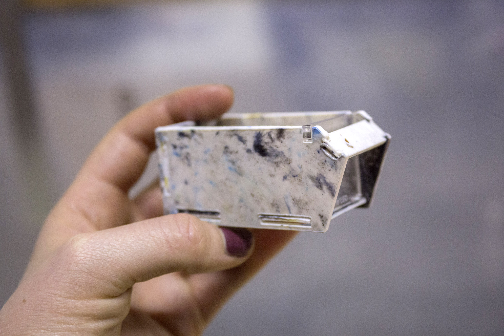
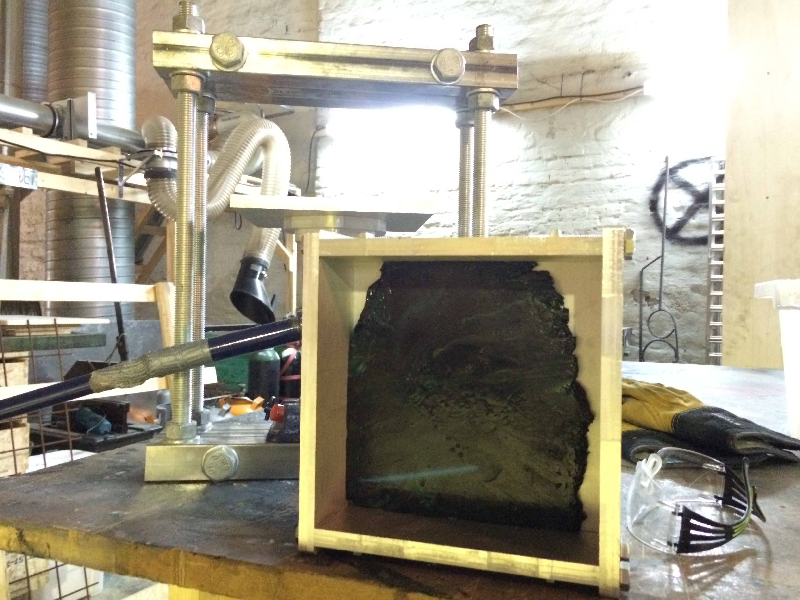
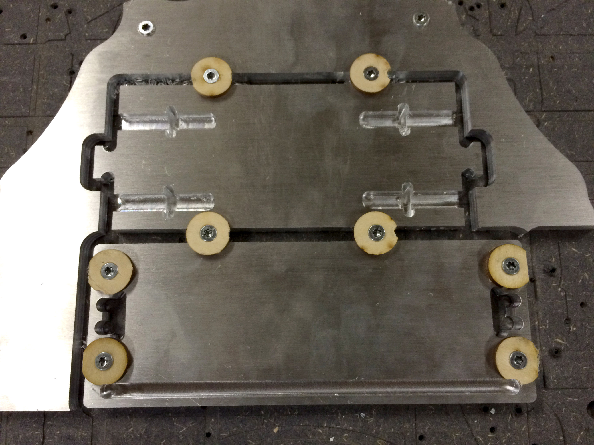
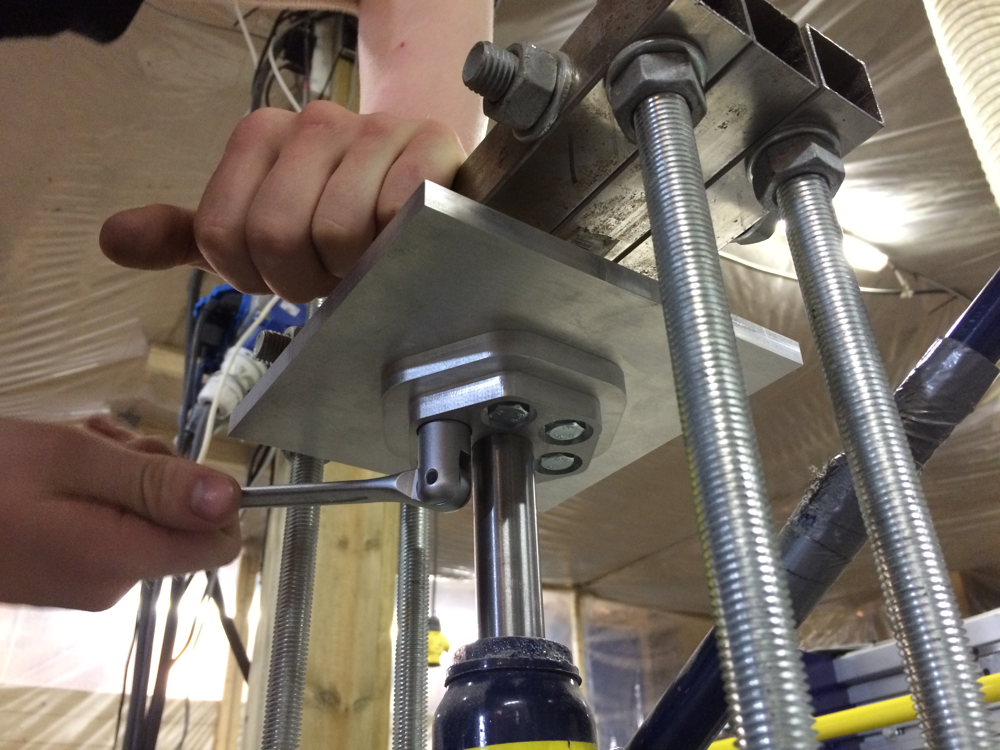
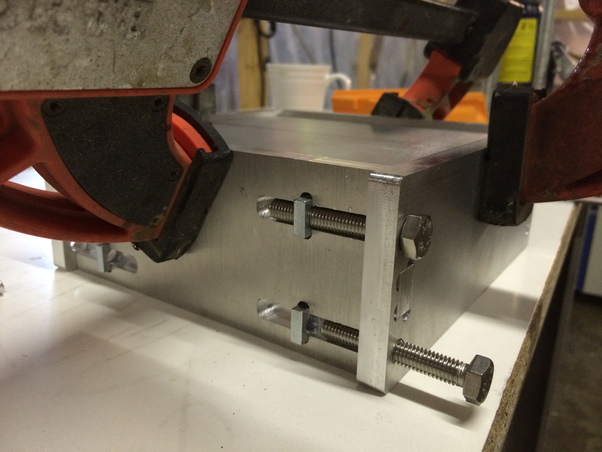
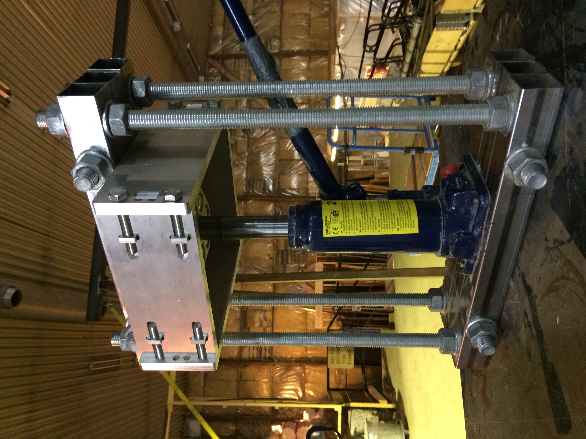

# Sheet maker

A pressing rig for making sheet material from waste. First tests are with PLA (bio plastic) and wood waste from CNC milling. Designed to be fabricatable on a large format CNC mill. We use a ShopBot PRS alpha to fabricate the parts.

## Status

Currently testing first mold box. Heating is done by placing mold on a cooking plate. Watercooling by submerging boxmold and hydraulic press in a bucket of water. Results are promising. A twosided heat source is needed for even sheets.

## Core principles

## TODO
* Test top side heating with 220v cartridge heater
* Develop water cooling system by engraving aluimium plates.
* Develop heat and pressure monitoring

## Roadmap

* Test vacuum clamping/bagging to replace hydraulic pressing. Much cheaper to scale if it works.
* Make mold for lasercutter sized sheets
* Make a full size (2.5m x 1.25m) mold
* Develop a system for automating the sheet pressing
* Make locally recycled plates a viable option for users of fab labs and makerspaces

## Motivation

* Envrionment - Reduce negative impact on our panet from consuming resources
* Economic - Make making good stuff more affordable
* Inspiration - Put awareness and supply chain consciousness on the agenda
* Skills - Make tools that build deeper inights into material properties

## Tests

!Failed oven test jack, does not like high temp](./img/12failed-ovent-test-jack-does-not-like-high-temp.JPG)

## Resources