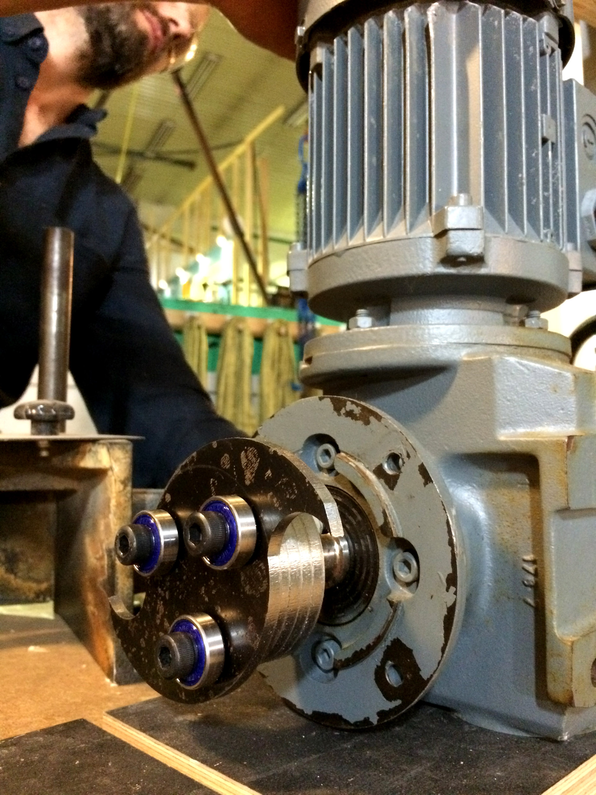

# Waste shredder

A shredder for processing old 3D prints and wood waste into pellet sized pieces. Designed to be fabricatable on a large format CNC mill. We use a ShopBot PRS alpha to fabricated the parts.

## Status

**Prototyping in progress**

## Core principles

## TODO

Preparation for Oslo Innovation Week Hackathon 2016

## Roadmap

## Motivation

## Tests

## Resources